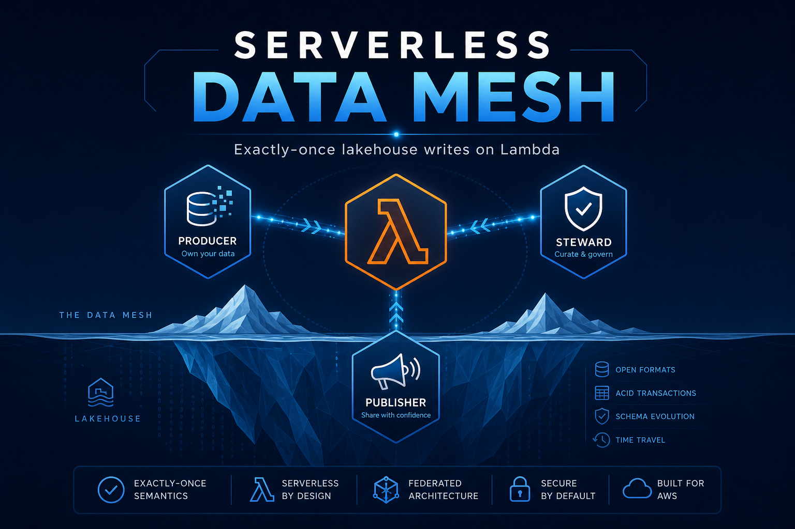
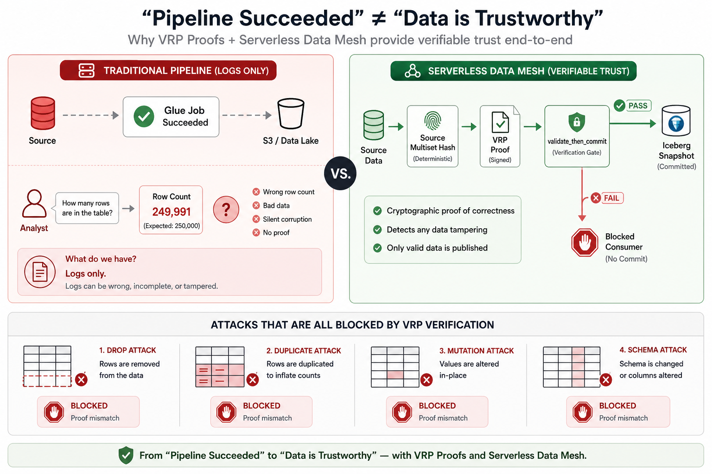
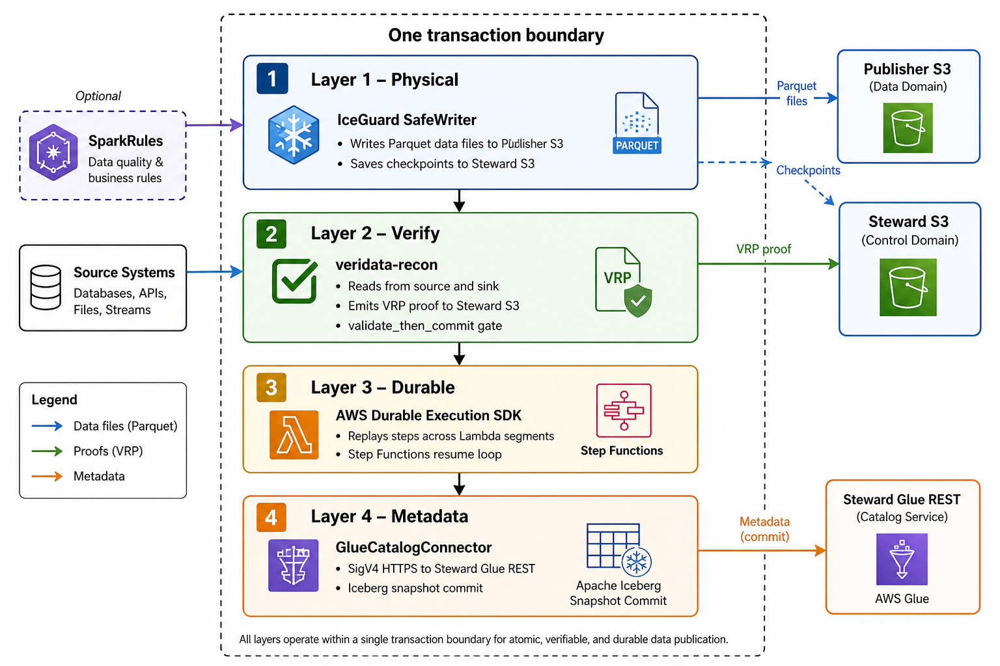
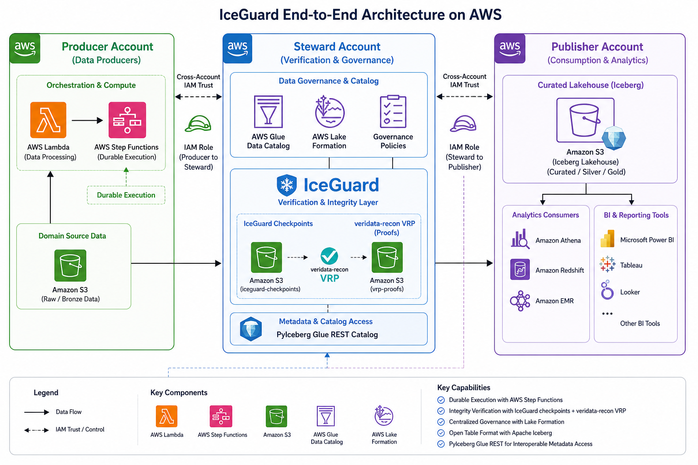
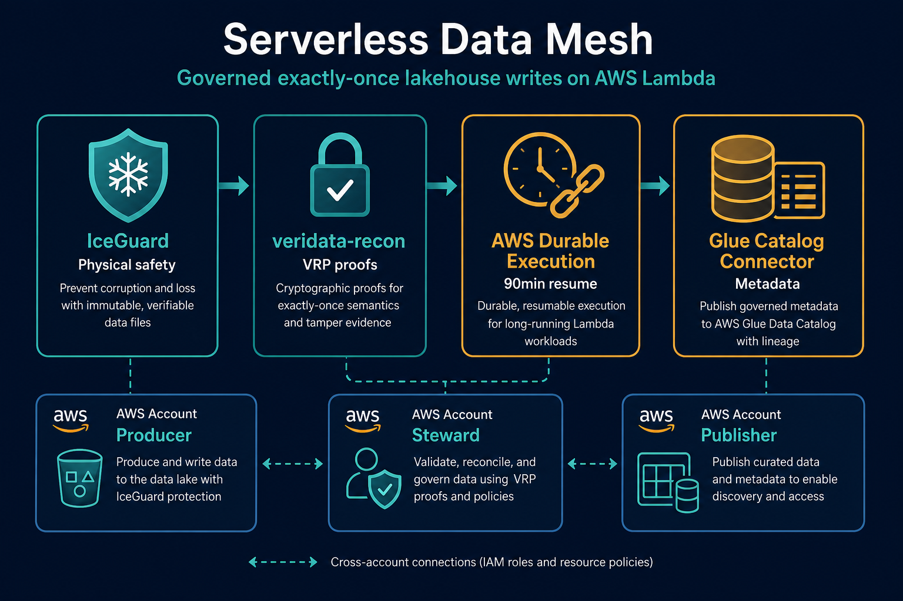
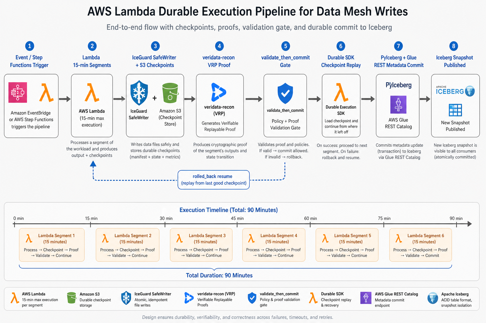

<div align="center">

# Serverless Data Mesh

**Governed, exactly-once lakehouse writes on AWS Lambda - with cryptographic proof, not just green job logs.**

[](https://www.python.org/downloads/)
[](LICENSE)
[](https://docs.aws.amazon.com/lambda/)
[](https://iceberg.apache.org/)

<p align="center">
  
</p>

An open Python framework for **federated data mesh** lakehouse publication on AWS:<br/>
**domain-oriented ownership**, **data as a product**, and **self-serve write infrastructure** for cross-domain teams.<br/>
**Producer** domains publish governed **data products** · **Steward** notaries enforce **federated computational governance** · **Publisher** zones expose consumer-ready **Iceberg data products** to the mesh.

[**Vaquar Pattern**](docs/vaquar-pattern.md) · [**Why it exists (blog)**](docs/why-serverless-data-mesh.md) · [**Getting started**](docs/getting-started.md) · [**Deploy**](infrastructure/terraform/README.md)

</div>

---

## What is this project?

**Serverless Data Mesh** is a coordination framework that turns AWS Lambda into a production-grade **domain write primitive** for lakehouse data meshes.

Instead of routing every backfill through a central Glue fleet, each domain ships a small Lambda handler. The framework wraps that handler in a governed **transaction boundary**: physical safety, cryptographic verification, durable orchestration, and proof-gated Iceberg metadata commits.

It combines four proven building blocks into one contract:

| Building block | Role |
|----------------|------|
| [IceGuard](https://pypi.org/project/iceguard/) | Chunked Parquet writes, timeout rollback, S3 resume |
| [veridata-recon](https://pypi.org/project/veridata-recon/) | Verifiable Reconciliation Proof (VRP) per chunk |
| [AWS Durable Execution](https://docs.aws.amazon.com/durable-execution/) | Replay completed steps across 15-min Lambda segments |
| [PyIceberg Glue REST](https://py.iceberg.apache.org/) | SigV4 metadata commit via `GlueCatalogConnector` |

Optional: [SparkRules](https://pypi.org/project/sparkrules/) for DRL business rules on Lambda (`pip install serverless-data-mesh[rules]`).

---

## The problem it solves

Most data mesh programs reorganize teams but leave the **write path** centralized. Domains file tickets; a platform team runs Glue; everyone gets a green "success" email. Then analysts find missing rows, auditors get log exports, and nobody can **prove** the partition is correct.

<p align="center">
  
</p>

| Pain | What happens today | What Serverless Data Mesh does |
|------|-------------------|-------------------------------|
| **Silent data loss** | Partition row counts drift; discovered days later | VRP `FAIL` blocks Iceberg snapshot; consumers never see bad data |
| **"Job succeeded" ≠ correct** | Glue exit code 0 with 6 missing rows | Multiset cryptographic proof per chunk |
| **Lambda 15-min limit** | "Use EMR/Glue for real backfills" | Durable Execution + Step Functions resume → **90+ minutes** |
| **Retry duplicates data** | Re-invoke creates duplicate Parquet | IceGuard rollback + `workload_id` checkpoints |
| **Platform bottleneck** | Every domain waits on central ETL | Each domain owns a Lambda writer + declared contract |
| **No audit evidence** | Sample rows and debate | Immutable VRP proofs in Steward S3; offline `verify_proof` |
| **Glue cost for nightly jobs** | DPUs idle 23 hours/day | Lambda scales to zero between backfills |
| **Federated blast radius** | One misconfigured job wipes consumer data | Producer · Steward · Publisher account separation |

**Full problem analysis:** [Why Serverless Data Mesh exists](docs/why-serverless-data-mesh.md)

---

## The solution: Vaquar Pattern

This framework introduces the **[Vaquar Pattern](docs/vaquar-pattern.md)**: a publishable architectural pattern for the data engineering world.

> **Proof-Gated Serverless Lakehouse Publication (PVDM)**  
> Physical → Verify → Durable → Metadata  
> Invariant: `commit_metadata ⟹ VRP = PASS`

<p align="center">
  
</p>

| Phase | Component | Outcome |
|-------|-----------|---------|
| **Physical** | IceGuard SafeWriter | Parquet in Publisher S3; checkpoints in Steward S3 |
| **Verify** | veridata-recon | VRP proof stored; `validate_then_commit` gate |
| **Durable** | AWS Durable SDK + Step Functions | 15-min segments chain into 90+ min workloads |
| **Metadata** | GlueCatalogConnector | Iceberg snapshot commit **only after proof PASS** |

What makes this new vs Outbox, Saga, Medallion, and Glue bookmarks: **Iceberg publication is gated on cryptographic multiset proof**, not executor success.

**Pattern spec, citations, anti-patterns:** [docs/vaquar-pattern.md](docs/vaquar-pattern.md)

---

## Key features

<table>
<tr>
<td width="50%" valign="top">

### Domain autonomy
- Per-domain Lambda handler (`examples/domain_writer/`)
- `DomainTransactionBoundary` declares write scope
- `DataProductContract` for registry-facing metadata
- No central Glue ETL as the write primitive

### Cryptographic trust
- VRP proof per chunk (veridata-recon)
- `validate_then_commit` blocks metadata on `FAIL`
- Consumer safety benchmark: drop / duplicate / mutation attacks
- Offline auditor verification without source access

</td>
<td width="50%" valign="top">

### Serverless at scale
- 15-min Lambda segments → 90+ min backfills
- IceGuard watchdog rollback before hard timeout
- Durable step replay: no duplicate committed chunks
- Terraform-tunable `lambda_timeout_seconds`

### Production ready
- Step Functions orchestrator + DLQ + monitoring
- Single-account `prod` and multi-account Terraform roots
- SAM template alternative
- CI: tests, benchmark, walkthrough, terraform validate

</td>
</tr>
<tr>
<td width="50%" valign="top">

### Federated governance
- **Producer**: domain compute
- **Steward**: proofs, checkpoints, Glue catalog (notary)
- **Publisher**: lakehouse S3, consumer Iceberg tables
- Lake Formation cross-account grants

</td>
<td width="50%" valign="top">

### Extensible
- `GlueCatalogConnector`: metadata only, not Glue ETL
- PySpark / Polars / PyArrow on Lambda
- `SparkRulesConnector`: DRL rules before VRP (`[rules]` extra)
- PyPI extras: `[rules]`, `[spark]`, `[all]`, `[dev]`

</td>
</tr>
</table>

---

## Architecture

### Three-account federated mesh

<p align="center">
  
</p>

| Account | Owner | Responsibility |
|---------|-------|----------------|
| **Producer** | Domain team (Orders, Payments, …) | Source data, Step Functions, domain writer Lambda |
| **Steward** | Platform / governance | Glue catalog, Lake Formation, checkpoints, VRP proofs |
| **Publisher** | Analytics / data products | Curated lakehouse S3, Iceberg tables, consumer access |

**Flow:** Producer Lambda reads source → writes Parquet to Publisher → stores proofs in Steward → commits metadata via Steward Glue REST → consumers query Publisher.

→ [Full deploy guide](docs/data-mesh-end-to-end.md)

---

### Lambda execution model

<p align="center">
  
</p>

<p align="center">
  
</p>

**Compute on Lambda. Catalog via Glue connector. No Glue ETL jobs.**

| Layer | Runs on Lambda? | Component |
|-------|-----------------|-----------|
| Physical transforms | Yes | PySpark-on-Lambda, Polars, PyArrow |
| Business rules (optional) | Yes | SparkRules `LocalRuleExecutor` |
| AWS Glue ETL jobs | **No** | Separate managed service; not used for writes |
| Glue Data Catalog metadata | API only | `GlueCatalogConnector` (HTTPS + SigV4) |

```
Event / Step Functions
        │
        ▼
Lambda :live  (15-min segments, up to 90+ min total)
        │
        ├── Read source        → domain-specific reader
        ├── SparkRules         → optional DRL filter
        ├── IceGuard           → chunked Parquet + S3 checkpoints + rollback
        ├── veridata-recon     → VRP proof per chunk
        ├── Durable SDK        → replay completed steps on resume
        └── GlueCatalogConnector → Glue Iceberg REST metadata commit
        │
        ▼
   committed │ rolled_back → resume │ verification_failed
```

→ [Glue connector guide](docs/glue-connector.md) · [Architecture](docs/architecture.md)

---

## Quick start

**Requires Python 3.12+**

### Try in 60 seconds (no AWS)

```bash
pip install serverless-data-mesh
serverless-data-mesh demo
```

Runs the full **PVDM lifecycle** locally: 1000-row clean write → corrupt write blocked by VRP → consumer sees only clean data.

```bash
make gate-demo       # verification gate fire-alarm demo
make multi-domain    # orders + payments atomicity demo
```

### Full development setup

```bash
git clone https://github.com/vaquarkhan/aws-serverless-datamesh-framework.git
cd aws-serverless-datamesh-framework

make install
make test
make demo             # same as serverless-data-mesh demo
make walkthrough      # 12-step tutorial (no AWS)
make benchmark        # consumer safety: corrupt data never commits
```

### Cost comparison (AWS)

Published methodology and workload definitions: **[benchmarks/README.md](benchmarks/README.md)** (run on AWS to populate dollar amounts).

### Install from PyPI

```bash
pip install serverless-data-mesh
pip install "serverless-data-mesh[rules]"   # + SparkRules on Lambda
pip install "serverless-data-mesh[spark]"   # + PySpark + SparkRules
```

→ [PyPI guide](docs/pypi.md)

### Minimal code example

```python
from serverless_data_mesh import (
    IceGuardDurableCoordinator,
    GlueCatalogConnector,
    DataProductContract,
    DomainTransactionBoundary,
    VRPProofGenerator,
    DataWriteWorkload,
)

boundary = DomainTransactionBoundary(
    domain_id="orders-domain",
    source_namespace="raw_orders",
    target_table="orders_curated",
    partition_spec={"dt": "2026-06-14"},
)

coordinator = IceGuardDurableCoordinator(
    durable_context=durable_ctx,
    lambda_context=lambda_ctx,
    proof_generator=VRPProofGenerator(),
    catalog_adapter=glue_adapter,
)
outcome = coordinator.run_workload(workload)
# outcome ∈ {committed, rolled_back, verification_failed}
```

→ [13-step developer tutorial](docs/getting-started.md)

---

## Deploy to AWS

```bash
./infrastructure/terraform/scripts/package_lambda.sh
cd infrastructure/terraform/environments/prod
terraform init && terraform apply
```

| Path | Use when |
|------|----------|
| **[Terraform (production)](infrastructure/terraform/README.md)** | Step Functions, DLQ, monitoring, configurable timeouts |
| [Multi-account mesh](infrastructure/terraform/environments/multi-account/README.md) | Producer / Steward / Publisher across AWS accounts |
| [SAM alternative](infrastructure/sam/README.md) | SAM-native teams |
| [Deployment guide](docs/deployment.md) | Manual Lambda / IAM setup |

→ [Terraform step-by-step](docs/terraform-guide.md)

---

## Documentation

| Document | What you will learn |
|----------|---------------------|
| **[Vaquar Pattern](docs/vaquar-pattern.md)** | The flagship pattern; cite this in architecture docs |
| **[Why Serverless Data Mesh](docs/why-serverless-data-mesh.md)** | Blog: industry problem, connectivity, portfolio stack |
| **[Data mesh patterns](docs/data-mesh-patterns.md)** | 13 named patterns + concept coverage matrix |
| **[End-to-end guide](docs/data-mesh-end-to-end.md)** | Three-account journey, IAM, deploy order |
| [Getting started](docs/getting-started.md) | Hands-on tutorial for domain engineers |
| [Architecture](docs/architecture.md) | Components, failure modes, 90-min execution |
| [Glue connector](docs/glue-connector.md) | Lambda + Spark vs Glue ETL |
| [SparkRules connector](docs/sparkrules-connector.md) | DRL business rules on Lambda |
| [Domain contracts](docs/domain-contracts.md) | Event schema and boundary contracts |
| [Walkthrough](examples/tutorials/walkthrough.py) | Runnable local demo |

---

## Project structure

```
serverless-data-mesh/
├── docs/
│   ├── vaquar-pattern.md           # Flagship pattern for the data engineering world
│   ├── why-serverless-data-mesh.md # Blog article with diagrams
│   ├── data-mesh-end-to-end.md     # Three-account deploy guide
│   ├── data-mesh-patterns.md       # Pattern catalog + coverage matrix
│   └── images/                     # Architecture and product diagrams
├── examples/
│   ├── domain_writer/              # Reference Lambda handler
│   └── tutorials/                  # Interactive walkthrough
├── infrastructure/
│   ├── terraform/                  # Prod + multi-account IaC
│   └── sam/                        # AWS SAM template
├── src/serverless_data_mesh/       # Framework library
├── eval/                           # Consumer safety benchmark
└── tests/
```

---

## Governance and quality

| Artifact | Purpose |
|----------|---------|
| `eval/validate_then_commit_benchmark.py` | Proves corrupt data never reaches consumers |
| `SECURITY.md` | Vulnerability reporting policy |
| `.pre-commit-config.yaml` | Ruff lint + version sync hooks |
| `.github/dependabot.yml` | Automated dependency updates |
| `VERSION` + `scripts/sync_version.py` | Single source of truth for releases |

```bash
make benchmark      # 5 attack scenarios; all must VRP FAIL
make version-check  # VERSION / pyproject / __init__ in sync
make pre-commit     # Local quality gates
```

---

## Who is this for?

| Role | Value |
|------|-------|
| **Domain data engineers** | Own your write path without operating clusters |
| **Platform / data architects** | Federated mesh with proof notary and blast-radius control |
| **Analytics consumers** | Trust VRP proofs + Iceberg snapshots, not job logs |
| **Auditors / compliance** | Offline cryptographic verification per chunk |
| **FinOps** | Lambda per backfill instead of always-on Glue DPUs |

---

## License

Apache-2.0. See [LICENSE](LICENSE).

---

<div align="center">

**Serverless Data Mesh** · [Vaquar Pattern](docs/vaquar-pattern.md) · [GitHub](https://github.com/vaquarkhan/aws-serverless-datamesh-framework)

*Domain teams own the write path. The mesh proves correctness before consumers see a snapshot.*

</div>
