<div align="center">

# Serverless Data Mesh

**Governed, exactly-once lakehouse writes on AWS Lambda - with cryptographic proof, not just green job logs.**

[](https://www.python.org/downloads/)
[](https://pypi.org/project/serverless-data-mesh/)
[](https://pypistats.org/packages/serverless-data-mesh)
[](https://pepy.tech/projects/serverless-data-mesh)
[](https://github.com/vaquarkhan/aws-serverless-datamesh-framework/pkgs/container/serverless-data-mesh)
[](LICENSE)
[](https://docs.aws.amazon.com/lambda/)
[](https://iceberg.apache.org/)

<p align="center">
  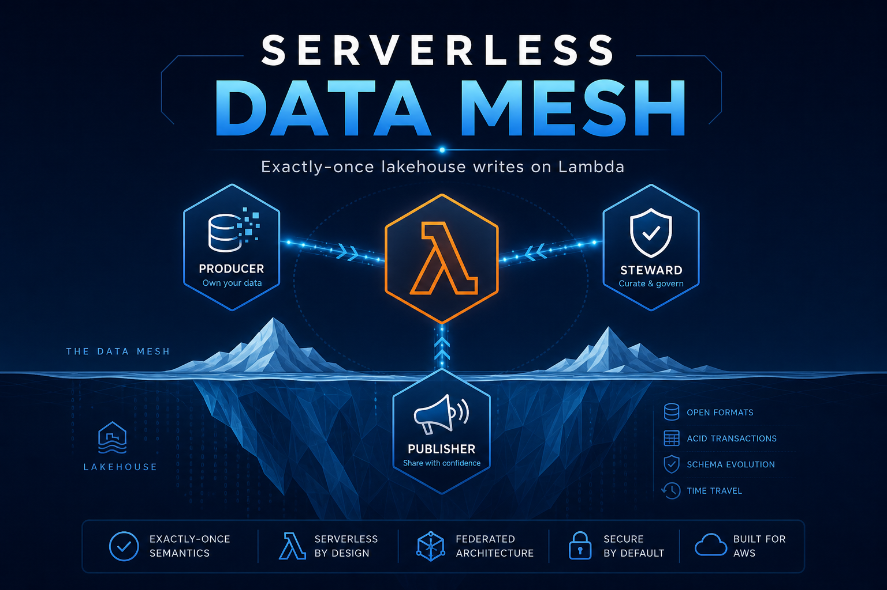
</p>

An open Python framework for **federated data mesh** lakehouse publication on AWS:<br/>
**domain-oriented ownership**, **data as a product**, and **self-serve write infrastructure** for cross-domain teams.<br/>
**Producer** domains publish governed **data products** - **Steward** notaries enforce **federated computational governance** - **Publisher** zones expose consumer-ready **Iceberg data products** to the mesh.

[**PyPI**](https://pypi.org/project/serverless-data-mesh/) · [**Docker (GHCR)**](https://github.com/vaquarkhan/aws-serverless-datamesh-framework/pkgs/container/serverless-data-mesh) · [**Walkthrough**](#how-to-start---walkthrough-gifs--benefits) · [**GIF gallery**](docs/visual-tutorial.md) · [**Vaquar Pattern**](docs/vaquar-pattern.md) · [**Paper (arXiv)**](https://arxiv.org/abs/2608.14643) · [**Deploy**](docs/aws-production-deploy.md)

</div>

---

## How to start - walkthrough (GIFs + benefits)

Read this section in the README - no extra docs required.  
**Interactive auto-play demo:** after `ui --open`, open [http://127.0.0.1:8765/walkthrough](http://127.0.0.1:8765/walkthrough) · or open [docs/demo-walkthrough.html](docs/demo-walkthrough.html)

**Also useful:**

| Resource | Link / command |
|----------|----------------|
| **Full GIF gallery** | [docs/visual-tutorial.md](docs/visual-tutorial.md) |
| **Control center** | `serverless-data-mesh ui --path examples/medallion-e2e/generated --open` → http://127.0.0.1:8765/ |
| **Durable Lambda clocks** | [examples/durable-compute/](examples/durable-compute/) (tfvars + dual-clock guide) |

### Copy / paste to start

**Requires Python 3.12+.** From the repo root:

```bash
pip install serverless-data-mesh

# Optional: 60s proof (no AWS)  -  clean commit, corrupt blocked
serverless-data-mesh demo

# Generate sample mesh + open control center
serverless-data-mesh apply \
  --contract examples/medallion-e2e/northstar.mesh.yaml \
  --output examples/medallion-e2e/generated

serverless-data-mesh ui --path examples/medallion-e2e/generated --open
# → http://127.0.0.1:8765/
# → http://127.0.0.1:8765/walkthrough   (auto-play GIF demo)
```

| In the UI | What to use it for |
|-----------|--------------------|
| Overview | KPIs + trust bars |
| Pipelines | Bronze / silver / gold outputs |
| Trust | VRP PASS/FAIL board |
| Tutorial | Same GIF guide as below |
| **Demo walkthrough** (header) | Auto-play Do / Benefit video |
| **Run PVDM demo** (header) | Local gate demo → updates Trust |

<p align="center">
  
</p>

### Step 1  -  Install & prove the gate

<p align="center">
  
</p>

```bash
pip install serverless-data-mesh
serverless-data-mesh demo
```

| | |
|--|--|
| **You do** | Install, then run `demo` once |
| **You get** | Clean write **commits**; corrupt write is **blocked**  -  in &lt;60s, **no AWS** |
| **Benefit** | Proof that “pipeline succeeded” ≠ trustworthy data |

### Step 2  -  Create mesh YAML

<p align="center">
  
</p>

```bash
serverless-data-mesh new --template medallion --output my-mesh
# or use the retail sample: examples/medallion-e2e/northstar.mesh.yaml
```

| | |
|--|--|
| **You do** | Scaffold (or edit) a medallion / northstar contract |
| **You get** | A domain-owned `mesh.yaml` |
| **Benefit** | Domain teams own the contract  -  not a central Glue ticket queue |

### Step 3  -  Apply (compile pipelines)

<p align="center">
  
</p>

```bash
serverless-data-mesh apply \
  --contract my-mesh/mesh.yaml \
  --output my-mesh/generated
```

| | |
|--|--|
| **You do** | Run `apply` on your contract |
| **You get** | Handlers, Step Functions ASL, VRP config, layer Lambda manifest |
| **Benefit** | One YAML → many proof-gated pipelines (bronze / silver / gold) |

### Step 4  -  Start the control center UI

<p align="center">
  
</p>

```bash
serverless-data-mesh ui --path my-mesh/generated --open
# Control center:  http://127.0.0.1:8765/
# GIF walkthrough: http://127.0.0.1:8765/walkthrough
```

| | |
|--|--|
| **You do** | Point `ui` at the generated folder and open the browser |
| **You get** | KPIs, pipelines, trust, PVDM, durable clocks, Tutorial tab |
| **Benefit** | Review readiness **before** you spend AWS money |

### Step 5  -  Deploy Durable Lambda (AWS)

<p align="center">
  
</p>

```bash
./infrastructure/terraform/scripts/package_lambda.sh
cd infrastructure/terraform/environments/prod
# dual clocks  -  see examples/durable-compute/terraform.tfvars.example
terraform apply
```

| | |
|--|--|
| **You do** | Package the Lambda zip + `terraform apply` ([durable-compute example](examples/durable-compute/)) |
| **You get** | Durable Lambda on Firecracker, on-demand scale-to-zero, dual clocks (segment + workload) |
| **Benefit** | Backfills longer than 15 minutes without idle EMR/Glue clusters |

### Step 6  -  Observe & attest

<p align="center">
  
</p>

```bash
serverless-data-mesh attest demo --json
serverless-data-mesh dashboard --open
```

| | |
|--|--|
| **You do** | Run attestation demo and/or trust dashboard |
| **You get** | VRP proofs + PVDM-A decision records + CloudWatch trust metrics |
| **Benefit** | Auditable publication  -  consumers only see snapshots after **VRP PASS** |

### Quick links (same as the walkthrough footer)

- **Full GIF gallery:** [docs/visual-tutorial.md](docs/visual-tutorial.md)
- **Control center:** `serverless-data-mesh ui --path examples/medallion-e2e/generated --open`
- **Durable Lambda clocks:** [examples/durable-compute/](examples/durable-compute/)

### Docker (GHCR - published image)

Official image (release `v1.2.0` publishes via GitHub Actions to GHCR):

```bash
docker pull ghcr.io/vaquarkhan/serverless-data-mesh:1.2.0
# or: ghcr.io/vaquarkhan/serverless-data-mesh:latest
docker run --rm -p 8765:8765 ghcr.io/vaquarkhan/serverless-data-mesh:1.2.0
# open http://127.0.0.1:8765/
```

Package page: [ghcr.io/vaquarkhan/serverless-data-mesh](https://github.com/vaquarkhan/aws-serverless-datamesh-framework/pkgs/container/serverless-data-mesh)

```bash
# Build locally instead
docker build -t serverless-data-mesh:local .
docker run --rm -p 8765:8765 serverless-data-mesh:local
```

### Install & download stats

| Channel | Command / link |
|---------|----------------|
| **PyPI** | `pip install serverless-data-mesh==1.2.0` · [project](https://pypi.org/project/serverless-data-mesh/) · [monthly stats](https://pypistats.org/packages/serverless-data-mesh) · [total downloads](https://pepy.tech/projects/serverless-data-mesh) |
| **Docker** | `docker pull ghcr.io/vaquarkhan/serverless-data-mesh:latest` |
| **GitHub Release** | [v1.2.0](https://github.com/vaquarkhan/aws-serverless-datamesh-framework/releases/tag/v1.2.0) |

---

## What is this project?

**Serverless Data Mesh** is a coordination framework that turns AWS Lambda into a production-grade **domain write primitive** for lakehouse data meshes.

Instead of routing every backfill through a central Glue fleet, each domain ships a small Lambda handler. The framework wraps that handler in a governed **transaction boundary**: physical safety, cryptographic verification, durable orchestration, and proof-gated Iceberg metadata commits.

It combines four proven building blocks into one contract:

<p align="center">
  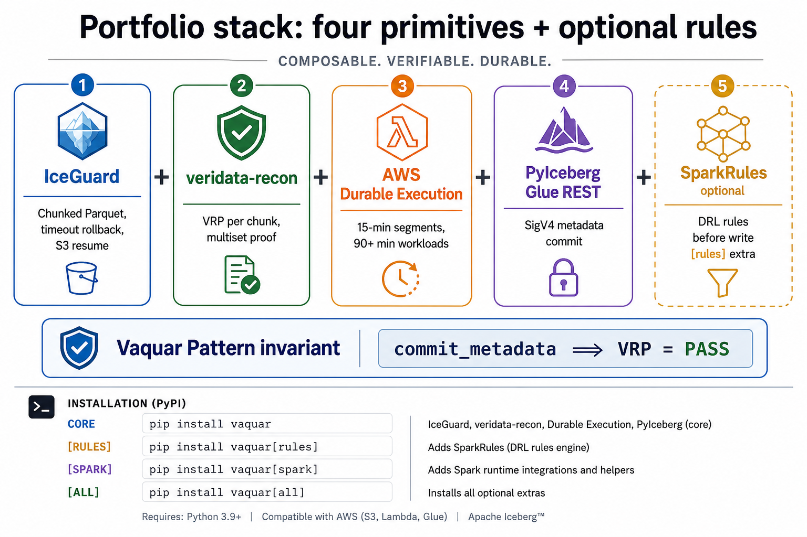
</p>

| Building block | Role |
|----------------|------|
| [IceGuard](https://pypi.org/project/iceguard/) | Chunked Parquet writes, timeout rollback, S3 resume |
| [veridata-recon](https://pypi.org/project/veridata-recon/) | Verifiable Reconciliation Proof (VRP) per chunk |
| [AWS Durable Execution](https://docs.aws.amazon.com/durable-execution/) | Replay completed steps across 15-min Lambda segments |
| [PyIceberg Glue REST](https://py.iceberg.apache.org/) | SigV4 metadata commit via `GlueCatalogConnector` |

Optional: [SparkRules](https://pypi.org/project/sparkrules/) for DRL business rules on Lambda (`pip install serverless-data-mesh[rules]`). See [Verification & business rules](#verification--business-rules) below.

---

## The problem it solves

Most data mesh programs reorganize teams but leave the **write path** centralized. Domains file tickets; a platform team runs Glue; everyone gets a green "success" email. Then analysts find missing rows, auditors get log exports, and nobody can **prove** the partition is correct.

<p align="center">
  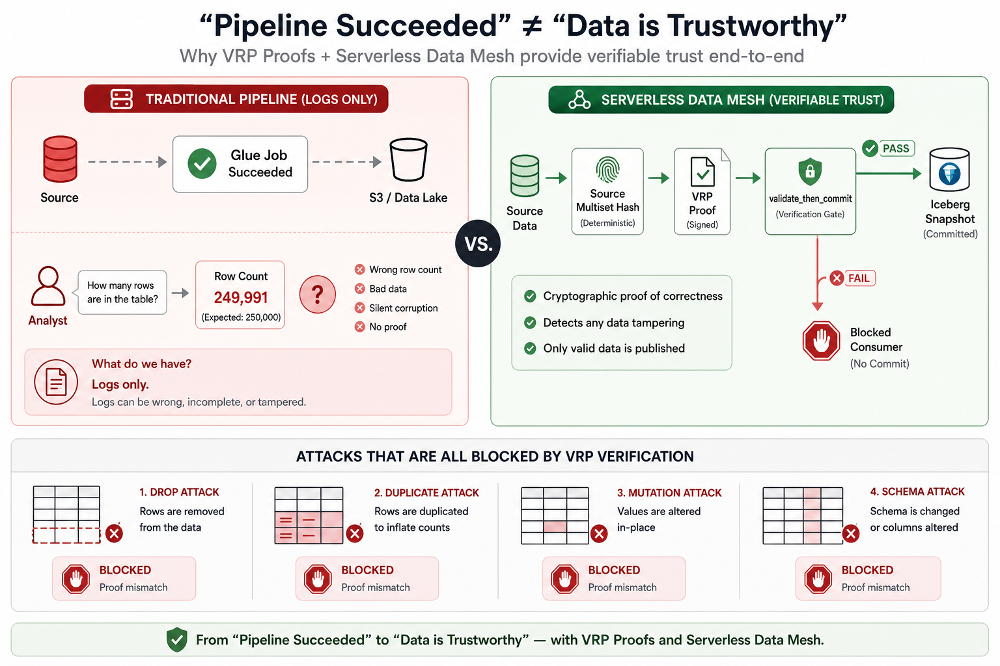
</p>

| Pain | What happens today | What Serverless Data Mesh does |
|------|-------------------|-------------------------------|
| **Silent data loss** | Partition row counts drift; discovered days later | VRP `FAIL` blocks Iceberg snapshot; consumers never see bad data |
| **"Job succeeded" ≠ correct** | Glue exit code 0 with 6 missing rows | Multiset cryptographic proof per chunk |
| **Lambda 15-min limit** | "Use EMR/Glue for real backfills" | Durable Execution + Step Functions resume → **configurable** total runtime (overcomes the per-invoke limit) |
| **Retry duplicates data** | Re-invoke creates duplicate Parquet | IceGuard rollback + `workload_id` checkpoints |
| **Platform bottleneck** | Every domain waits on central ETL | Each domain owns a Lambda writer + declared contract |
| **No audit evidence** | Sample rows and debate | Immutable VRP proofs in Steward S3; offline `verify_proof` |
| **Glue cost for nightly jobs** | DPUs idle 23 hours/day | Lambda scales to zero between backfills |
| **Federated blast radius** | One misconfigured job wipes consumer data | Producer · Steward · Publisher account separation |

**Full problem analysis:** [Why Serverless Data Mesh exists](docs/why-serverless-data-mesh.md)

---

## The solution: Vaquar Pattern

This framework is the **reference implementation** of the **[Vaquar Pattern](docs/vaquar-pattern.md)**  -  a proprietary architectural method invented by **Vaquar Khan** for proof-gated serverless lakehouse publication.

<p align="center">
  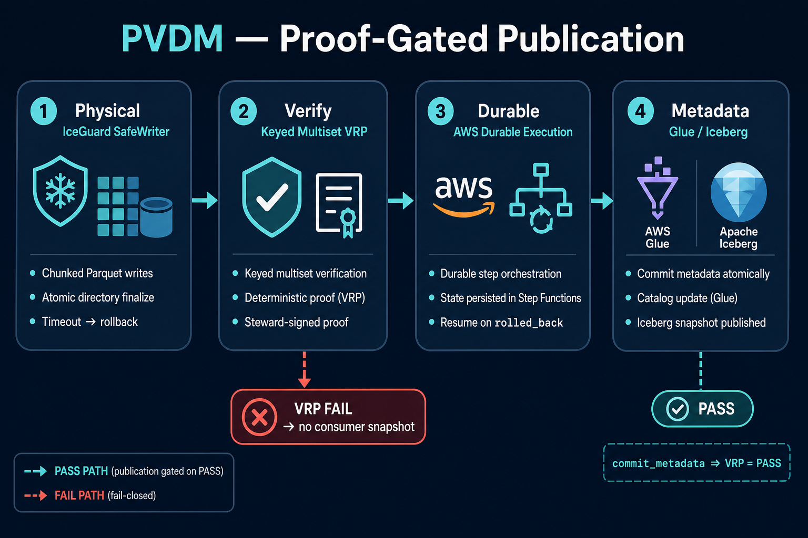
</p>

<p align="center">
  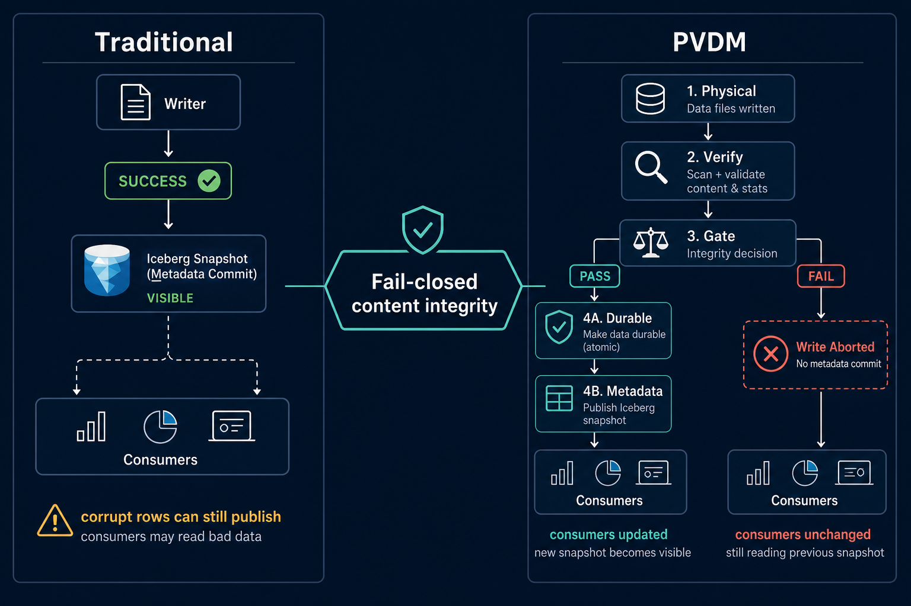
</p>

<p align="center">
  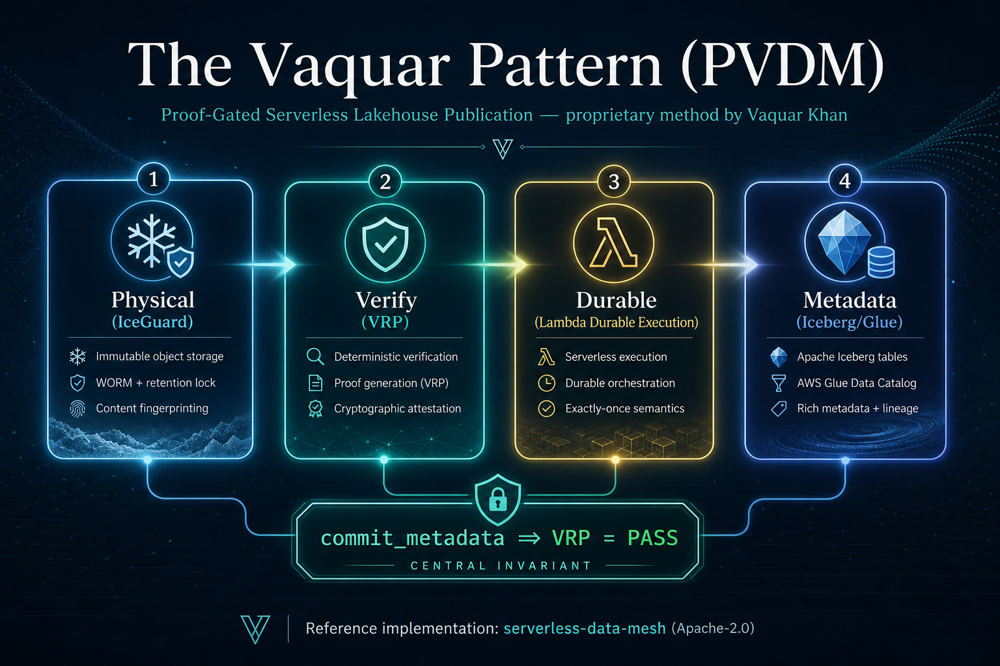
</p>

**Read the paper & reference gate**

| | |
|--|--|
| **arXiv preprint** | [arXiv:2608.14643](https://arxiv.org/abs/2608.14643) — *Proof-Gated Publication: Verify-Before-Commit Content Integrity for Serverless Data-Mesh Lakehouses* |
| **Reference gate + adversarial suite** | [github.com/vaquarkhan/Proof-gated-publication-PVDM](https://github.com/vaquarkhan/Proof-gated-publication-PVDM) (stdlib gate, 30/30 suite, Spark/Iceberg benchmarks) |
| **This repo** | Production AWS mapping (IceGuard · veridata-recon · Durable SDK · Glue/Iceberg) |

> **Proof-Gated Serverless Lakehouse Publication (PVDM)**  
> Physical → Verify → Durable → Metadata  
> Invariant: `commit_metadata ⟹ VRP = PASS`

| | |
|--|--|
| **Method name** | Vaquar Pattern |
| **Operational acronym** | **PVDM** (Physical · Verify · Durable · Metadata) |
| **Inventor** | Vaquar Khan |
| **Copyright** | © 2024–2026 Vaquar Khan  -  proprietary method (name + invariants) |
| **Status** | Proprietary method · open reference implementation (Apache-2.0) |
| **Cite** | [arXiv:2608.14643](https://arxiv.org/abs/2608.14643) · [docs/vaquar-pattern.md](docs/vaquar-pattern.md) · [NOTICE](NOTICE) |

<p align="center">
  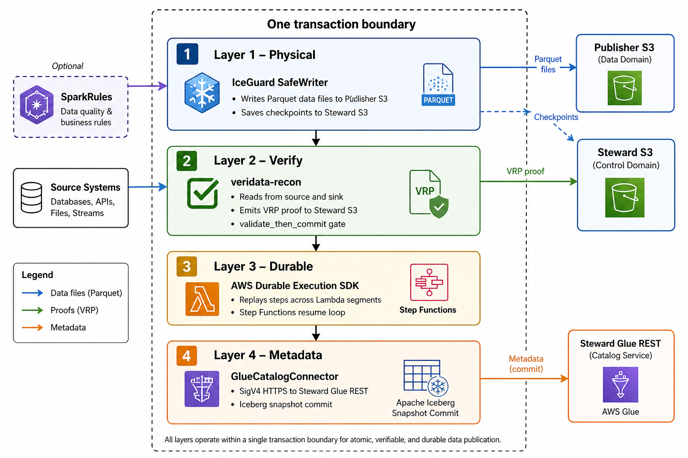
</p>

<p align="center">
  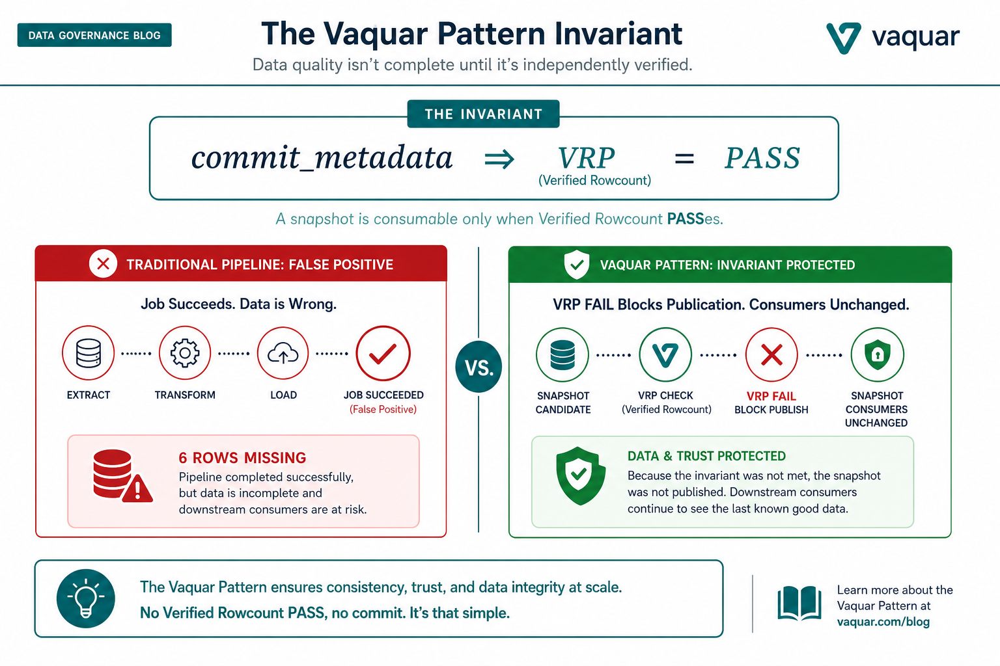
</p>

| Phase | Component | Outcome | Implemented? |
|-------|-----------|---------|--------------|
| **Physical** | IceGuard SafeWriter | Parquet in Publisher S3; checkpoints in Steward S3 | **Yes**  -  `IceGuardDurableCoordinator` + IceGuard watchdog |
| **Verify** | veridata-recon + keyed Steward binding | VRP proof stored; `validate_then_commit` + Metadata TOCTOU gate | **Yes**  -  PASS blocks FAIL before metadata |
| **Durable** | AWS Durable SDK + Step Functions | 15-min segments chained to any configured total | **Yes**  -  `@durable_execution` + SFN resume |
| **Metadata** | GlueCatalogConnector | Iceberg snapshot **only after** VRP PASS | **Yes**  -  proof-gated commit |

Optional (not a fifth PVDM phase): SparkRules DRL / rules gate before Physical; PVDM-A decision attestation after Verify.

What makes this new vs Outbox, Saga, Medallion, and Glue bookmarks: **Iceberg publication is gated on cryptographic multiset proof**, not executor success.

**See it live:** [How to start (GIF walkthrough)](#how-to-start---walkthrough-gifs--benefits) · `serverless-data-mesh demo` · UI `/walkthrough`  
**Paper:** [arXiv:2608.14643](https://arxiv.org/abs/2608.14643) · **Reference gate:** [Proof-gated-publication-PVDM](https://github.com/vaquarkhan/Proof-gated-publication-PVDM)  
**Pattern spec:** [docs/vaquar-pattern.md](docs/vaquar-pattern.md) · **Full blog:** [docs/blog-the-vaquar-pattern.md](docs/blog-the-vaquar-pattern.md) · **Compute model:** [examples/durable-compute/](examples/durable-compute/)

---

## Durable Lambda compute model

**No idle EMR/Glue clusters. No EC2 on-demand fleet.** Domain writers run on **AWS Lambda** with **Durable Execution**, Firecracker isolation, and **fully configurable dual clocks**.

<p align="center">
  
</p>

| Capability | What we use | What we do **not** run |
|------------|-------------|-------------------------|
| **Durable Lambda** | `@durable_execution` + Terraform `durable_config` | Glue ETL as the write path |
| **MicroVM isolation** | AWS Lambda on **Firecracker** microVMs (AWS-managed) | Custom Firecracker / self-managed microVMs |
| **On-demand compute** | **On-demand Lambda** scaling (scale to zero) | EC2 on-demand / ASG fleets; provisioned concurrency (optional later) |
| **Configurable time** | Per-invoke timeout **and** durable total budget | Fixed 15-min wall clock for the whole backfill |

### Dual clocks (Terraform-tunable)

| Knob | tfvars / variable | Meaning | Limits |
|------|-------------------|---------|--------|
| **Container clock** | `lambda_timeout_seconds` | One Lambda invocation | 1–**900** s (AWS hard max / 15 min) |
| **Workload clock** | `durable_execution_timeout_seconds` | Total durable budget across segments | **Configurable** — set to your backfill wall-clock (AWS allows up to ~1 year) |
| **IceGuard lead time** | `iceguard_rollback_threshold_ms` | Rollback before hard kill | Auto or explicit ms |
| **SFN resume** | `max_resume_attempts`, `resume_wait_seconds` | Re-invoke after `rolled_back` | Tunable (auto-bumped from durable ÷ segment) |

```hcl
# infrastructure/terraform/environments/prod/terraform.tfvars (example)
enable_durable_execution           = true
lambda_timeout_seconds             = 900      # 15 min per segment (AWS max)
# Workload clock: set to whatever your job needs — this is how we overcome the
# 15-minute Lambda limit (segments chain until the durable budget is used).
durable_execution_timeout_seconds  = 10800
lambda_memory_mb                   = 4096
iceguard_rollback_threshold_ms     = 30000    # yield before hard timeout
```

Long backfills = **many durable segments** (each ≤ `lambda_timeout_seconds`), not one forever-running process. Configure `durable_execution_timeout_seconds` for the full job; IceGuard rolls back incomplete chunks; Durable SDK replays completed steps; Step Functions resumes on `rolled_back`.

→ [Durable compute example](examples/durable-compute/README.md) · [Architecture](docs/architecture.md#durable-lambda-compute-model)

---

## Verification & business rules

The Vaquar Pattern’s **Verify** phase is powered by [veridata-recon](https://pypi.org/project/veridata-recon/) on PyPI. Optional [SparkRules](https://pypi.org/project/sparkrules/) DRL runs **before** physical writes and VRP  -  on Lambda, not Glue ETL.

### veridata-recon: VRP per chunk

Every chunk gets a **Verifiable Reconciliation Proof**: multiset hashes over `identity_fields` and `content_fields` compare source rows to sink Parquet. `validate_then_commit` blocks Iceberg metadata unless `verdict = PASS`.

<p align="center">
  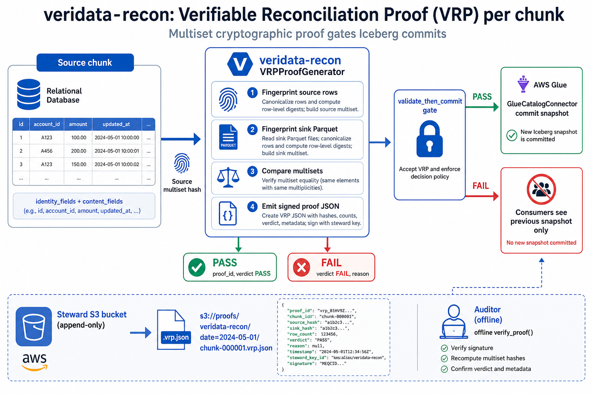
</p>

| VRP outcome | What happens | Consumer impact |
|-------------|--------------|-----------------|
| **PASS** | Proof stored in Steward S3; metadata commit proceeds | New Iceberg snapshot visible |
| **FAIL** | `verification_failed`; no snapshot commit | Previous snapshot unchanged |
| **Offline audit** | `verify_proof()` on `chunk-NNNNNN.vrp.json` | Auditors verify without source access |

```python
from serverless_data_mesh import VRPProofGenerator, validate_then_commit

proof = VRPProofGenerator().generate(source_rows, sink_rows, identity_fields=["payment_id"])
validate_then_commit(proof)  # raises if verdict != PASS
```

**Attacks blocked:** drop, duplicate, mutation, schema drift  -  see the [consumer safety benchmark](eval/validate_then_commit_benchmark.py) (`make benchmark`).

→ [Vaquar Pattern invariant (image)](docs/blog-the-vaquar-pattern.md#4-the-vaquar-invariant) · [Observability: VRP metrics & S3 proofs](docs/observability-production.md)

### SparkRules: DRL on Lambda before VRP

Domain teams declare rules in YAML (`spark_rules_enabled: true`) or load Steward-hosted DRL from S3. Rules enrich or gate chunks in pure Python (`apply_chunk`) or optional PySpark-on-Lambda (`apply_drl_spark`).

<p align="center">
  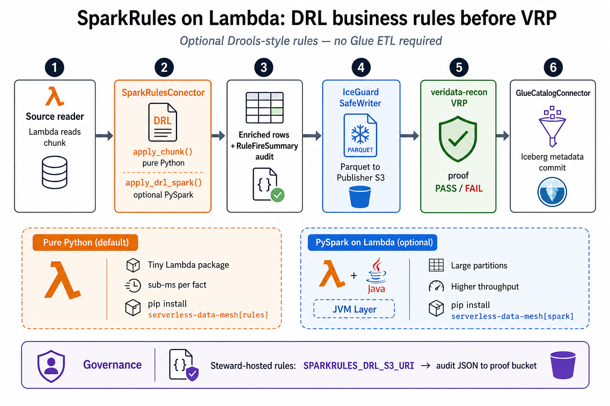
</p>

| Mode | Install | When to use |
|------|---------|-------------|
| **Pure Python** | `pip install "serverless-data-mesh[rules]"` | Default  -  sub-ms per fact, small Lambda zip |
| **PySpark on Lambda** | `pip install "serverless-data-mesh[spark]"` | Large partitions, same DRL at scale |
| **Steward governance** | `SPARKRULES_DRL_S3_URI=s3://steward-rules/...` | Central rule packs + `RuleFireSummary` audit lineage |

```yaml
# mesh.yaml excerpt  -  compiler emits SparkRules hook in readers.py
runtime:
  engine: pyarrow
  package_extras: rules
  spark_rules_enabled: true
```

```python
from serverless_data_mesh import SparkRulesConnector

connector = SparkRulesConnector.from_environment()  # or from_s3(...)
enriched, audit = connector.apply_chunk(source_records)
```

**Order matters:** Rules → Physical write (IceGuard) → VRP (veridata-recon) → Metadata (Glue REST). Failed rules block the chunk before VRP runs.

→ [SparkRules connector guide](docs/sparkrules-connector.md) · [Retail mesh PySpark example](examples/retail-mesh/README.md)

---

## Key features

<table>
<tr>
<td width="50%" valign="top">

### Domain autonomy
- Per-domain Lambda handler (`examples/domain_writer/`)
- `DomainTransactionBoundary` declares write scope
- `DataProductContract` for registry-facing metadata
- No central Glue ETL as the write primitive

### Cryptographic trust
- VRP proof per chunk (veridata-recon)
- `validate_then_commit` blocks metadata on `FAIL`
- Consumer safety benchmark: drop / duplicate / mutation attacks
- Offline auditor verification without source access

</td>
<td width="50%" valign="top">

### Serverless at scale
- 15-min Lambda segments chained to a configurable total runtime (overcomes the AWS per-invoke limit)
- IceGuard watchdog rollback before hard timeout
- Durable step replay: no duplicate committed chunks
- Terraform-tunable `lambda_timeout_seconds`

### Production ready
- Step Functions orchestrator + DLQ + monitoring
- Single-account `prod` and multi-account Terraform roots
- SAM template alternative
- CI: tests, benchmark, walkthrough, terraform validate

</td>
</tr>
<tr>
<td width="50%" valign="top">

### Federated governance
- **Producer**: domain compute
- **Steward**: proofs, checkpoints, Glue catalog (notary)
- **Publisher**: lakehouse S3, consumer Iceberg tables
- Lake Formation cross-account grants

</td>
<td width="50%" valign="top">

### Extensible
- `GlueCatalogConnector`: metadata only, not Glue ETL
- PySpark / Polars / PyArrow on Lambda
- `SparkRulesConnector`: DRL rules before VRP (`[rules]` extra)
- PyPI extras: `[rules]`, `[spark]`, `[all]`, `[dev]`

</td>
</tr>
</table>

---

## Create pipelines from YAML

**Metadata-driven pipeline creation**  -  define your mesh in YAML; the compiler generates proof-gated Lambda pipelines, Step Functions orchestrators, VRP config, consumer SLAs, and Terraform manifests. Domain teams only implement `readers.py` (source/sink I/O).

<p align="center">
  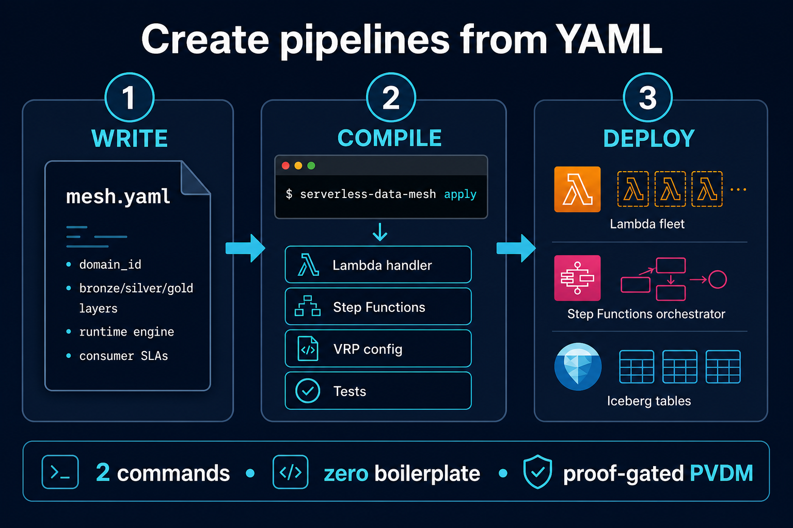
</p>

### Two commands to a full mesh

```bash
pip install serverless-data-mesh

# 1. Starter template (medallion, single pipeline, or northstar retail)
serverless-data-mesh new --template medallion --output my-mesh

# 2. Validate + compile + doctor + deploy checklist
serverless-data-mesh apply --contract my-mesh/mesh.yaml --output my-mesh/generated
```

| Command | What it does |
|---------|----------------|
| `new` | Copy starter YAML (`medallion`, `single`, `northstar`) |
| `apply` | validate → compile → doctor → `GETTING_STARTED.md` |
| `compile` | Generate pipelines only (advanced) |
| `validate` | Fast CI gate on YAML schema |
| `doctor` | List which `readers.py` still need your code |
| `deploy` | apply + Terraform + optional Step Functions start |

### One YAML → bronze / silver / gold medallion

A single `MedallionMesh` contract expands into **N domains × 3 layers** plus mesh-wide orchestration. The [northstar example](examples/medallion-e2e/northstar.mesh.yaml) produces **6 PVDM pipelines** (orders + payments) from one file.

<p align="center">
  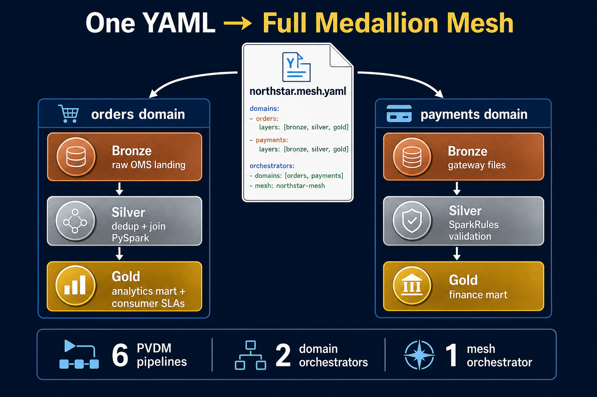
</p>

```bash
serverless-data-mesh apply \
  --contract examples/medallion-e2e/northstar.mesh.yaml \
  --output examples/medallion-e2e/generated
```

### What `apply` generates

<p align="center">
  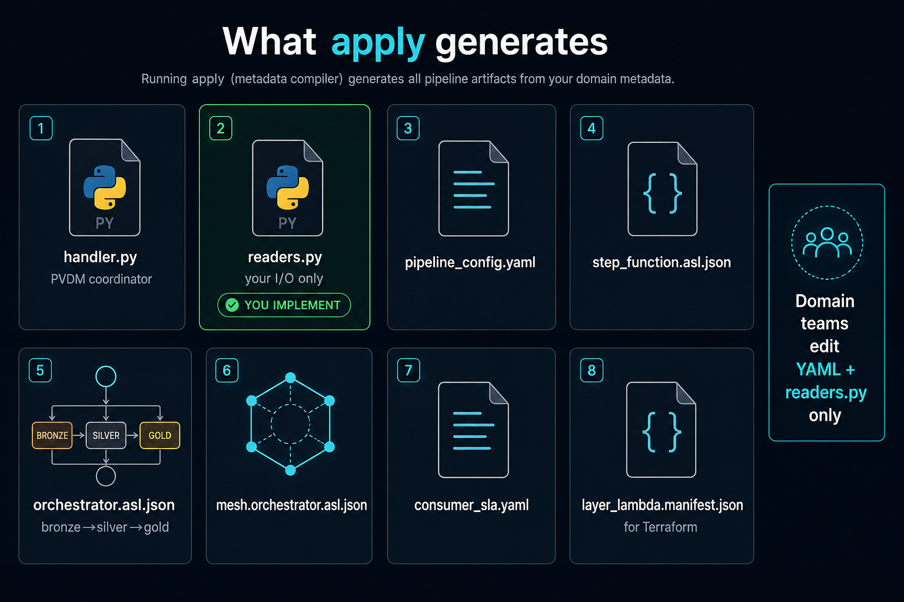
</p>

| You write | Framework generates |
|-----------|---------------------|
| `mesh.yaml` metadata | Lambda handlers, durable Step Functions |
| `readers.py` per layer | VRP proof config, auto-repair hooks, tests |
| One-time Terraform wiring | Per-layer `layer_lambda.manifest.json`, mesh orchestrator ASL |

**Single-table pipeline** (add one data product without full medallion):

```bash
serverless-data-mesh compile \
  --contract examples/contracts/payments.mesh.pipeline.yaml \
  --output domains/
```

→ [Metadata-driven pipeline guide](docs/metadata-driven-pipeline.md) · [5-min AWS deploy](docs/first-mesh-on-aws.md) · [Medallion example](examples/medallion-e2e/README.md)

---

## Architecture

### Three-account federated mesh

<p align="center">
  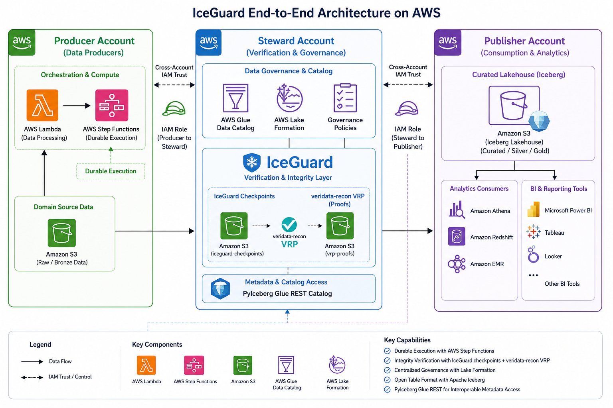
</p>

| Account | Owner | Responsibility |
|---------|-------|----------------|
| **Producer** | Domain team (Orders, Payments, …) | Source data, Step Functions, domain writer Lambda |
| **Steward** | Platform / governance | Glue catalog, Lake Formation, checkpoints, VRP proofs |
| **Publisher** | Analytics / data products | Curated lakehouse S3, Iceberg tables, consumer access |

**Flow:** Producer Lambda reads source → writes Parquet to Publisher → stores proofs in Steward → commits metadata via Steward Glue REST → consumers query Publisher.

→ [Full deploy guide](docs/data-mesh-end-to-end.md)

---

### Lambda execution model

<p align="center">
  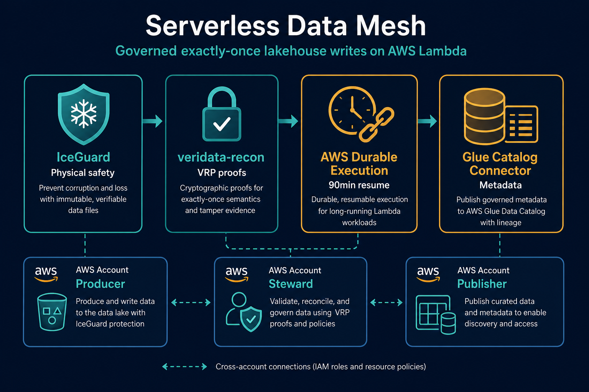
</p>

<p align="center">
  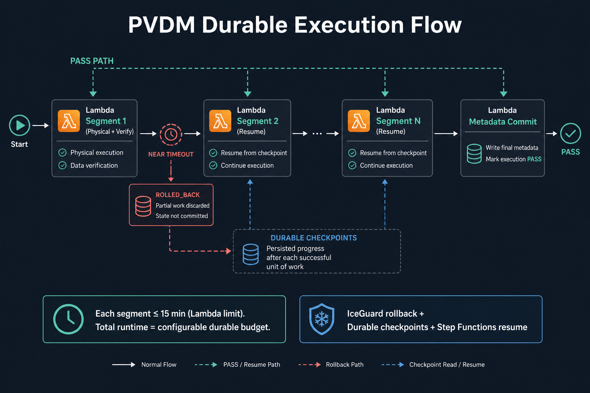
</p>

**Compute on Lambda. Catalog via Glue connector. No Glue ETL jobs.**

| Layer | Runs on Lambda? | Component |
|-------|-----------------|-----------|
| Physical transforms | Yes | PySpark-on-Lambda, Polars, PyArrow |
| Business rules (optional) | Yes | SparkRules `LocalRuleExecutor` |
| AWS Glue ETL jobs | **No** | Separate managed service; not used for writes |
| Glue Data Catalog metadata | API only | `GlueCatalogConnector` (HTTPS + SigV4) |

```
Event / Step Functions
        │
        ▼
Lambda :live  (15-min segments; total budget = durable_execution_timeout_seconds)
        │
        ├── Read source        → domain-specific reader
        ├── SparkRules         → optional DRL filter
        ├── IceGuard           → chunked Parquet + S3 checkpoints + rollback
        ├── veridata-recon     → VRP proof per chunk
        ├── Durable SDK        → replay completed steps on resume
        └── GlueCatalogConnector → Glue Iceberg REST metadata commit
        │
        ▼
   committed │ rolled_back → resume │ verification_failed
```

→ [Glue connector guide](docs/glue-connector.md) · [Architecture](docs/architecture.md)

---

## Quick start

**Requires Python 3.12+**

### Try in 60 seconds (no AWS)

Works on **Windows, Mac, and Linux**  -  pure-Python verifier fallback when Rust wheels unavailable.

```bash
pip install serverless-data-mesh
serverless-data-mesh demo
```

### Install from PyPI

**Package:** [`serverless-data-mesh`](https://pypi.org/project/serverless-data-mesh/) · **Requires Python 3.12+** · **Latest:** [1.2.0](https://pypi.org/project/serverless-data-mesh/1.2.0/)

| | Link |
|---|------|
| **PyPI project** | https://pypi.org/project/serverless-data-mesh/ |
| **Download files (1.2.0)** | https://pypi.org/project/serverless-data-mesh/1.2.0/#files |
| **5-min AWS guide** | [docs/first-mesh-on-aws.md](docs/first-mesh-on-aws.md) |

**Recommended install (pip):**

```bash
# Latest release
pip install serverless-data-mesh

# Pin a version (recommended for production)
pip install serverless-data-mesh==1.2.0

# Upgrade
pip install -U serverless-data-mesh
```

| Extra | Install command | What you get |
|-------|-----------------|--------------|
| *(core)* | `pip install serverless-data-mesh` | IceGuard, veridata-recon, Durable SDK, PyIceberg Glue REST, boto3 |
| `[rules]` | `pip install "serverless-data-mesh[rules]"` | + [SparkRules](https://pypi.org/project/sparkrules/) DRL on Lambda |
| `[spark]` | `pip install "serverless-data-mesh[spark]"` | + PySpark + SparkRules (large Lambda package) |
| `[all]` | `pip install "serverless-data-mesh[all]"` | rules + spark |
| `[dev]` | `pip install "serverless-data-mesh[dev]"` | pytest, ruff, pre-commit (contributors) |

**Verify install:**

```bash
python -c "import serverless_data_mesh as sdm; print(sdm.__version__)"
serverless-data-mesh demo          # local PVDM gate demo (<60s, no AWS)
serverless-data-mesh new --template medallion --output my-mesh
serverless-data-mesh apply --contract my-mesh/mesh.yaml --output my-mesh/generated
serverless-data-mesh ui --path my-mesh/generated --open   # mesh control panel
```

### Local mesh control UI

After `apply`, open the **control center** (KPIs, pipelines, trust board, PVDM, durable clocks, visual tutorial):

```bash
serverless-data-mesh new --template medallion --output my-mesh
serverless-data-mesh apply --contract my-mesh/mesh.yaml --output my-mesh/generated
serverless-data-mesh ui --path my-mesh/generated --host 127.0.0.1 --port 8765 --open
# → http://127.0.0.1:8765/
```

Or against the northstar sample:

```bash
serverless-data-mesh apply \
  --contract examples/medallion-e2e/northstar.mesh.yaml \
  --output examples/medallion-e2e/generated
serverless-data-mesh ui --path examples/medallion-e2e/generated --open
```

**UI features:** Overview KPIs · pipeline explorer · VRP trust bars · PVDM-A attestations · dual-clock durable panel · in-app GIF tutorial · one-click local PVDM / attest demos.

**Visual tutorial (GIFs):** [docs/visual-tutorial.md](docs/visual-tutorial.md)

**Platform notes:**

- **Linux (Lambda / CI):** full cryptographic VRP via `veridata-recon` wheels.
- **Windows / Mac (local dev):** `demo`, `canary`, and `reprocess-demo` work via pure-Python fallback when Rust wheels are unavailable.
- **AWS deploy:** build a Linux-compatible Lambda zip with `infrastructure/terraform/scripts/package_lambda.sh` (see [PyPI guide](docs/pypi.md)).

→ Full install, extras, and publish docs: [docs/pypi.md](docs/pypi.md)

### Cost comparison (published estimates)

| Workload | Lambda+PVDM | Glue ETL | Savings |
|----------|-------------|----------|---------|
| 100K rows | $0.025 | $0.22 | **8.7x** |
| 1M rows | $0.025 | $0.44 | **17x** |
| 10M rows | $0.051 | $1.47 | **29x** |

Details: [benchmarks/README.md](benchmarks/README.md) · `make cost-estimate`

### More CLI tools

```bash
serverless-data-mesh dashboard              # HTML trust dashboard (proofs / CloudWatch / demo)
serverless-data-mesh dashboard --cloudwatch # live VRP metrics from CloudWatch
serverless-data-mesh canary                 # VRP canary before promotion
serverless-data-mesh reprocess-demo         # auto-repair dropped records after VRP FAIL
serverless-data-mesh catalog export --contract my-mesh/mesh.yaml  # Backstage entities
```

**Production features:** auto VRP reprocessing, live CloudWatch + Grafana trust dashboard, Lake Formation consumer SLA enforcement. See [docs/mesh-trust-dashboard.md](docs/mesh-trust-dashboard.md).

### Full development setup

```bash
git clone https://github.com/vaquarkhan/aws-serverless-datamesh-framework.git
cd aws-serverless-datamesh-framework

make install
make test
make demo             # PVDM demo (fallback verifier on Windows/Mac)
make gate-demo        # verification gate fire-alarm demo
make multi-domain     # orders + payments atomicity
make cost-estimate    # populate benchmark cost JSON
make walkthrough      # 12-step tutorial (no AWS)
make benchmark        # consumer safety: corrupt data never commits
```

### Minimal code example

```python
from serverless_data_mesh import (
    IceGuardDurableCoordinator,
    GlueCatalogConnector,
    DataProductContract,
    DomainTransactionBoundary,
    VRPProofGenerator,
    DataWriteWorkload,
)

boundary = DomainTransactionBoundary(
    domain_id="orders-domain",
    source_namespace="raw_orders",
    target_table="orders_curated",
    partition_spec={"dt": "2026-06-14"},
)

coordinator = IceGuardDurableCoordinator(
    durable_context=durable_ctx,
    lambda_context=lambda_ctx,
    proof_generator=VRPProofGenerator(),
    catalog_adapter=glue_adapter,
)
outcome = coordinator.run_workload(workload)
# outcome ∈ {committed, rolled_back, verification_failed}
```

→ [13-step developer tutorial](docs/getting-started.md)

---

## Deploy to AWS

**Prod-grade checklist (SNS confirm + alarms + smoke):** [docs/aws-production-deploy.md](docs/aws-production-deploy.md)

```bash
./infrastructure/terraform/scripts/package_lambda.sh
cd infrastructure/terraform/environments/prod
cp terraform.tfvars.example terraform.tfvars
# set unique buckets + ops_alert_emails, then:
terraform init && terraform apply
# Confirm the SNS subscription email before go-live
```

| Path | Use when |
|------|----------|
| **[AWS production deploy](docs/aws-production-deploy.md)** | SNS, SFN alarms, DLQ IAM, smoke scripts, runbook |
| **[Terraform (production)](infrastructure/terraform/README.md)** | Step Functions, DLQ, SNS, monitoring, dual clocks |
| [Multi-account mesh](infrastructure/terraform/environments/multi-account/README.md) | Producer / Steward / Publisher across AWS accounts |
| [SAM alternative](infrastructure/sam/README.md) | SAM-native teams |
| [Deployment guide](docs/deployment.md) | Env vars / IAM summary |

→ [Terraform step-by-step](docs/terraform-guide.md)

---

## Documentation

| Document | What you will learn |
|----------|---------------------|
| **[Metadata-driven pipelines](docs/metadata-driven-pipeline.md)** | **Complete guide: YAML schema, bronze/silver/gold, compile, deploy** |
| **[Vaquar Pattern (proprietary method)](docs/vaquar-pattern.md)** | Formal PVDM spec  -  cite this; inventor attribution |
| **[PVDM paper (arXiv:2608.14643)](https://arxiv.org/abs/2608.14643)** | Proof-gated publication preprint (methods + evaluation) |
| **[PVDM reference gate](https://github.com/vaquarkhan/Proof-gated-publication-PVDM)** | Stdlib gate + 30-case adversarial suite + Spark benchmarks |
| **[Visual tutorial (GIFs)](docs/visual-tutorial.md)** | Step-by-step animated walkthrough + control UI Tutorial tab |
| **[Durable compute example](examples/durable-compute/README.md)** | Lambda dual clocks, Firecracker, on-demand, tfvars |
| **[Observability (production)](docs/observability-production.md)** | Structured logs, VRP S3 proofs, CloudWatch dashboard, DLQ smoke tests |
| **[Medallion example](examples/medallion-e2e/README.md)** | One YAML → 6 pipelines + orchestrators |
| **[Retail flat ETL example](examples/retail-mesh/README.md)** | 5 domain pipelines, PySpark on Lambda |
| **[Vaquar Pattern blog](docs/blog-the-vaquar-pattern.md)** | Full article: images, journey, adoption playbook |
| **[Vaquar Pattern spec](docs/vaquar-pattern.md)** | Formal spec - cite this in architecture docs |
| **[Why Serverless Data Mesh](docs/why-serverless-data-mesh.md)** | Blog: industry problem, connectivity, portfolio stack |
| **[Data mesh patterns](docs/data-mesh-patterns.md)** | 13 named patterns + concept coverage matrix |
| **[Multi-account deploy guide](docs/data-mesh-end-to-end.md)** | Three-account journey, IAM, deploy order |
| [Getting started](docs/getting-started.md) | Hands-on tutorial for domain engineers |
| [Architecture](docs/architecture.md) | Components, failure modes, configurable durable execution |
| **[Due diligence: claims vs repo](docs/due-diligence-architecture-claims.md)** | What is shipped vs overstated vs roadmap (PVDM-A / MCP) |
| [PVDM-A / Agentic roadmap](docs/roadmap-pvdm-a-agentic.md) | Decision attestation + MCP plan (not shipped yet) |
| [Glue connector](docs/glue-connector.md) | Lambda + Spark vs Glue ETL |
| [SparkRules connector](docs/sparkrules-connector.md) | DRL business rules on Lambda |
| [Domain contracts](docs/domain-contracts.md) | Event schema and boundary contracts |
| [Walkthrough](examples/tutorials/walkthrough.py) | Runnable local demo |

---

## Project structure

```
serverless-data-mesh/
├── docs/
│   ├── metadata-driven-pipeline.md # Complete YAML → pipeline guide (medallion)
│   ├── blog-the-vaquar-pattern.md  # Full Vaquar Pattern blog (images)
│   ├── vaquar-pattern.md           # Formal pattern spec (cite this)
│   ├── why-serverless-data-mesh.md # Blog article with diagrams
│   ├── data-mesh-end-to-end.md     # Three-account deploy guide
│   ├── aws-production-deploy.md    # SNS, alarms, smoke, runbook
│   ├── data-mesh-patterns.md       # Pattern catalog + coverage matrix
│   ├── observability-production.md # VRP logs, metrics, S3 proofs, DLQ
│   └── images/                     # Architecture and product diagrams
├── examples/
│   ├── medallion-e2e/              # One YAML → bronze/silver/gold mesh
│   ├── retail-mesh/                # Flat pipelines real-world ETL
│   ├── durable-compute/            # Dual-clock Lambda timeout / durable tfvars
│   ├── contracts/                  # Single DataProductPipeline samples
│   ├── domain_writer/              # Reference Lambda handler
│   └── tutorials/                  # Interactive walkthrough
├── infrastructure/
│   ├── terraform/                  # Prod + multi-account IaC
│   └── sam/                        # AWS SAM template
├── src/serverless_data_mesh/       # Framework library
├── eval/                           # Consumer safety benchmark
└── tests/
```

---

## Governance and quality

| Artifact | Purpose |
|----------|---------|
| `eval/validate_then_commit_benchmark.py` | Proves corrupt data never reaches consumers |
| `SECURITY.md` | Vulnerability reporting policy |
| `.pre-commit-config.yaml` | Ruff lint + version sync hooks |
| `.github/dependabot.yml` | Automated dependency updates |
| `VERSION` + `scripts/sync_version.py` | Single source of truth for releases |

```bash
make benchmark      # 5 attack scenarios; all must VRP FAIL
make version-check  # VERSION / pyproject / __init__ in sync
make pre-commit     # Local quality gates
```

---

## Who is this for?

| Role | Value |
|------|-------|
| **Domain data engineers** | Own your write path without operating clusters |
| **Platform / data architects** | Federated mesh with proof notary and blast-radius control |
| **Analytics consumers** | Trust VRP proofs + Iceberg snapshots, not job logs |
| **Auditors / compliance** | Offline cryptographic verification per chunk |
| **FinOps** | Lambda per backfill instead of always-on Glue DPUs |

---

## License

Apache-2.0 for the reference implementation code. See [LICENSE](LICENSE).

**PVDM / Vaquar Pattern** is a **proprietary method** of **Vaquar Khan** (© 2024–2026). See [NOTICE](NOTICE) and [docs/vaquar-pattern.md](docs/vaquar-pattern.md).

**Paper:** [arXiv:2608.14643](https://arxiv.org/abs/2608.14643) · **Reference gate + suite:** [Proof-gated-publication-PVDM](https://github.com/vaquarkhan/Proof-gated-publication-PVDM)

---

<div align="center">

**Serverless Data Mesh** · [PyPI](https://pypi.org/project/serverless-data-mesh/) · [Paper](https://arxiv.org/abs/2608.14643) · [Vaquar Pattern blog](docs/blog-the-vaquar-pattern.md) · [GitHub](https://github.com/vaquarkhan/aws-serverless-datamesh-framework)

*Domain teams own the write path. The mesh proves correctness before consumers see a snapshot.*

*Vaquar Pattern (PVDM)  -  © 2024–2026 Vaquar Khan · proprietary method · reference implementation Apache-2.0 · see [NOTICE](NOTICE)*

</div>
