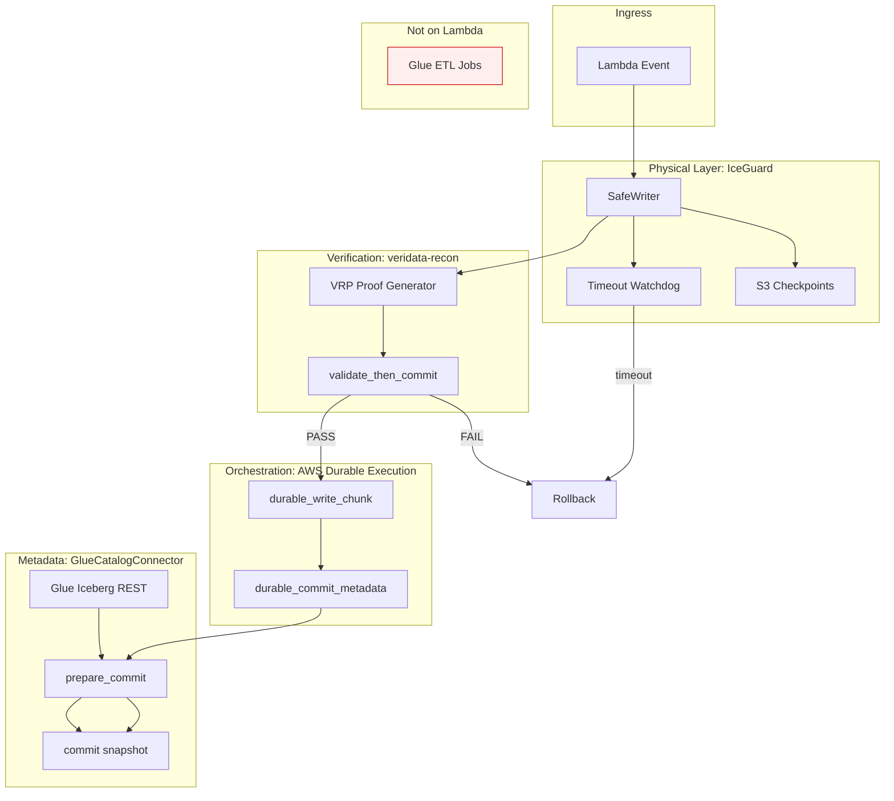
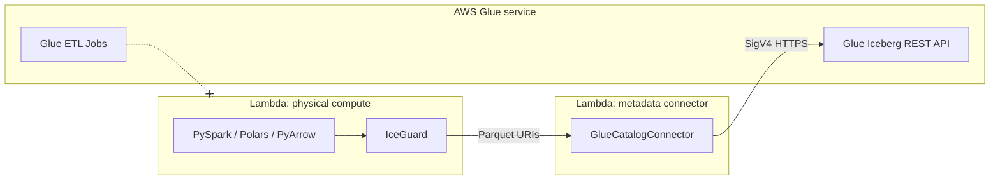
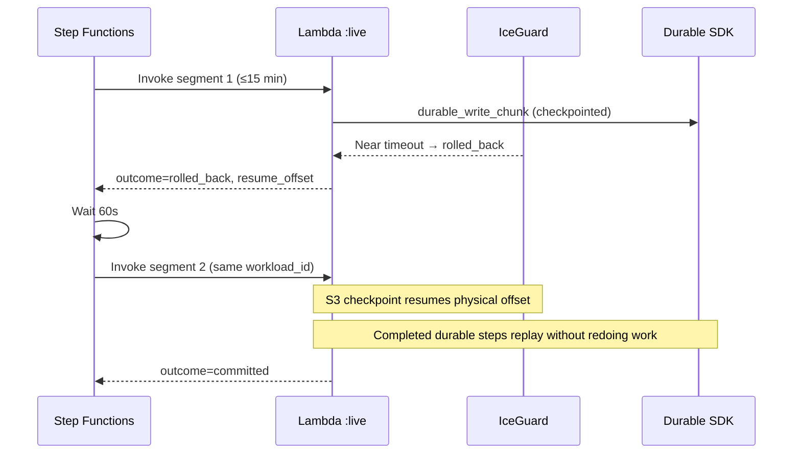

# Architecture

## Overview

Serverless Data Mesh coordinates **cross-domain lakehouse writes** on AWS Lambda.
Each domain team publishes data under a declared transaction boundary; the framework
enforces exactly-once semantics, cryptographic verification, and resumable execution.

For the full **Producer · Steward · Publisher** federated model and step-by-step backfill journey, see **[Data Mesh End-to-End](data-mesh-end-to-end.md)**.

For **Lambda + Spark vs Glue ETL** and the metadata connector, see **[Glue Catalog Connector](glue-connector.md)**.

For the **concept coverage matrix** and **named patterns**, see **[Data Mesh Patterns](data-mesh-patterns.md)**.

## Components



## Transaction phases

| Phase | Owner | Responsibility |
|-------|-------|----------------|
| Physical write | IceGuard | Chunked Parquet writes, watchdog rollback, S3 resume |
| Verification | veridata-recon | Source/sink multiset proof per chunk |
| Durable checkpoint | AWS Durable SDK | Cross-invocation step replay |
| Metadata commit | GlueCatalogConnector | Iceberg 2PC over Glue REST (SigV4 HTTPS) |

## Compute vs catalog (Lambda + Spark, not Glue ETL)



| Runs on Lambda | Does not run on Lambda |
|----------------|------------------------|
| PySpark-on-Lambda, Polars, PyArrow | AWS Glue ETL jobs |
| IceGuard, VRP, Durable SDK | Glue Interactive Sessions |
| `GlueCatalogConnector` (REST client only) | Glue Studio job execution |

Full guide: **[glue-connector.md](glue-connector.md)**.

## Failure modes

- **VRP FAIL**: metadata commit blocked; physical files eligible for rollback
- **Lambda timeout**: IceGuard rolls back uncommitted Parquet; durable steps resume
- **Catalog error**: `CatalogCommitError`; abort without publishing snapshot

## Long-running execution (90+ minutes)

Lambda containers still have a **15-minute hard cap** per invocation (`timeout = 900`).
The framework supports longer backfills with **two cooperating clocks**:

| Layer | Setting | Default | Role |
|-------|---------|---------|------|
| Per invocation | Lambda `timeout` | 900s (15 min) | One container segment; IceGuard watchdog fires before this limit |
| Total durable budget | `durable_config.execution_timeout` | 5400s (90 min) | AWS Durable Execution ceiling for one execution ID across replays |
| Orchestration | Step Functions `max_resume_attempts` | ≥ 8 for 90 min | Re-invokes after `rolled_back` when a segment ends early |
| Per SFN task | `TimeoutSeconds` on `lambda:invoke` | 960s | Waits for **one** segment to return, not the full 90 minutes |



**Direct invoke** (qualified `:live` ARN, no Step Functions): durable execution can chain platform-managed replays within `execution_timeout` without returning `rolled_back` between segments: useful for jobs that fit entirely under the durable budget.

**Step Functions backfill**: each `rolled_back` ends one segment; the resume loop starts a new invocation. IceGuard S3 checkpoints (keyed by `workload_id`) carry the physical resume offset; durable step checkpoints prevent re-writing verified chunks.

Tune in Terraform (`environments/prod/terraform.tfvars`):

```hcl
durable_execution_timeout_seconds = 5400   # 90 minutes
max_resume_attempts               = 10     # auto-bumped to ceil(5400/900)+2 if lower
lambda_per_invocation_timeout_seconds = 900
```
