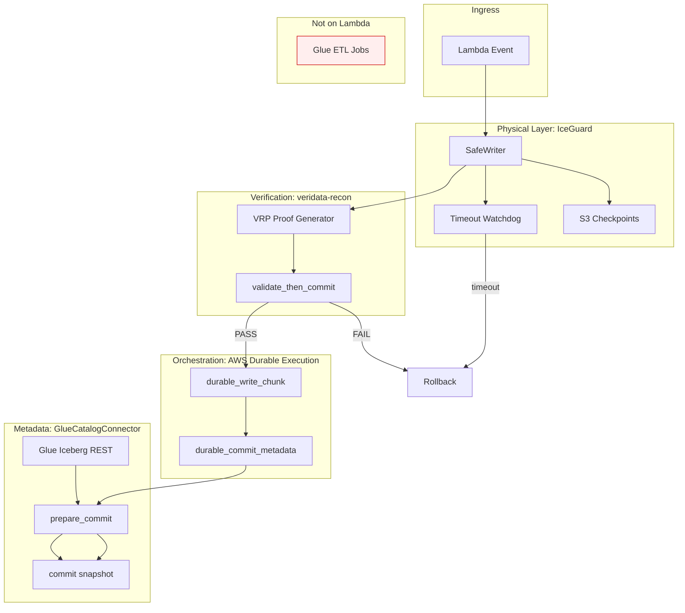
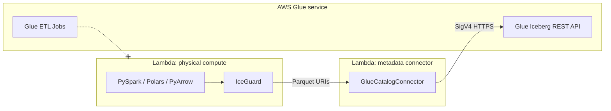
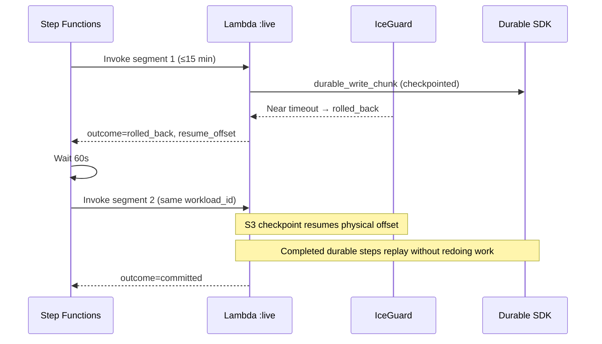

# Architecture

## Overview

Serverless Data Mesh coordinates **cross-domain lakehouse writes** on AWS Lambda.
Each domain team publishes data under a declared transaction boundary; the framework
enforces exactly-once semantics, cryptographic verification, and resumable execution.

For the full **Producer · Steward · Publisher** federated model and step-by-step backfill journey, see **[Data Mesh End-to-End](data-mesh-end-to-end.md)**.

For **Lambda + Spark vs Glue ETL** and the metadata connector, see **[Glue Catalog Connector](glue-connector.md)**.

For the **concept coverage matrix** and **named patterns**, see **[Data Mesh Patterns](data-mesh-patterns.md)**.

## Components


```mermaid
flowchart TB
    subgraph ingress [Ingress]
        EVT[Lambda Event]
    end

    subgraph physical [Physical Layer: IceGuard]
        SW[SafeWriter]
        WD[Timeout Watchdog]
        CP[S3 Checkpoints]
    end

    subgraph verify [Verification: veridata-recon]
        VRP[VRP Proof Generator]
        VTC[validate_then_commit]
    end

    subgraph durable [Orchestration: AWS Durable Execution]
        DS1[durable_write_chunk]
        DS2[durable_commit_metadata]
    end

    subgraph metadata [Metadata: GlueCatalogConnector]
        CONN[Glue Iceberg REST]
        PREP[prepare_commit]
        COMMIT[commit snapshot]
        CONN --> PREP --> COMMIT
    end

    subgraph not_on_lambda [Not on Lambda]
        GLUE_ETL[Glue ETL Jobs]
        style GLUE_ETL fill:#fee,stroke:#c00
    end

    EVT --> SW
    SW --> VRP --> VTC
    VTC -->|PASS| DS1
    DS1 --> DS2
    DS2 --> PREP --> COMMIT
    SW --> WD
    SW --> CP
    VTC -->|FAIL| RB[Rollback]
    WD -->|timeout| RB
```

## Transaction phases

| Phase | Owner | Responsibility |
|-------|-------|----------------|
| Physical write | IceGuard | Chunked Parquet writes, watchdog rollback, S3 resume |
| Verification | veridata-recon | Source/sink multiset proof per chunk |
| Durable checkpoint | AWS Durable SDK | Cross-invocation step replay |
| Metadata commit | GlueCatalogConnector | Iceberg 2PC over Glue REST (SigV4 HTTPS) |

## Compute vs catalog (Lambda + Spark, not Glue ETL)


```mermaid
flowchart LR
    subgraph lambda_compute [Lambda: physical compute]
        SPARK[PySpark / Polars / PyArrow]
        IG[IceGuard]
        SPARK --> IG
    end

    subgraph lambda_meta [Lambda: metadata connector]
        GCC[GlueCatalogConnector]
    end

    subgraph aws_glue [AWS Glue service]
        REST[Glue Iceberg REST API]
        ETL[Glue ETL Jobs]
    end

    IG -->|Parquet URIs| GCC
    GCC -->|SigV4 HTTPS| REST
    ETL -.-x lambda_compute
```

| Runs on Lambda | Does not run on Lambda |
|----------------|------------------------|
| PySpark-on-Lambda, Polars, PyArrow | AWS Glue ETL jobs |
| IceGuard, VRP, Durable SDK | Glue Interactive Sessions |
| `GlueCatalogConnector` (REST client only) | Glue Studio job execution |

Full guide: **[glue-connector.md](glue-connector.md)**.

## Failure modes

- **VRP FAIL**: metadata commit blocked; physical files eligible for rollback
- **Lambda timeout**: IceGuard rolls back uncommitted Parquet; durable steps resume
- **Catalog error**: `CatalogCommitError`; abort without publishing snapshot

## Durable Lambda compute model

| Capability | This framework | Notes |
|------------|----------------|-------|
| **Durable Lambda** | Yes | `durable_config` + `@durable_execution` + Durable SDK steps |
| **MicroVM** | Yes (AWS-managed) | Lambda runs on **Firecracker** microVMs; we do not operate Firecracker |
| **On-demand instances** | On-demand **Lambda** | Scale to zero; **not** EC2 on-demand fleets |
| **Configurable run time** | Yes (dual clocks) | Per-invoke ≤ 900s; durable budget **configurable** (any duration you set) |

Sales diagram: [docs/images/durable-lambda-compute-model.png](images/durable-lambda-compute-model.png) · Hands-on: [examples/durable-compute/](../examples/durable-compute/)

## Long-running execution (configurable durable budget)

Lambda containers still have a **15-minute hard cap** per invocation (`timeout = 900`).
This framework **overcomes that limit** with **two cooperating clocks**: each segment stays within 15 minutes; the workload clock is Terraform-tunable for whatever wall-clock time the backfill needs (AWS Durable Execution allows up to ~1 year).

| Layer | Setting | Role |
|-------|---------|------|
| Per invocation | Lambda `timeout` (≤ 900s) | One container segment; IceGuard watchdog fires before this limit |
| Total durable budget | `durable_config.execution_timeout` | **Configurable** ceiling for one execution ID across replays |
| Orchestration | Step Functions `max_resume_attempts` | Re-invokes after `rolled_back` when a segment ends early |
| Per SFN task | `TimeoutSeconds` on `lambda:invoke` | Waits for **one** segment to return, not the full workload budget |


```mermaid
sequenceDiagram
    participant SFN as Step Functions
    participant L as Lambda :live
    participant IG as IceGuard
    participant DE as Durable SDK

    SFN->>L: Invoke segment 1 (≤15 min)
    L->>DE: durable_write_chunk (checkpointed)
    IG-->>L: Near timeout → rolled_back
    L-->>SFN: outcome=rolled_back, resume_offset
    SFN->>SFN: Wait 60s
    SFN->>L: Invoke segment 2 (same workload_id)
    Note over L,IG: S3 checkpoint resumes physical offset
    Note over L,DE: Completed durable steps replay without redoing work
    L-->>SFN: outcome=committed
```

**Direct invoke** (qualified `:live` ARN, no Step Functions): durable execution can chain platform-managed replays within `execution_timeout` without returning `rolled_back` between segments: useful for jobs that fit entirely under the durable budget.

**Step Functions backfill**: each `rolled_back` ends one segment; the resume loop starts a new invocation. IceGuard S3 checkpoints (keyed by `workload_id`) carry the physical resume offset; durable step checkpoints prevent re-writing verified chunks.

Tune in Terraform (`environments/prod/terraform.tfvars`):

```hcl
# Set durable budget to your backfill wall-clock (overcomes the 15-min Lambda limit)
durable_execution_timeout_seconds     = 10800
max_resume_attempts                   = 14     # auto-bumped to ceil(durable/lambda)+2 if lower
lambda_timeout_seconds                = 900
```
