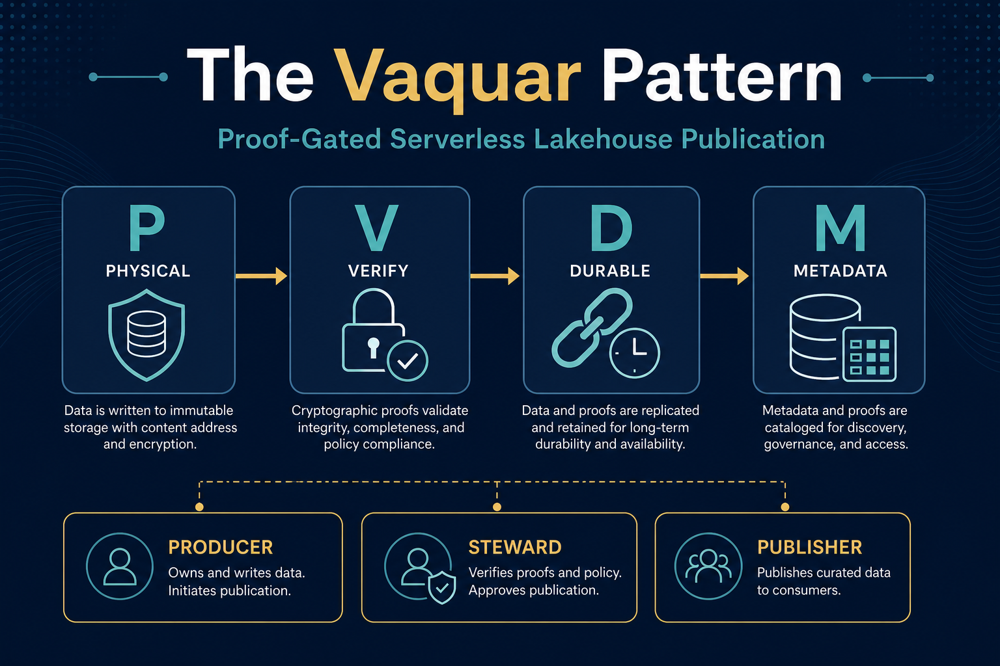
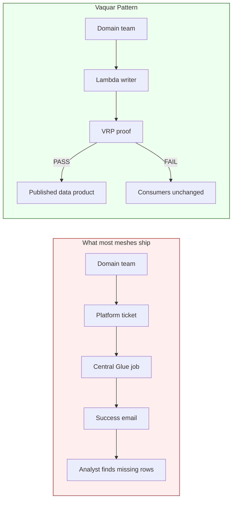
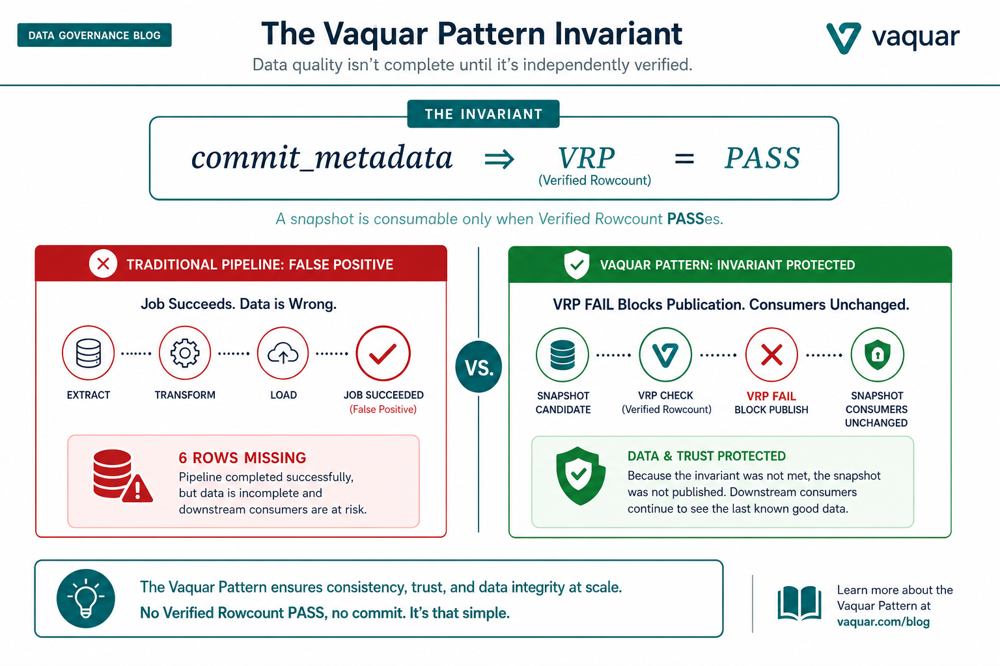
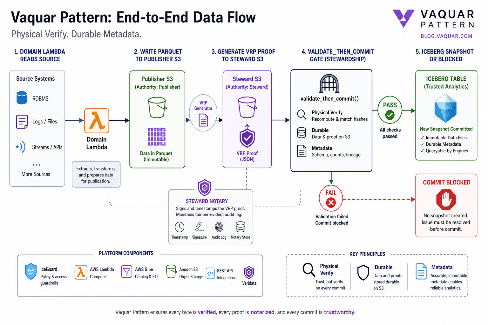
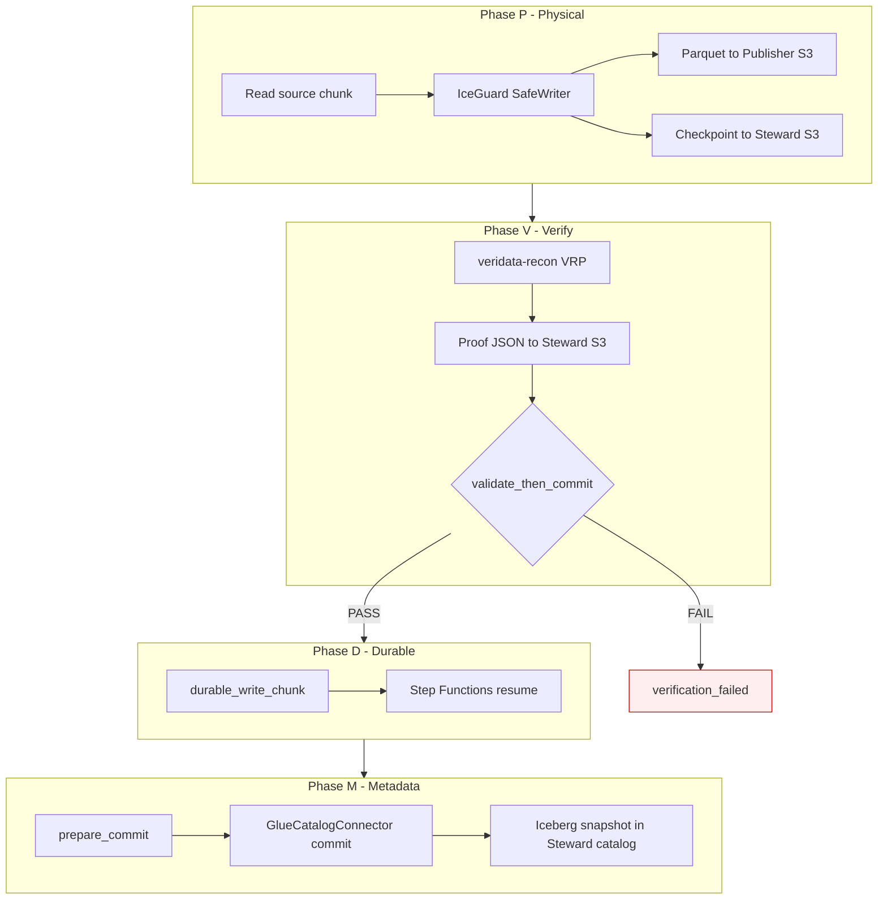
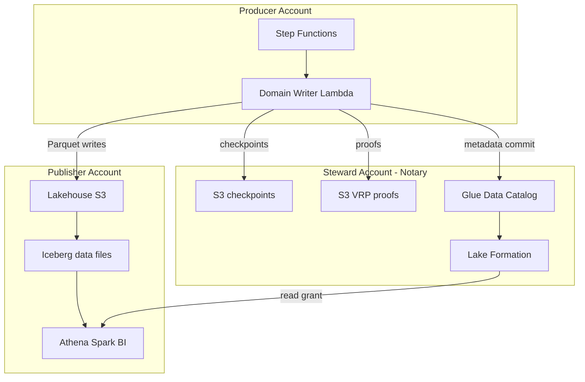
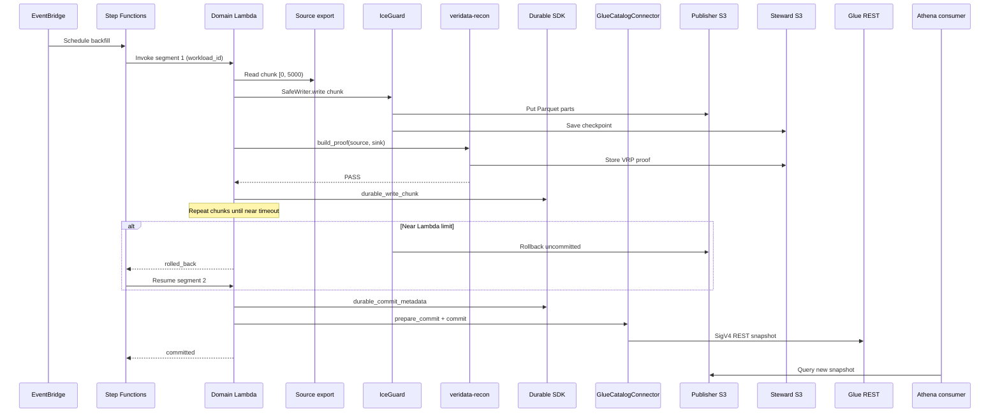
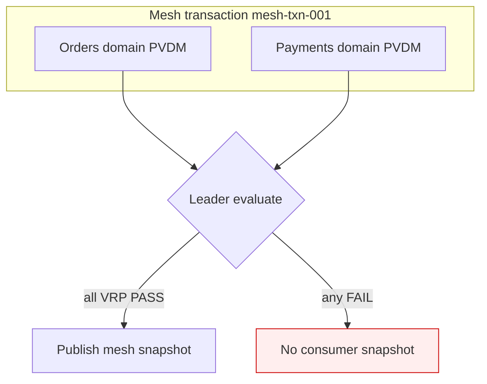

# The Vaquar Pattern: Proof-Gated Serverless Lakehouse Publication

**A complete guide to PVDM for federated data meshes on AWS**

*By Vaquar Khan · Version 1.0 · Reading time ~25 minutes · Apache-2.0*

| | |
|--|--|
| **Pattern** | Vaquar Pattern |
| **Acronym** | **PVDM** (Physical · Verify · Durable · Metadata) |
| **Canonical spec** | [vaquar-pattern.md](vaquar-pattern.md) |
| **Reference impl** | [Serverless Data Mesh](https://github.com/vaquarkhan/aws-serverless-datamesh-framework) |
| **Try in 60s** | `pip install serverless-data-mesh && serverless-data-mesh demo` |

---

<p align="center">
  
</p>

---

## Table of contents

1. [The one-line answer](#1-the-one-line-answer)
2. [Why the data mesh needs a new pattern](#2-why-the-data-mesh-needs-a-new-pattern)
3. [What the Vaquar Pattern is (and is not)](#3-what-the-vaquar-pattern-is-and-is-not)
4. [The Vaquar invariant](#4-the-vaquar-invariant)
5. [PVDM: four phases in depth](#5-pvdm-four-phases-in-depth)
6. [Three accounts: Producer, Steward, Publisher](#6-three-accounts-producer-steward-publisher)
7. [End-to-end journey: one chunk, start to finish](#7-end-to-end-journey-one-chunk-start-to-finish)
8. [Two clocks: 15 minutes vs 90 minutes](#8-two-clocks-15-minutes-vs-90-minutes)
9. [The verification gate: seeing failure work](#9-the-verification-gate-seeing-failure-work)
10. [Multi-domain mesh transactions](#10-multi-domain-mesh-transactions)
11. [How this differs from every alternative](#11-how-this-differs-from-every-alternative)
12. [Adoption playbook](#12-adoption-playbook)
13. [Reference implementation map](#13-reference-implementation-map)
14. [How to cite and spread the name](#14-how-to-cite-and-spread-the-name)

---

## 1. The one-line answer

> **If the proof fails, the snapshot does not exist for consumers. Period.**

That sentence is the Vaquar Pattern. Everything else is engineering detail.

Most data platforms optimize for **throughput**: move rows fast, log success, move on. The Vaquar Pattern optimizes for **publication correctness**: domain teams own serverless writes, a Steward notary stores cryptographic proofs, and **Iceberg metadata commits only after VRP PASS** - never because Glue returned `SUCCEEDED` or Lambda exited with code 0.

**Operational shorthand:** engineers say **PVDM** in architecture docs. **Vaquar Pattern** is the formal name for citations.

---

## 2. Why the data mesh needs a new pattern

Zhamak Dehghani gave us the **organizational** data mesh: domain-oriented ownership, data as a product, self-serve infrastructure, federated computational governance.

What she did not give us was a **technical write primitive** - a repeatable transaction boundary every domain can implement without operating clusters.



### The gap no existing pattern fills

| Pattern | Solves | Does not solve |
|---------|--------|----------------|
| Data mesh (org) | Ownership, contracts | Governed write transaction |
| Medallion | Bronze / silver / gold | Multiset cryptographic proof |
| Outbox | Reliable side effects | Pre-snapshot proof gate |
| Saga | Compensating transactions | Proof notary; math not logs |
| 2PC | Atomic commit | Domain serverless + federated accounts |
| dbt tests | Row quality in warehouse | Pre-commit multiset hash |
| Glue bookmarks | Incremental cursor | Source-sink equivalence proof |
| Lambda idempotency | Duplicate suppression | Blocking corrupt publication |

**The Vaquar Pattern names the missing layer:** proof-gated publication on serverless compute in a federated mesh.

<p align="center">
  
</p>

---

## 3. What the Vaquar Pattern is (and is not)

### It is

- A **technical publication contract** for lakehouse data products
- Four mandatory phases: **PVDM**
- Three mandatory accounts: **Producer · Steward · Publisher**
- One mandatory invariant: **no metadata commit without VRP PASS**
- Platform-agnostic in principle; **AWS Lambda + Iceberg** is the reference implementation

### It is not

- A rebrand of "data mesh" organizational advice
- A replacement for Glue ETL for heavy cluster aggregation (Glue remains valid **downstream**)
- A streaming exactly-once framework (batch/backfill oriented)
- "Trust the pipeline logs"

### The name

**Vaquar Pattern** - formal, citeable, for papers and architecture reviews.

**PVDM** - everyday shorthand engineers use in runbooks: "We PVDM the silver-to-gold publish."

---

## 4. The Vaquar invariant

<p align="center">
  
</p>

### Formal

```
∀ chunk C in workload W:
  commit_metadata(C) ⟹ VRP(C) = PASS
  VRP(C) = FAIL ⟹ ¬∃ snapshot' : consumers_visible(snapshot')
```

### Plain language

| Condition | Consumer impact |
|-----------|-----------------|
| VRP **PASS** for every chunk | Metadata commit may proceed; new snapshot visible |
| VRP **FAIL** on any chunk | Metadata commit **blocked**; consumers see **previous** snapshot only |
| Executor exit code 0 | **Irrelevant** to publication decision |

This is the hook. Lead with it in every talk, article, and architecture review.

---

## 5. PVDM: four phases in depth

<p align="center">
  
</p>

<p align="center">
  
</p>



### Phase P - Physical

**Owner:** Domain writer (Producer account)  
**Primitive:** IceGuard SafeWriter

| Responsibility | Artifact |
|----------------|----------|
| Read source partition/chunk | In-memory or streamed records |
| Write Parquet to Publisher lakehouse | `s3://publisher-lakehouse/.../part-*.parquet` |
| Save resume checkpoint to Steward | `s3://steward-checkpoints/{workload_id}/...` |
| Rollback uncommitted files on timeout | No orphan Parquet visible to catalog |

**Invariant:** Physical files exist **before** verification, but are **not yet** part of a consumer-visible snapshot.

### Phase V - Verify

**Owner:** veridata-recon (VRP)  
**Gate:** `validate_then_commit`

| Step | What happens |
|------|--------------|
| Hash source multiset | Identity + content fields per chunk |
| Hash sink multiset | Same fields from written Parquet |
| Generate VRP proof | Signed JSON with PASS/FAIL verdict |
| Persist proof to Steward | Immutable audit artifact |
| Gate metadata | FAIL → raise `VerificationRejectedError` |

**Invariant:** Multiset equivalence, not row-count spot checks.

### Phase D - Durable

**Owner:** AWS Durable Execution SDK + Step Functions  
**Linkage:** `workload_id`

| Concern | Solution |
|---------|----------|
| Lambda 15-min hard cap | Chain segments via SFN resume loop |
| Retry without duplicate commits | Replay **completed** durable steps only |
| Timeout mid-chunk | IceGuard rollback → `rolled_back` → resume |

**Invariant:** One logical workload, many physical containers.

### Phase M - Metadata

**Owner:** GlueCatalogConnector (PyIceberg Glue REST)  
**Protocol:** SigV4 HTTPS to Glue Iceberg REST API

| Step | What happens |
|------|--------------|
| `prepare_commit` | Stage metadata transaction |
| `commit` | Publish Iceberg snapshot |
| Consumer visibility | Athena/Spark/BI read new snapshot **only now** |

**Invariant:** Metadata commit is **always last** and **always proof-gated**.

### Phase summary table

| Phase | Runs where | Trust artifact | Failure outcome |
|-------|------------|----------------|-----------------|
| **P** | Producer Lambda | S3 Parquet + checkpoint | Rollback physical |
| **V** | Producer Lambda | Steward VRP JSON | `verification_failed` |
| **D** | Producer Lambda + SFN | Durable step IDs | `rolled_back` → resume |
| **M** | Producer Lambda → Steward API | Iceberg snapshot | Abort; no publish |

---

## 6. Three accounts: Producer, Steward, Publisher

<p align="center">
  
</p>



### Why three accounts?

| Account | Mesh principle | Vaquar role |
|---------|----------------|-------------|
| **Producer** | Domain-oriented ownership | Domain ships `handler.py`, owns SLA |
| **Steward** | Federated computational governance | **Notary**: proofs, catalog, LF - domain cannot erase audit trail |
| **Publisher** | Data as a product exposure | Consumer blast-radius isolation |

**Steward is the trust anchor.** If proofs lived in the Producer account, a misconfigured domain could delete evidence. The notary model separates **autonomy** from **auditability**.

### Cross-account data flows

| From | To | Data | Protocol |
|------|-----|------|----------|
| Producer Lambda | Publisher S3 | Parquet files | `s3:PutObject` (LF grant) |
| Producer Lambda | Steward S3 | Checkpoints, VRP proofs | `s3:PutObject` (bucket policy) |
| Producer Lambda | Steward Glue | Iceberg metadata | HTTPS SigV4 REST |
| Consumers | Publisher + Steward | Query curated tables | Lake Formation |

Deploy order and IAM: [data-mesh-end-to-end.md](data-mesh-end-to-end.md)

---

## 7. End-to-end journey: one chunk, start to finish

**Scenario:** Orders domain backfills `orders_curated` partition `dt=2026-06-14` with 250,000 rows.



### Timeline (typical 90-minute backfill)

| Time | Event | Outcome |
|------|-------|---------|
| T+0 | Step Functions starts `workload_id=orders-2026-06-14` | Segment 1 begins |
| T+0..14m | Chunks 0..N written, each VRP PASS | Durable steps checkpointed |
| T+14m | IceGuard watchdog fires | `rolled_back`, uncommitted Parquet removed |
| T+14m | SFN resumes segment 2 | Replay from chunk N+1 |
| T+14m..85m | Remaining chunks | No duplicate committed chunks |
| T+85m | Final chunk VRP PASS | `durable_commit_metadata` |
| T+86m | Glue REST snapshot committed | Consumers see new partition |
| T+86m+ | OpenLineage event emitted | Mesh discovery updated |

### Outcome vocabulary

| Outcome | Meaning | Operator action |
|---------|---------|-----------------|
| `committed` | All chunks verified; snapshot published | None |
| `rolled_back` | Segment ended early; safe to resume | SFN auto-resumes |
| `verification_failed` | VRP FAIL; snapshot blocked | Fix data; re-invoke |
| `resumed` | Continued from durable checkpoint | Normal for long jobs |

---

## 8. Two clocks: 15 minutes vs 90 minutes

<p align="center">
  
</p>

Lambda has a **hard 900-second container limit**. Serious backfills need **90+ minutes**. The Vaquar Pattern uses **two cooperating clocks**:

```mermaid
gantt
    title Vaquar Pattern: 90-minute workload across Lambda segments
    dateFormat X
    axisFormat %M min

    section Segment 1
    Chunks plus VRP plus durable checkpoint :0, 14
    section Segment 2
    Resume from durable state :14, 28
    section Segment 3
    Resume :28, 42
    section Segment N
    Final commit metadata :84, 90
```



| Clock | Setting | Default | Role |
|-------|---------|---------|------|
| **Container** | Lambda `timeout` | 900s | One IceGuard-protected segment |
| **Workload** | `durable_execution_timeout` | 5400s | Total budget across replays |
| **Orchestration** | SFN `max_resume_attempts` | ≥ 8 | Chains segments |
| **Watchdog** | `rollback_threshold_ms` | ~30s before limit | IceGuard rollback margin |

**Linkage key:** `workload_id` appears in checkpoints, proofs, durable steps, and snapshot properties.

---

## 9. The verification gate: seeing failure work

The Vaquar thesis is only credible when you **see the gate block bad data**.

### Try locally (no AWS)

```bash
pip install serverless-data-mesh
serverless-data-mesh demo
```

**What it runs:**

| Step | Action | Result |
|------|--------|--------|
| 1 | Write 1000 rows correctly | VRP PASS → `committed` |
| 2 | Inject 1 corrupted row | VRP FAIL → `verification_failed` |
| 3 | Consumer query | **1000 rows** (corrupt never visible) |

```bash
make gate-demo
# or: python examples/tutorials/verification_gate_demo.py
```

<p align="center">
  
</p>

### Production benchmark

```bash
make benchmark
```

Five attack scenarios (drop, duplicate, mutation) - all must VRP `FAIL`. See `eval/validate_then_commit_benchmark.py`.

---

## 10. Multi-domain mesh transactions

Single-domain PVDM is the atomic unit. **Mesh-level atomicity** extends Vaquar across domains:



**Policy:** Deferred leader commit - domains prove locally, Steward publishes only when **all** domains PASS.

```bash
make multi-domain
# examples/multi-domain-orders-payments/test_atomicity.py
```

| Scenario | Orders | Payments | Mesh outcome | Consumer rows |
|----------|--------|----------|--------------|---------------|
| Both clean | PASS | PASS | `committed` | 1000 |
| Payments corrupt | PASS | FAIL | `verification_failed` | **0** (no partial) |

Details: [examples/multi-domain-orders-payments/README.md](../examples/multi-domain-orders-payments/README.md)

---

## 11. How this differs from every alternative

| Approach | Domain autonomy | Proof of correctness | Serverless | Long backfills | Pre-snapshot gate |
|----------|-----------------|----------------------|------------|----------------|-------------------|
| Central Glue ETL | Low | Logs | No | Yes | No |
| EMR Spark | Medium | Logs | No | Yes | No |
| Custom Lambda scripts | High | None | Yes | Fragile | No |
| dbt + warehouse | Medium | Tests | N/A | N/A | No |
| Outbox / Saga | Varies | Logs | Varies | Varies | No |
| **Vaquar Pattern (PVDM)** | **High** | **VRP per chunk** | **Yes** | **Yes** | **Yes** |

### Anti-patterns (not Vaquar)

| Anti-pattern | Why it fails |
|--------------|--------------|
| Commit metadata first, verify later | Bad snapshots reach consumers |
| Proofs in Producer account | Domain can delete audit trail |
| Trust CloudWatch SUCCESS | No multiset proof |
| Glue ETL as write primitive | Not domain-owned serverless |
| Skip Steward notary | No federated governance anchor |

---

## 12. Adoption playbook

### Phase 1: Try (day 1)

```bash
pip install serverless-data-mesh
serverless-data-mesh demo
make gate-demo
```

### Phase 2: Canary domain (week 1)

1. Pick one curated table (`orders_curated`)
2. Declare `DomainTransactionBoundary` + `DataProductContract`
3. Run 5,000-row canary through full PVDM
4. Inspect VRP proofs in Steward S3
5. Query Publisher Athena

### Phase 3: Production (week 2-4)

1. Deploy three-account Terraform ([multi-account README](../infrastructure/terraform/environments/multi-account/README.md))
2. Enable Durable Execution + Step Functions resume
3. Tune `lambda_timeout_seconds` ([terraform-guide.md](terraform-guide.md))
4. Wire OpenLineage on `committed` ([lineage module](../src/serverless_data_mesh/lineage/openlineage.py))

### Phase 4: Mesh scale (month 2+)

1. Onboard second domain with same PVDM contract
2. Enable mesh leader commit for cross-domain transactions
3. Publish cost benchmark ([benchmarks/README.md](../benchmarks/README.md))

### When to apply

- Multiple domains → shared Iceberg lakehouse
- Federated AWS accounts (or planned)
- Compliance beyond log statements
- Backfills 15-90+ minutes on Lambda
- "Job succeeded" has burned you before

### When to defer

- Single team, single pipeline
- Trusted streaming exactly-once already
- Domains won't declare boundaries

---

## 13. Reference implementation map

| Vaquar concept | Code / infra |
|----------------|--------------|
| PVDM coordinator | `IceGuardDurableCoordinator` |
| Proof gate | `validate_then_commit` |
| Domain boundary | `DomainTransactionBoundary` |
| Data product contract | `DataProductContract` |
| Local demo (no AWS) | `serverless-data-mesh demo` |
| Verification gate demo | `examples/tutorials/verification_gate_demo.py` |
| Multi-domain example | `examples/multi-domain-orders-payments/` |
| Consumer safety benchmark | `eval/validate_then_commit_benchmark.py` |
| OpenLineage | `serverless_data_mesh.lineage` |
| Production Terraform | `infrastructure/terraform/environments/` |

```python
from serverless_data_mesh import (
    IceGuardDurableCoordinator,
    DomainTransactionBoundary,
    VRPProofGenerator,
)

boundary = DomainTransactionBoundary(
    domain_id="orders-domain",
    source_namespace="raw_orders",
    target_table="orders_curated",
    partition_spec={"dt": "2026-06-14"},
)

coordinator = IceGuardDurableCoordinator(
    durable_context=durable_ctx,
    lambda_context=lambda_ctx,
    proof_generator=VRPProofGenerator(),
    catalog_adapter=glue_adapter,
)
result = coordinator.execute_workload(workload, batch_writer=..., source_reader=...)
```

---

## 14. How to cite and spread the name

### Canonical URL

https://github.com/vaquarkhan/aws-serverless-datamesh-framework/blob/main/docs/vaquar-pattern.md

**This blog:**

https://github.com/vaquarkhan/aws-serverless-datamesh-framework/blob/main/docs/blog-the-vaquar-pattern.md

### One-liner for architecture docs

> We apply the **Vaquar Pattern** (PVDM) for domain writes: Physical → Verify → Durable → Metadata, with Steward notarization and VRP-gated Iceberg commits.

### BibTeX

```bibtex
@misc{khan2026vaquar,
  author       = {Vaquar Khan},
  title        = {The Vaquar Pattern: Proof-Gated Serverless Lakehouse Publication},
  year         = {2026},
  version      = {1.0},
  howpublished = {GitHub},
  url          = {https://github.com/vaquarkhan/aws-serverless-datamesh-framework/blob/main/docs/vaquar-pattern.md}
}
```

### Making the name stick

| Strategy | Action |
|----------|--------|
| **Canonical link** | Cite the spec URL above (typos fixed) |
| **Acronym in runbooks** | "PVDM the publish" in daily engineering language |
| **Formal name in papers** | "Vaquar Pattern" in titles and citations |
| **Lead with invariant** | "If proof fails, snapshot doesn't exist" |
| **Third-party use** | Conference talks, Medium/DZone articles linking the spec |
| **Try-before-believe** | `serverless-data-mesh demo` in every intro |

### Known implementations

| Implementation | Platform | Status |
|----------------|----------|--------|
| [Serverless Data Mesh](https://github.com/vaquarkhan/aws-serverless-datamesh-framework) | AWS Lambda + Iceberg + Glue REST | Reference |
| *Your platform* | Databricks, GCP, Azure, … | [Submit a PR](vaquar-pattern.md#known-implementations) |

---

## Related reading

| Document | Focus |
|----------|-------|
| [vaquar-pattern.md](vaquar-pattern.md) | Formal spec (short) |
| [why-serverless-data-mesh.md](why-serverless-data-mesh.md) | Framework problem thesis |
| [data-mesh-end-to-end.md](data-mesh-end-to-end.md) | Three-account deploy |
| [data-mesh-patterns.md](data-mesh-patterns.md) | Full pattern catalog |
| [getting-started.md](getting-started.md) | Developer tutorial |

---

<div align="center">

**The Vaquar Pattern** · PVDM · Proof-Gated Serverless Lakehouse Publication

*Domain teams own the write path. The mesh proves correctness before consumers see a snapshot.*

[Spec](vaquar-pattern.md) · [Framework](https://github.com/vaquarkhan/aws-serverless-datamesh-framework) · [Try demo](https://github.com/vaquarkhan/aws-serverless-datamesh-framework#try-in-60-seconds-no-aws)

</div>
