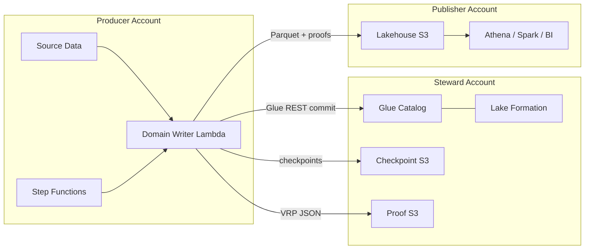
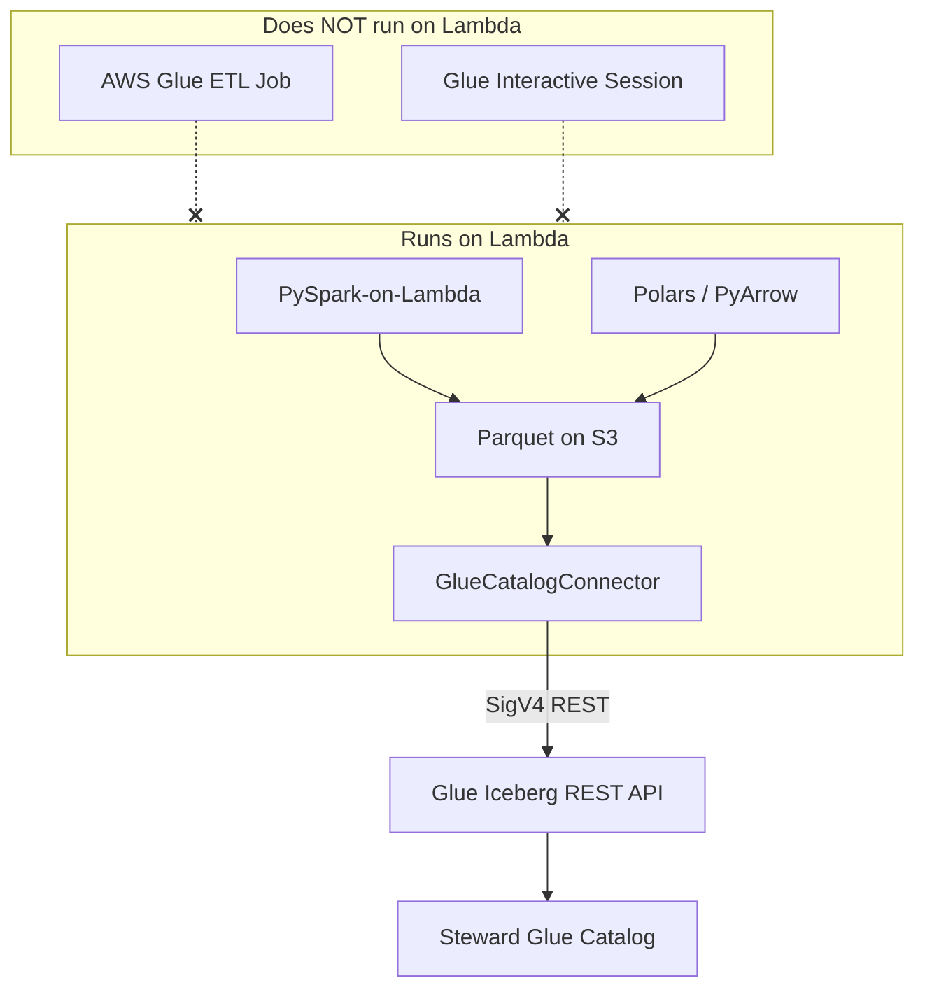
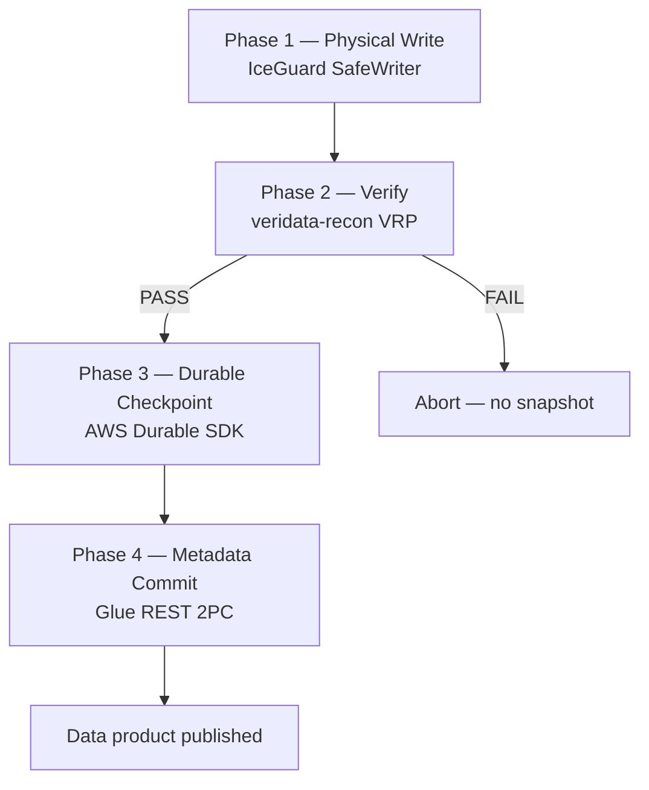

# Serverless Data Mesh — End-to-End Guide

**A new open framework for governed, exactly-once lakehouse writes on AWS Lambda.**

This document explains how **Serverless Data Mesh** works from first principles through production deployment across a **three-account federated data mesh**: **Producer**, **Steward**, and **Publisher**. It is written for platform engineers, domain data owners, and auditors who need a complete picture—not just API reference.

---

## Table of contents

1. [What problem we solve](#1-what-problem-we-solve)
2. [The three-account model](#2-the-three-account-model)
3. [How Lambda fits in](#3-how-lambda-fits-in)
4. [Glue Catalog Connector (not Glue ETL)](#4-glue-catalog-connector-not-glue-etl)
5. [End-to-end journey (one backfill)](#5-end-to-end-journey-one-backfill)
6. [Transaction boundary (four phases)](#6-transaction-boundary-four-phases)
7. [90-minute execution on 15-minute Lambda](#7-90-minute-execution-on-15-minute-lambda)
8. [VRP proofs and audit trail](#8-vrp-proofs-and-audit-trail)
9. [IAM and cross-account trust](#9-iam-and-cross-account-trust)
10. [Deploy per account](#10-deploy-per-account)
11. [Operating the mesh](#11-operating-the-mesh)
12. [Framework packages](#12-framework-packages)
13. [Getting started](#13-getting-started)

---

## 1. What problem we solve

Traditional data platforms centralize ingestion in one account and one pipeline. **Data mesh** inverts that: each **domain team** owns its data products, quality, and SLAs—but consumers still need **trust**, **lineage**, and **exactly-once** semantics when data lands in a shared lakehouse.

Serverless Data Mesh gives domain teams a **repeatable Lambda-native write contract**:

| Guarantee | Mechanism |
|-----------|-----------|
| **Exactly-once physical writes** | IceGuard chunked Parquet + S3 checkpoints + rollback |
| **Cryptographic verification** | veridata-recon VRP proof per chunk |
| **No silent data loss** | `validate_then_commit` blocks metadata commit on FAIL |
| **Long backfills on Lambda** | AWS Durable Execution + Step Functions resume loop |
| **Governed metadata** | `GlueCatalogConnector` → Glue Iceberg REST 2PC (SigV4) |

Without this framework, domain teams either:

- Run fragile custom scripts with no proof of correctness, or
- Centralize everything in a platform monolith that cannot scale to hundreds of domains.

**Serverless Data Mesh is the missing coordination layer**—small enough to run in each domain's Lambda, strict enough for enterprise audit.


---

## 2. The three-account model

A production federated mesh **separates concerns across three AWS accounts**. This is not optional for enterprise scale: it enforces blast-radius isolation, clear ownership, and auditable data promotion.


### Account A — Producer (Domain)

**Who owns it:** The domain team (e.g. Orders, Payments, Inventory).

**Responsibility:** Owns **source-of-truth data** and triggers materialization into the mesh.

| Resource | Purpose |
|----------|---------|
| Source S3 / operational DB exports | Raw domain inputs |
| Step Functions (optional) | Schedules and resume loops for long backfills |
| Lambda **domain writer** | Runs `IceGuardDurableCoordinator` handler |
| EventBridge rules | Cron triggers (nightly partition materialization) |
| Domain IAM roles | Least privilege to read source, write via cross-account to Steward/Publisher |

**What the Producer does *not* do:** It does not own the global Glue catalog, proof archive policy, or consumer-facing publish SLAs. It **declares** a `DomainTransactionBoundary` and **executes** the write under that contract.

```python
DomainTransactionBoundary(
    domain_id="orders-domain",
    source_namespace="raw_orders",
    target_table="orders_curated",
    partition_spec={"dt": "2026-06-14"},
    quality_policy_id="strict-zero-drop",
    max_chunk_records=5000,
)
```

---

### Account B — Steward (Platform / Governance)

**Who owns it:** The data platform or mesh governance team.

**Responsibility:** **Trust infrastructure**—catalog, policies, checkpoints, proofs, and Lake Formation.

| Resource | Purpose |
|----------|---------|
| **Glue Data Catalog** | Canonical Iceberg table definitions |
| **Lake Formation** | Cross-account table/bucket grants, column-level security |
| **Checkpoint bucket** | IceGuard S3 resume state (`{workload_id}/checkpoint.json`) |
| **VRP proof bucket** | Immutable audit artifacts per chunk |
| **IAM / LF policies** | Who may write metadata, who may read proofs |
| **CloudWatch / SNS** | Platform-wide alarms (rollback spikes, VRP failures) |

**Steward is the "notary"** of the mesh. Every domain write leaves a proof trail in Steward-controlled storage. Consumers and auditors trust **Steward's buckets and catalog**, not individual domain Lambdas.

**S3 layout (Steward):**

```
s3://{checkpoint_bucket}/{domain_id}/{workload_id}/     # IceGuard checkpoints
s3://{proof_bucket}/{domain_id}/{workload_id}/proofs/   # chunk-000000.vrp.json, ...
```

---

### Account C — Publisher (Curated / Consumption)

**Who owns it:** The analytics platform or data product office.

**Responsibility:** **Published lakehouse zone** that downstream teams query.

| Resource | Purpose |
|----------|---------|
| **Lakehouse S3** | Curated Iceberg data files (Parquet) |
| **Glue tables** (registered in Steward catalog) | `orders_curated`, `payments_curated`, … |
| **Read roles** | Athena, Spark, BI tools, ML feature stores |
| **Data product metadata** | SLAs, ownership tags, freshness dashboards |

**Publisher exposes data products** to the organization. Physical files land in Publisher's lakehouse bucket; **metadata commits** go through Steward's Glue REST endpoint; **verification** is proven against Steward's proof bucket.

**Promotion flow:** Producer Lambda writes Parquet → Publisher bucket; Steward catalog records the snapshot; Publisher consumers see new data only after VRP PASS + metadata commit.

---

### Why three accounts?

| Concern | Single-account anti-pattern | Three-account benefit |
|---------|----------------------------|------------------------|
| Blast radius | One misconfigured Lambda deletes consumer data | Producer mistakes cannot wipe publish zone |
| Audit | Proofs mixed with raw sources | Steward holds immutable proof chain |
| Ownership | Platform team owns everything | Domain owns Producer; platform owns Steward |
| Consumption | Consumers need write-adjacent IAM | Publisher is read-only by design |
| Compliance | Hard to prove who wrote what | `domain_id` + `workload_id` + VRP hash chain |



---

## 3. How Lambda fits in

Lambda is the **execution unit** for domain writes—not because batch EMR is wrong, but because:

1. **Domains are independent** — each team ships a small handler, not a shared cluster.
2. **Cost follows usage** — backfills scale to zero between runs.
3. **Durable Execution** — AWS now chains 15-minute segments into **90+ minute** jobs.
4. **IceGuard** — turns Lambda's hard timeout into a **safe rollback + resume** primitive.


### Runtime stack (inside one Lambda invocation)

```
examples.domain_writer.handler.lambda_handler
    └── @durable_execution
            └── IceGuardDurableCoordinator.run(workload)
                    ├── iceguard.protect()          # physical SafeWriter
                    ├── VRPProofGenerator         # veridata-recon
                    ├── validate_then_commit()      # gate
                    ├── durable_write_chunk()       # durable step
                    └── durable_commit_metadata()   # Glue REST 2PC
```

### Invocation paths

| Path | When to use |
|------|-------------|
| **Step Functions → Lambda `:live`** | Production backfills; automatic resume on `rolled_back` |
| **EventBridge → Step Functions** | Scheduled nightly partition builds |
| **Direct `aws lambda invoke :live`** | Development and debugging |
| **Cross-account invoke** | Producer Lambda role in Account A invokes Steward-deployed alias (advanced) |

**Important:** Durable Functions require the **qualified ARN** (`function-name:live`). The framework Terraform module always publishes a `live` alias.

---

## 4. Glue Catalog Connector (not Glue ETL)

A common misconception: "we use Glue, so we need Glue jobs." **In this framework, Glue means the Data Catalog API—not the Glue ETL engine.**



| Component | What it is | On Lambda? |
|-----------|------------|------------|
| **PySpark-on-Lambda** | Your domain `batch_writer` — transforms + Parquet | Yes |
| **GlueCatalogConnector** | Metadata-only REST client (`prepare_commit` / `commit`) | Yes (HTTPS client) |
| **Glue Data Catalog** | Table/snapshot registry in Steward account | API target |
| **AWS Glue ETL** | Managed Spark job runner (DPUs, JobRun) | **No** |

```python
from serverless_data_mesh import GlueCatalogConnector

connector = GlueCatalogConnector.from_environment(
    namespace="raw_orders",
    table_name="orders_curated",
)
connector.prepare_commit(parquet_paths_from_spark)
snapshot_id = connector.commit()  # after VRP PASS
```

**Physical writes** use Spark, Polars, or PyArrow in your handler. **Metadata registration** uses the connector—never a Glue job submission from Lambda.

Full diagrams, sequences, and Spark wiring: **[glue-connector.md](glue-connector.md)**.

---

## 5. End-to-end journey (one backfill)

This section walks through **one complete backfill** of 250,000 order records from Producer to Publisher.

### Step 0 — Contract published (before any code runs)

The Orders domain registers its data product in the mesh registry (Confluence / Backstage / internal portal):

- **domain_id:** `orders-domain`
- **source:** `s3://producer-orders/raw/dt=2026-06-14/`
- **target:** `orders_curated` Iceberg table, partition `dt=2026-06-14`
- **quality_policy_id:** `strict-zero-drop`
- **SLA:** published within 2 hours of source landing

Steward creates Lake Formation grants: Producer role may write Publisher lakehouse prefix and commit Glue metadata.

---

### Step 1 — Trigger (Producer)

EventBridge fires at 02:00 UTC (or an operator starts Step Functions manually):

```json
{
  "workload_id": "backfill-2026q2-orders-20260614",
  "total_records": 250000,
  "domain_id": "orders-domain",
  "source_uri": "s3://producer-orders/raw/dt=2026-06-14/",
  "target_uri": "s3://publisher-lakehouse/curated/orders/",
  "partition_spec": {"dt": "2026-06-14"}
}
```

Step Functions state machine (`sdm-prod-backfill-orchestrator`) receives the input.

---

### Step 2 — Lambda segment 1 (Producer Lambda)

1. Handler parses event → `DataWriteWorkload`
2. Coordinator loads IceGuard checkpoint from Steward (`checkpoint_bucket`) — empty on first run
3. **Chunk loop** (up to `max_chunk_records` per chunk):
   - Read source records `[offset, offset + chunk_size)`
   - Write Parquet to Publisher lakehouse path via **Spark-on-Lambda / Polars / PyArrow** (not Glue ETL)
   - Generate VRP proof → upload to Steward `proof_bucket`
   - `validate_then_commit` — if **FAIL**, abort; metadata never committed
   - `durable_write_chunk` checkpoint — replay skips completed chunks
4. IceGuard watchdog detects ~30s before Lambda 15-min limit
5. Rolls back **uncommitted** Parquet for current chunk
6. Saves checkpoint `{next_offset: 125000, ...}` to Steward S3
7. Returns:

```json
{
  "outcome": "rolled_back",
  "resume_offset": 125000,
  "committed_chunks": 25,
  "workload_id": "backfill-2026q2-orders-20260614"
}
```

---

### Step 3 — Step Functions resume loop

State machine sees `outcome == rolled_back`, waits 60s, increments `resume_attempt`, re-invokes Lambda with **same** `workload_id`.

IceGuard loads checkpoint — resumes at offset 125,000. Durable steps replay — chunks 0–24 are **not** re-written.

---

### Step 4 — Lambda segment N (final)

After offset 250,000:

1. All chunks verified (VRP PASS)
2. `durable_commit_metadata` runs
3. `GlueCatalogConnector` calls Glue REST `add_files` (SigV4, Steward catalog)
4. Iceberg snapshot published

```json
{
  "outcome": "committed",
  "snapshot_id": 9876543210123,
  "committed_chunks": 50,
  "workload_id": "backfill-2026q2-orders-20260614"
}
```

Step Functions → **Success**.

---

### Step 5 — Consumption (Publisher)

Athena / Spark in Publisher account queries `orders_curated` WHERE `dt = '2026-06-14'`.

An auditor runs offline verification:

```bash
veridata-recon verify_proof \
  --proof s3://steward-proofs/orders-domain/backfill-2026q2-orders-20260614/proofs/chunk-000025.vrp.json
```

**Trust chain:** Source multiset hash → VRP proof → Iceberg snapshot — all tied by `workload_id`.

---

## 6. Transaction boundary (four phases)

Every write passes through **four phases**. Skipping any phase breaks mesh guarantees.



| Phase | Owner package | Failure behavior |
|-------|---------------|------------------|
| Physical | IceGuard | Rollback uncommitted files; resume from S3 checkpoint |
| Verify | veridata-recon | `verification_failed`; proofs retained for forensics |
| Durable | AWS Durable SDK | Replay idempotent steps on next segment |
| Metadata | PyIceberg Glue REST | `CatalogCommitError`; no consumer-visible snapshot |

---

## 7. 90-minute execution on 15-minute Lambda

Lambda has a **hard 15-minute per-invocation limit**. The framework still supports **90+ minute backfills** via two cooperating clocks:

| Setting | Default | Meaning |
|---------|---------|---------|
| `lambda_per_invocation_timeout_seconds` | 900 | One container segment |
| `durable_execution_timeout_seconds` | 5400 | Total durable budget (90 min) |
| `max_resume_attempts` | 10 | Step Functions loops after `rolled_back` |
| Step Functions `TimeoutSeconds` | 960 | Waits for one segment, not 90 min |

See [architecture.md — Long-running execution](architecture.md#long-running-execution-90-minutes) for sequence diagrams and Terraform tuning.

---

## 8. VRP proofs and audit trail

**VRP (Verifiable Reconciliation Proof)** is the mesh's audit anchor.

Per chunk, the framework writes:

```
s3://{proof_bucket}/{domain_id}/{workload_id}/proofs/chunk-{NNNNNN}.vrp.json
```

Each proof binds:

- **source_ref** — opaque locator (e.g. `source_uri` + byte range)
- **sink_ref** — Parquet path in Publisher lakehouse
- **content hash multiset** — cryptographic summary of records written
- **policy** — `strict-zero-drop`, identity rules, tolerances

**FAIL** means: multiset mismatch (drops, duplicates, mutations). Metadata commit is **blocked**.

Steward retention (default 90 days for proofs) is independent of Producer compute lifecycle—proofs survive Lambda deletion.

---

## 9. IAM and cross-account trust

### Producer → Steward (write checkpoints & proofs)

```json
{
  "Effect": "Allow",
  "Action": ["s3:PutObject", "s3:GetObject", "s3:ListBucket"],
  "Resource": [
    "arn:aws:s3:::steward-checkpoints/*",
    "arn:aws:s3:::steward-proofs/*"
  ]
}
```

Bucket policies in Steward trust Producer role ARN.

### Producer → Publisher (write Parquet)

Lake Formation grant:

- **Principal:** Producer domain writer role
- **Resource:** `publisher-lakehouse/curated/orders/`
- **Permissions:** `DATA_LOCATION_ACCESS`, `ALTER`, `INSERT`

### Producer → Steward Glue (commit metadata)

```json
{
  "Effect": "Allow",
  "Action": [
    "glue:GetTable", "glue:UpdateTable",
    "glue:GetPartition", "glue:GetPartitions"
  ],
  "Resource": "arn:aws:glue:us-east-2:STEWARD_ACCOUNT:table/raw_orders/orders_curated"
}
```

Plus `lakeformation:GetDataAccess` for credential vending to Iceberg REST.

### Publisher → consumers (read only)

Separate read roles; no write path to Producer.

---

## 10. Deploy per account

The included Terraform (`infrastructure/terraform/environments/prod`) deploys a **single-account reference stack**. Map modules to accounts as follows:

| Module | Typical account | Notes |
|--------|-----------------|-------|
| `storage` (checkpoints, proofs) | **Steward** | Cross-account bucket policies |
| `storage` (lakehouse) | **Publisher** | LF registration in Steward |
| `iam` + `lambda` | **Producer** | Or Steward if centrally hosted |
| `stepfunctions` | **Producer** | Triggers domain writer |
| `eventbridge` | **Producer** | Schedules |
| `monitoring` | **Steward** or **Producer** | Rollback alarms → SNS |

### Minimum deploy order

1. **Steward** — Glue DB/tables, checkpoint + proof buckets, LF admin
2. **Publisher** — Lakehouse bucket, LF resource registration, consumer read roles
3. **Producer** — Package Lambda (`scripts/package_lambda.sh`), deploy handler, wire cross-account ARNs in env vars:

```bash
ICEGUARD_CHECKPOINT_BUCKET=steward-checkpoints-ACCOUNT_ID
VRP_PROOF_BUCKET=steward-proofs-ACCOUNT_ID
ICEBERG_TABLE_BUCKET=publisher-lakehouse-ACCOUNT_ID
ICEBERG_WAREHOUSE=STEWARD_ACCOUNT_ID:s3tablescatalog/publisher-lakehouse-ACCOUNT_ID
```

4. **Validate** — Small workload (`total_records: 1000`), inspect proofs, query Publisher table

Detailed Terraform steps: [terraform-guide.md](terraform-guide.md).

---

## 11. Operating the mesh

### Handler outcomes

| `outcome` | Meaning | Action |
|-----------|---------|--------|
| `committed` | Snapshot published | None — success |
| `resumed` | Continued from checkpoint | Normal for long jobs |
| `rolled_back` | IceGuard near-timeout rollback | Step Functions auto-resumes |
| `verification_failed` | VRP FAIL | Inspect proofs; fix source; do not re-run blindly |

### Dashboards (recommended)

- Lambda **duration p99** approaching 900s → reduce `max_chunk_records`
- Log filter **IceGuard rollback** count → capacity signal
- Step Functions **Failed** executions → VRP or catalog errors
- S3 proof bucket **growth rate** per `domain_id`

### Onboarding a new domain

1. Register `domain_id` and boundary in mesh catalog
2. Steward creates Glue namespace + LF grants
3. Domain team forks `examples/domain_writer/`
4. CI runs `make test` + proof integration test
5. Platform runs canary backfill in Producer
6. Publisher lists data product in internal marketplace

---

## 12. Framework packages

| Package | Role in mesh |
|---------|--------------|
| [iceguard](https://pypi.org/project/iceguard/) | Physical layer — SafeWriter, watchdog, S3 resume |
| [veridata-recon](https://pypi.org/project/veridata-recon/) | Verification — Rust VRP, `validate_then_commit` |
| [aws-durable-execution-sdk-python](https://pypi.org/project/aws-durable-execution-sdk-python/) | Orchestration — checkpoint/replay across segments |
| [pyiceberg](https://pypi.org/project/pyiceberg/) | Metadata — Glue REST SigV4, `add_files` 2PC |

```python
from serverless_data_mesh import (
    IceGuardDurableCoordinator,
    GlueCatalogConnector,
    VRPProofGenerator,
    DataWriteWorkload,
    DomainTransactionBoundary,
)
```

---

## 13. Getting started

| Audience | Start here |
|----------|------------|
| Domain developer | [getting-started.md](getting-started.md) — 13-step tutorial |
| Platform engineer | [terraform-guide.md](terraform-guide.md) — production deploy |
| Architect / auditor | This document + [glue-connector.md](glue-connector.md) + [data-mesh-patterns.md](data-mesh-patterns.md) |
| API contracts | [domain-contracts.md](domain-contracts.md) |

```bash
git clone <repo-url> serverless-data-mesh
cd serverless-data-mesh
python3.12 -m venv .venv && source .venv/bin/activate
make install && make test
```

---

## Summary

**Serverless Data Mesh** is a new framework for the world because it combines:

- **Federated ownership** — Producer domains ship independent Lambdas
- **Centralized trust** — Steward holds catalog, proofs, checkpoints
- **Safe publication** — Publisher exposes verified Iceberg products
- **Serverless economics** — no always-on clusters for intermittent backfills
- **Mathematical verification** — VRP proofs, not just "we logged success"

Three accounts. One transaction boundary. Exactly-once from source to consumption.

---

*Apache-2.0 — [LICENSE](../LICENSE)*
