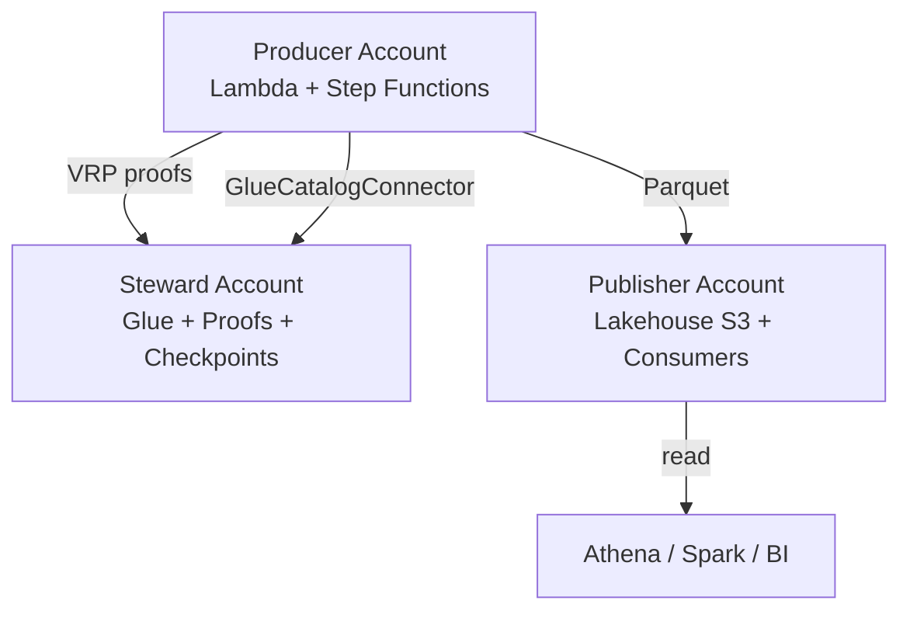
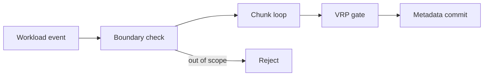
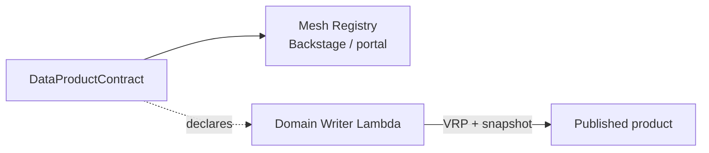
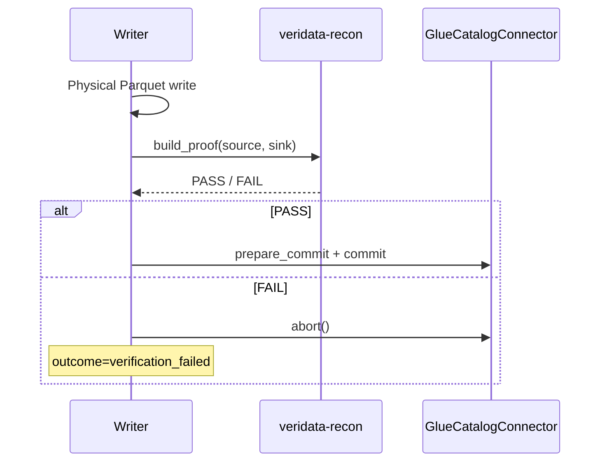
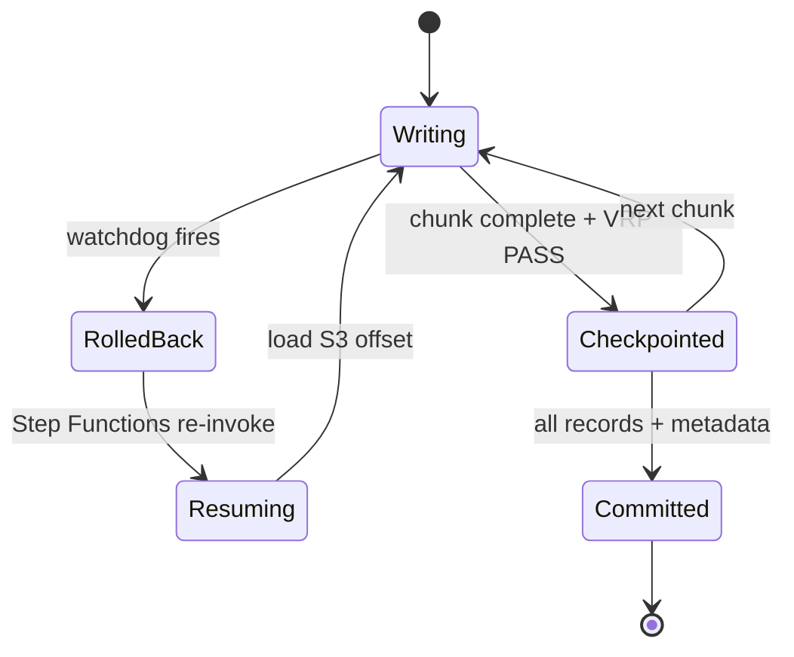
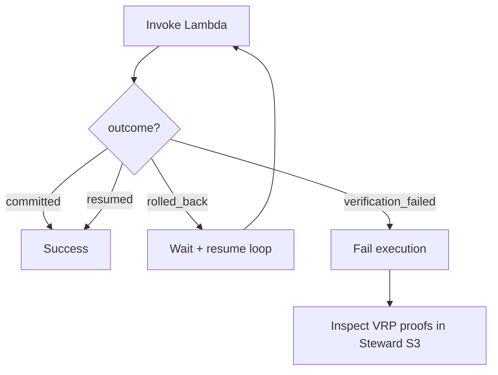
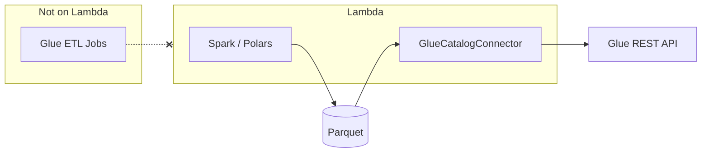
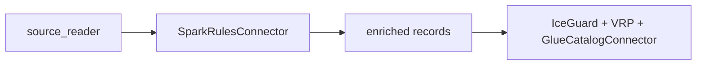
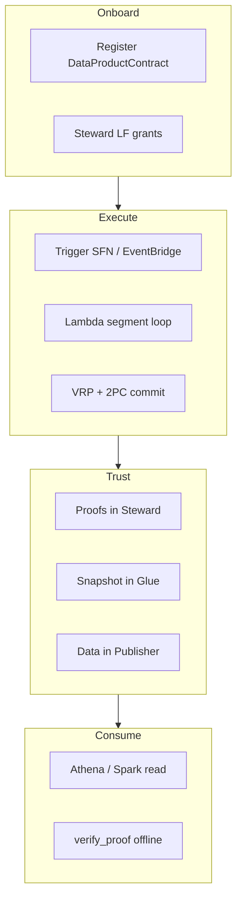

# Serverless Data Mesh — Concepts & Patterns

**A new framework for the world:** federated domain ownership, cryptographic verification, and exactly-once lakehouse writes—on AWS Lambda, without centralizing every pipeline.

This document maps **data mesh concepts** to **named patterns** in the framework, shows what is **fully covered end-to-end** today, and lists **improvements** on the roadmap.

---

## Concept coverage matrix

| Data mesh concept | Pattern in framework | Code / infra | Doc |
|-------------------|----------------------|--------------|-----|
| Domain ownership | Domain Transaction Boundary | `DomainTransactionBoundary` | [domain-contracts.md](domain-contracts.md) |
| Data product contract | Data Product Contract | `DataProductContract` | This doc §2 |
| Federated governance | Steward Notary | Steward S3 proofs + Glue catalog | [data-mesh-end-to-end.md](data-mesh-end-to-end.md) |
| Three-account isolation | Producer · Steward · Publisher | Terraform + IAM | [data-mesh-end-to-end.md](data-mesh-end-to-end.md) |
| Self-serve write path | Domain Writer Lambda | `examples/domain_writer/` | [getting-started.md](getting-started.md) |
| Exactly-once physical writes | IceGuard SafeWriter | `iceguard` + coordinator | [architecture.md](architecture.md) |
| Validate-then-commit | VRP Gate | `validate_then_commit` | [getting-started.md](getting-started.md) §7 |
| Audit provability | VRP Proof Chain | Steward `proof_bucket` | [data-mesh-end-to-end.md](data-mesh-end-to-end.md) §8 |
| Physical / metadata split | Two-Phase Commit (2PC) | IceGuard + `GlueCatalogConnector` | [glue-connector.md](glue-connector.md) |
| Compute on Lambda | Spark-on-Lambda / Polars | `batch_writer` hook | [glue-connector.md](glue-connector.md) §4 |
| Catalog without Glue ETL | Glue Catalog Connector | `GlueCatalogConnector` | [glue-connector.md](glue-connector.md) |
| Long backfills | Segmented Execution | Durable + Step Functions | [architecture.md](architecture.md) |
| Idempotent jobs | Workload Identity | `workload_id` | [domain-contracts.md](domain-contracts.md) |
| Failure isolation | Poison Pill Stop | SFN `verification_failed` → Fail | This doc §8 |
| Progressive rollout | Canary Backfill | Pattern (manual today) | This doc §9 |
| Configurable timeouts | Execution Profile | Terraform `lambda_timeout_seconds` | [terraform-guide.md](terraform-guide.md) |
| Business rules on Lambda | SparkRules Connector | `SparkRulesConnector` `[rules]` | [sparkrules-connector.md](sparkrules-connector.md) |
| PyPI distribution | Package extras | `[rules]`, `[spark]`, `[all]` | [pypi.md](pypi.md) |
| Consumer discovery | Data Product Registry | `to_registry_entry()` | This doc §2 |
| Multi-domain fan-out | Mesh Orchestrator | **Roadmap** | This doc §11 |
| Schema evolution policy | Contract Versioning | `schema_version` field | This doc §2 |
| Lineage graph | OpenLineage hook | **Roadmap** | This doc §11 |
| Cost per domain | `domain_id` tagging | Terraform `Domain` tag | [terraform-guide.md](terraform-guide.md) |

**Coverage today:** 18 of 22 concepts have working patterns; 4 are explicit roadmap items.

---

## Pattern catalog (with diagrams)

### 1. Federated Three-Account Mesh

Domains **produce**, Steward **governs**, Publisher **exposes**.



**When to use:** Enterprise AWS organizations with blast-radius and audit requirements.

---

### 2. Domain Transaction Boundary

Every write declares scope before execution. The coordinator refuses out-of-bound commits.

```python
DomainTransactionBoundary(
    domain_id="orders-domain",
    source_namespace="raw_orders",
    target_table="orders_curated",
    partition_spec={"dt": "2026-06-14"},
    quality_policy_id="strict-zero-drop",
    max_chunk_records=5000,
)
```



---

### 3. Data Product Contract (new)

Registry-facing contract: ownership, SLA, schema version, plus the transaction boundary.

```python
from serverless_data_mesh import DataProductContract, DomainTransactionBoundary

contract = DataProductContract(
    product_id="orders-curated-daily",
    owner_team="orders-platform",
    boundary=DomainTransactionBoundary(
        domain_id="orders-domain",
        source_namespace="raw_orders",
        target_table="orders_curated",
        partition_spec={"dt": "2026-06-14"},
    ),
    sla_freshness_hours=2,
    schema_version="2.1.0",
    description="Curated orders partition for analytics mesh consumers",
)

registry_entry = contract.to_registry_entry()
```



---

### 4. Validate-Then-Commit

**No metadata commit without VRP PASS.** This is the framework's core trust innovation.



---

### 5. Physical–Metadata Two-Phase Commit

Phase 1: files on S3. Phase 2: catalog snapshot. Never invert the order.

| Phase | Owner | Artifact |
|-------|-------|----------|
| 1 Physical | IceGuard / Spark | Parquet in Publisher S3 |
| 1b Verify | veridata-recon | Proof in Steward S3 |
| 2 Metadata | GlueCatalogConnector | Iceberg snapshot in Glue |

---

### 6. Segmented Lambda Execution

Lambda max **900s per invocation**. Total job budget via **durable execution** + **Step Functions resume**.

```mermaid
gantt
    title 90-minute backfill (lambda_timeout_seconds=900)
    dateFormat X
    axisFormat %M min

    section Segment 1
    Lambda invoke 0-15min     :0, 900
    section Wait
    SFN resume_wait 60s       :900, 960
    section Segment 2
    Lambda invoke 15-30min    :960, 1860
    section Segment N
    Lambda invoke → committed :crit, 5400, 6300
```



**Terraform knobs** (all in `terraform.tfvars`):

```hcl
lambda_timeout_seconds            = 900   # per invocation (max 900)
durable_execution_timeout_seconds   = 5400  # total durable budget
lambda_memory_mb                    = 4096
sfn_invoke_timeout_buffer_seconds   = 60    # SFN wait = lambda + buffer
resume_wait_seconds                 = 60
max_resume_attempts                 = 10    # auto-bumped if too low
# iceguard_rollback_threshold_ms  = null  # auto: ~33ms × lambda_timeout
```

Verify after apply:

```bash
terraform output execution_timeouts
```

---

### 7. IceGuard Rollback–Resume

Near timeout, IceGuard rolls back **uncommitted** Parquet, saves S3 checkpoint, returns `rolled_back`. Next segment resumes—no duplicate committed chunks.



---

### 8. Poison Pill Isolation

`verification_failed` **stops** the Step Functions execution—no blind retries that could mask data quality incidents.



---

### 9. Canary Backfill (recommended rollout)

Onboard new domains with a small proof-bearing workload before full partition backfills.

| Stage | `total_records` | Purpose |
|-------|-----------------|---------|
| Canary | 1,000–10,000 | Prove IAM, connector, VRP path |
| Pilot | 10% partition | Validate duration / timeout tuning |
| Production | Full partition | Scheduled EventBridge → SFN |

```json
{
  "workload_id": "canary-orders-20260614-v1",
  "total_records": 5000,
  "domain_id": "orders-domain",
  "partition_spec": {"dt": "2026-06-14"}
}
```

---

### 10. Steward Notary

Steward account holds **immutable** proof artifacts. Producers cannot delete audit history without Steward IAM policy.

```
s3://{proof_bucket}/{domain_id}/{workload_id}/proofs/chunk-{NNNNNN}.vrp.json
```

Consumers verify offline—trust is mathematical, not operational.

---

### 11. Compute–Metadata Split (Lambda + Glue connector)



---

### 12. Workload Identity (idempotency)

`workload_id` keys checkpoints, proofs, and durable replay. **Never reuse** for a different source slice.

---

### 13. SparkRules on Lambda (business rules)

[SparkRules](https://pypi.org/project/sparkrules/) evaluates Drools-style DRL per chunk in pure Python—before VRP and physical write.



```bash
pip install "serverless-data-mesh[rules]"
SDM_EXTRAS=rules ./infrastructure/terraform/scripts/package_lambda.sh
```

See **[sparkrules-connector.md](sparkrules-connector.md)**.

---

## End-to-end: is everything covered?



| Stage | Covered? | Gap |
|-------|----------|-----|
| Product registration | Partial | Auto-publish `to_registry_entry()` to portal — manual |
| IAM / LF setup | Documented | No multi-account Terraform module yet |
| Trigger / schedule | Yes | EventBridge optional |
| Physical write | Yes | Spark stub only — domain implements |
| Verification | Yes | Requires `veridata-recon` install |
| Metadata commit | Yes | Glue prerequisites manual |
| Long execution | Yes | Terraform timeouts configurable |
| Resume on timeout | Yes | SFN loop |
| Consumer read | Documented | No subscription API |
| Offline audit | Yes | `veridata-recon verify_proof` |

**Verdict:** The framework covers the **write path end-to-end** for a new mesh domain. Remaining gaps are **platform ergonomics** (multi-account Terraform, registry automation, lineage)—not core transaction semantics.

---

## Roadmap patterns (improvements)

| Pattern | Description | Priority |
|---------|-------------|----------|
| **Mesh Orchestrator** | Step Functions Map state fan-out across domains | High |
| **Multi-account Terraform** | Steward / Publisher / Producer roots | `environments/multi-account/` (scaffold) | High |
| **OpenLineage emitter** | Emit lineage events on `committed` | Medium |
| **Schema drift gate** | Block commit if `schema_version` mismatch | Medium |
| **Consumer subscription webhook** | Notify Publisher on new snapshot | Medium |
| **Automatic registry sync** | Push `DataProductContract` to Backstage API | Low |

---

## How this differs from traditional platforms

| Traditional | Serverless Data Mesh |
|-------------|---------------------|
| Central ETL monolith | Per-domain Lambda writer |
| Glue jobs for everything | Glue **catalog connector** only |
| "Trust the pipeline logs" | VRP cryptographic proof per chunk |
| Retry until success | `verification_failed` stops the line |
| 15-min Lambda limit = blocker | Segmented execution to 90+ minutes |
| Single account lake | Producer · Steward · Publisher |

---

## Related documentation

| Doc | Focus |
|-----|-------|
| [data-mesh-end-to-end.md](data-mesh-end-to-end.md) | Three accounts, full backfill journey |
| [glue-connector.md](glue-connector.md) | Lambda + Spark vs Glue ETL |
| [architecture.md](architecture.md) | Component diagram |
| [terraform-guide.md](terraform-guide.md) | Deploy + timeout tuning |
| [getting-started.md](getting-started.md) | Developer tutorial |

---

*This framework introduces **validate-then-commit lakehouse writes on Lambda** as a first-class data mesh primitive—the world's domains get autonomy; the mesh gets proofs.*
