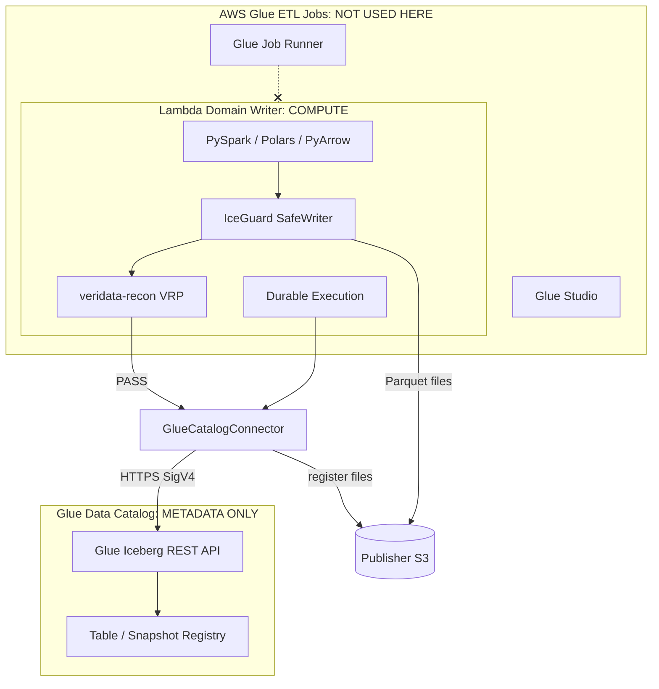
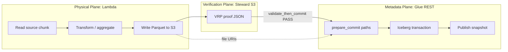
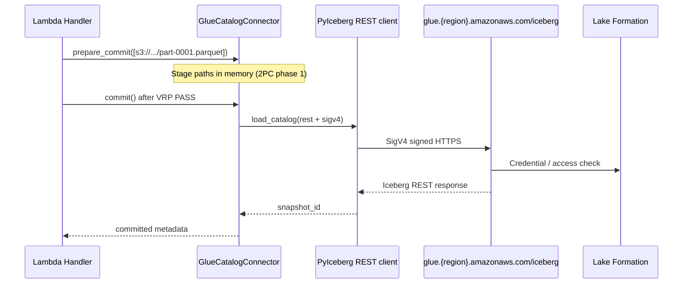
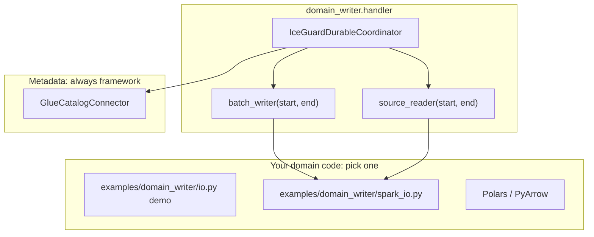
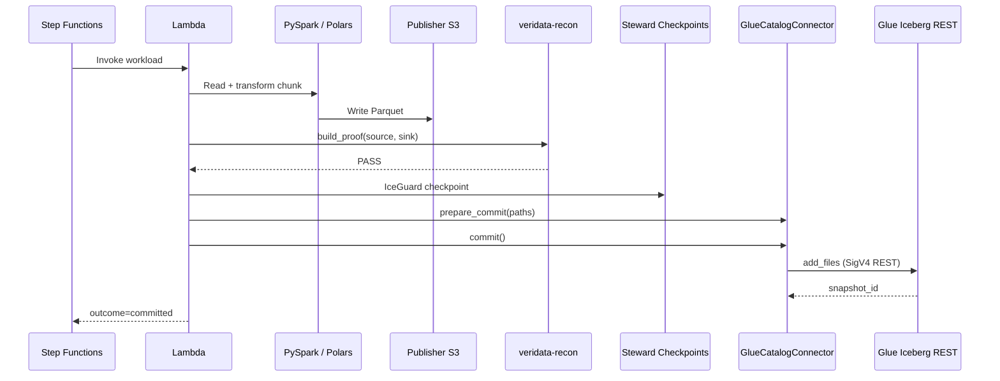
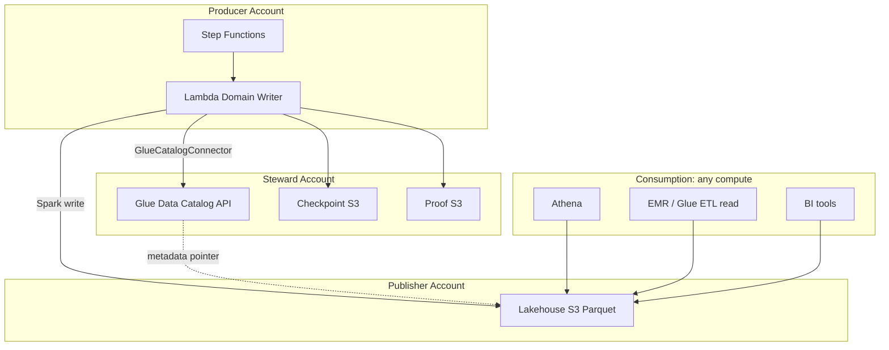
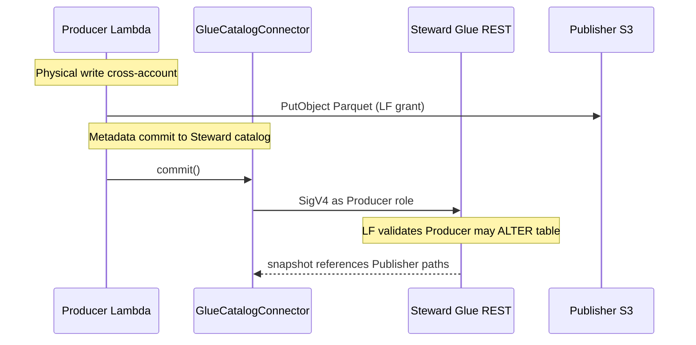

# Glue Catalog Connector: Lambda, Spark, and What Glue Does *Not* Do Here

Serverless Data Mesh separates **compute** (Lambda) from **catalog** (Glue Data Catalog).
This guide explains the **Glue Catalog Connector**, why **AWS Glue ETL jobs cannot run on Lambda**,
how **Spark on Lambda** fits the physical layer, and where mermaid diagrams map to production.

---

## Table of contents

1. [The core distinction](#1-the-core-distinction)
2. [Architecture: two planes](#2-architecture-two-planes)
3. [Glue Catalog Connector API](#3-glue-catalog-connector-api)
4. [Spark on Lambda (physical layer)](#4-spark-on-lambda-physical-layer)
5. [End-to-end sequence](#5-end-to-end-sequence)
6. [What runs in each AWS service](#6-what-runs-in-each-aws-service)
7. [Environment variables](#7-environment-variables)
8. [Multi-account Steward catalog](#8-multi-account-steward-catalog)
9. [Anti-patterns](#9-anti-patterns)
10. [Related docs](#10-related-docs)

---

## 1. The core distinction

| Capability | Runs on Lambda? | Used by this framework? |
|------------|-----------------|-------------------------|
| **PySpark / Spark-on-Lambda** (physical Parquet writes) | Yes (with JVM layer/container) | Yes: domain `batch_writer` |
| **Polars / PyArrow / DuckDB** (physical writes) | Yes | Yes: lighter alternative to Spark |
| **AWS Glue ETL job** (managed Spark runner) | **No** | **No**: separate service |
| **Glue Interactive Sessions** | **No** | **No** |
| **Glue Data Catalog** (table metadata) | N/A (API only) | **Yes**: via Glue Catalog Connector |
| **Glue Iceberg REST** (`add_files` 2PC) | N/A (HTTPS + SigV4) | **Yes**: metadata commit |



**Key insight:** Glue in this framework means **catalog connector**, not **Glue job engine**.
You get Iceberg table registration in the Steward Glue catalog without ever starting a Glue ETL job.

---

## 2. Architecture: two planes



| Plane | Technology | Runs where |
|-------|------------|------------|
| Physical | Spark-on-Lambda, Polars, demo `io.py` | Lambda container |
| Verification | veridata-recon | Lambda container |
| Orchestration | IceGuard + Durable SDK + Step Functions | Lambda + AWS control plane |
| Metadata | `GlueCatalogConnector` (PyIceberg REST) | Lambda → HTTPS → Glue API |

---

## 3. Glue Catalog Connector API

The connector is `GlueCatalogConnector` (alias of `GlueRestCatalogAdapter`).

```python
from serverless_data_mesh import GlueCatalogConnector

connector = GlueCatalogConnector.from_environment(
    namespace="raw_orders",       # Glue database
    table_name="orders_curated",  # Iceberg table
)

# Phase 1: stage data file paths (already on S3 from Spark/PyArrow)
connector.prepare_commit(parquet_paths)

# Phase 2: publish snapshot (only after VRP PASS)
snapshot_id = connector.commit(snapshot_properties={"app-id": "orders-domain"})
```

### Connector internals



### REST properties (automatic)

| Property | Value |
|----------|-------|
| `type` | `rest` |
| `uri` | `https://glue.{region}.amazonaws.com/iceberg` |
| `warehouse` | `{account_id}:s3tablescatalog/{bucket}` |
| `rest.sigv4-enabled` | `true` |
| `rest.signing-name` | `glue` |

No `spark.hadoop.*`, no Glue job `JobRunId`, no DPUs.

---

## 4. Spark on Lambda (physical layer)

Glue ETL cannot replace this: if you need Spark transforms, run **PySpark inside Lambda**
(or use Polars/PyArrow for smaller chunks).



### Wiring Spark into the handler

```python
from serverless_data_mesh import IceGuardDurableCoordinator, GlueCatalogConnector

# Inside handler: Spark session created once per cold start (domain code):
# spark = create_spark_session()  # JVM layer required

coordinator = IceGuardDurableCoordinator(
    durable_context=context,
    lambda_context=context,
    proof_generator=proofs,
    catalog_adapter=GlueCatalogConnector.from_environment(
        namespace=workload.boundary.source_namespace,
        table_name=workload.boundary.target_table,
    ),
)

result = coordinator.execute_workload(
    workload,
    batch_writer=lambda s, e: write_parquet_chunk_spark(spark, workload.target_uri, ...),
    source_reader=lambda s, e: records_from_source_spark(spark, workload.source_uri, s, e),
)
```

### Lambda packaging notes for Spark

| Approach | Pros | Cons |
|----------|------|------|
| **Lambda container image** | Full JVM + Spark control | Larger image, slower cold start |
| **Lambda layer (Spark)** | Zip deploy | Size limits, version pinning |
| **Polars / PyArrow** | Small package, fast cold start | Not full Spark SQL |

Install optional Spark deps:

```bash
pip install "serverless-data-mesh[spark]"
```

See `examples/domain_writer/spark_io.py` for the integration stub.

---

## 5. End-to-end sequence

One chunk, from Lambda through Glue catalog (no Glue job):



If IceGuard rolls back near 15 minutes, **Spark and connector split cleanly**:

- Spark may have written partial Parquet → IceGuard rolls back uncommitted files
- `GlueCatalogConnector.abort()`: no snapshot published
- Next segment resumes from S3 checkpoint: **no duplicate metadata**

---

## 6. What runs in each AWS service



**Downstream Glue ETL jobs** may *read* curated tables for further aggregation: that is
normal consumption. The **domain writer** that lands the mesh product does **not** invoke them.

---

## 7. Environment variables

| Variable | Connector use |
|----------|-----------------|
| `AWS_REGION` | Glue REST endpoint region |
| `AWS_ACCOUNT_ID` | Warehouse ARN (Steward account in multi-account) |
| `ICEBERG_WAREHOUSE` | `{account}:s3tablescatalog/{bucket}` |
| `ICEBERG_TABLE_BUCKET` | Default warehouse bucket name |

IAM (Lambda role in Producer, catalog in Steward):

```json
{
  "Action": [
    "glue:GetDatabase", "glue:GetTable", "glue:UpdateTable",
    "glue:GetPartition", "glue:GetPartitions"
  ],
  "Resource": "arn:aws:glue:REGION:STEWARD_ACCOUNT:table/NAMESPACE/TABLE"
}
```

Plus `lakeformation:GetDataAccess` when Lake Formation governs the table.

---

## 8. Multi-account Steward catalog



Set `ICEBERG_WAREHOUSE` to the **Steward** account warehouse string even when Parquet
lands in **Publisher** S3.

---

## 9. Anti-patterns

| Anti-pattern | Why it fails | Correct approach |
|--------------|--------------|------------------|
| Start a Glue ETL job from Lambda to write mesh data | Glue jobs are async managed runners, not Lambda subprocesses | Spark-on-Lambda or Polars in `batch_writer` |
| `spark.catalog` JVM commit inside Lambda | Heavy, fragile, wrong catalog session | `GlueCatalogConnector.commit()` |
| Commit metadata before VRP PASS | Silent data loss / audit gap | `validate_then_commit` gate in coordinator |
| Skip `prepare_commit` / `commit` 2PC | Orphan Parquet invisible to Athena | Always run connector after PASS |
| Invoke Lambda without `:live` alias | Durable + catalog replay breaks | Qualified ARN from Terraform |

---

## 10. Related docs

| Document | Topic |
|----------|-------|
| [Data mesh end-to-end](data-mesh-end-to-end.md) | Producer / Steward / Publisher journey |
| [Architecture](architecture.md) | Four-phase transaction boundary |
| [Getting started: Step 8](getting-started.md) | Connector setup in tutorial |
| [Domain contracts](domain-contracts.md) | `source_namespace` / `target_table` |
| `examples/domain_writer/spark_io.py` | Spark physical layer stub |

```python
# Public exports
from serverless_data_mesh import GlueCatalogConnector, GlueRestCatalogAdapter
```

Both names refer to the same metadata-only Glue Iceberg REST connector.
