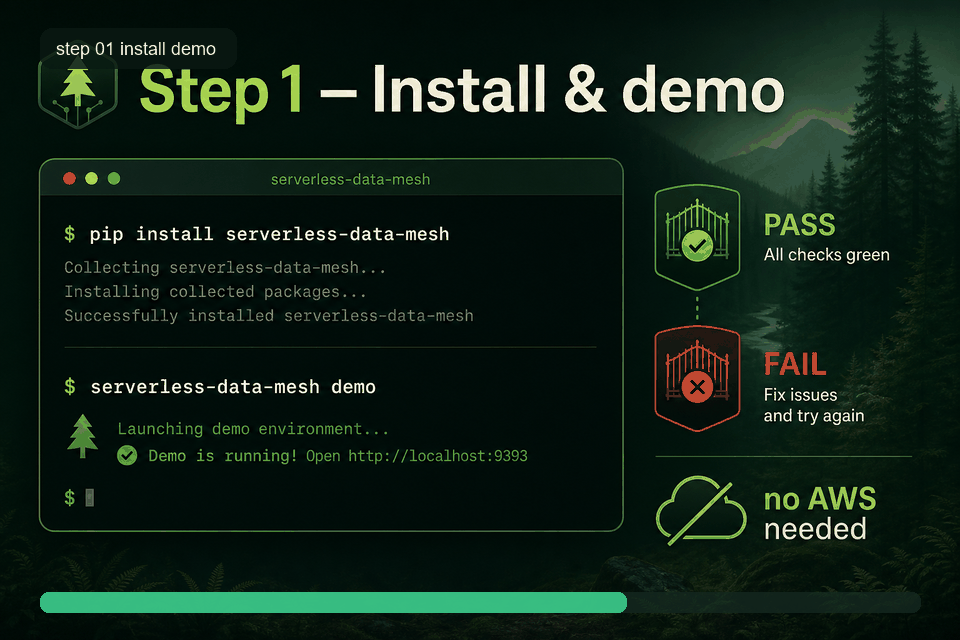
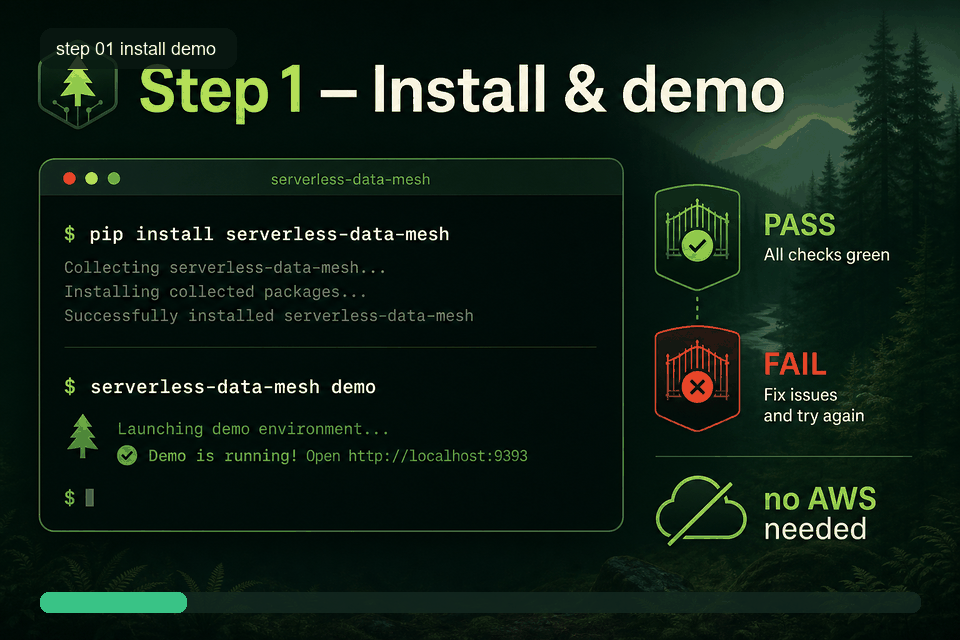
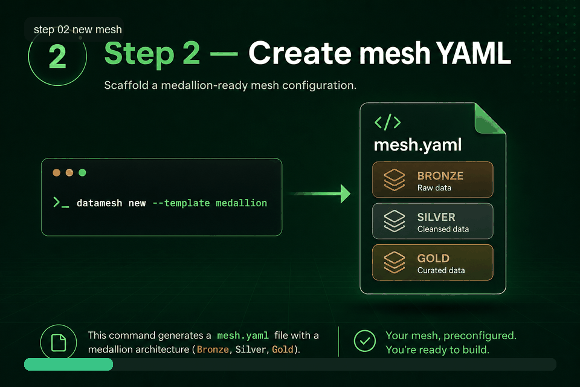
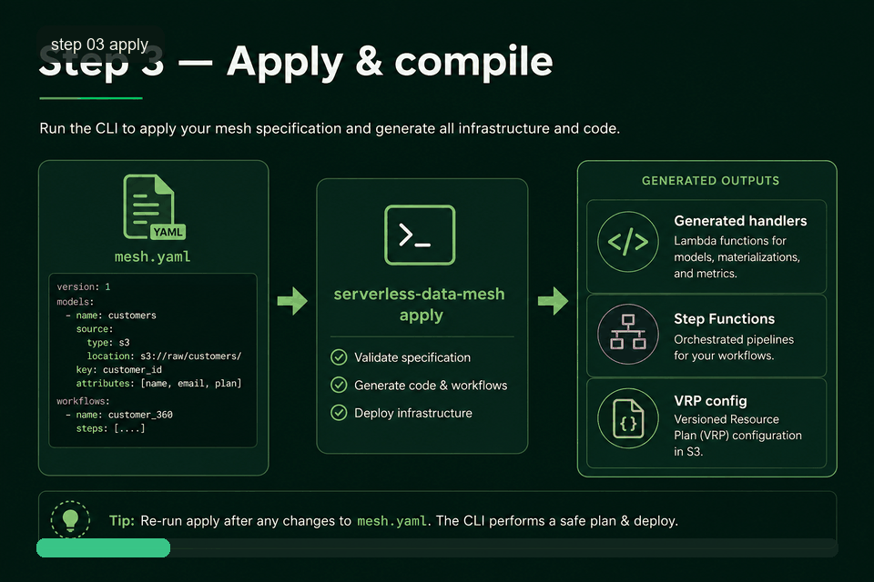
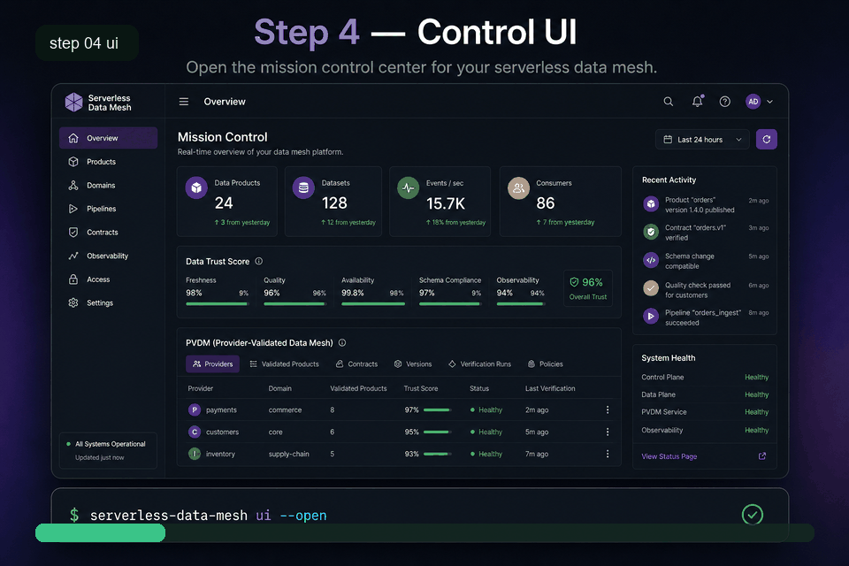
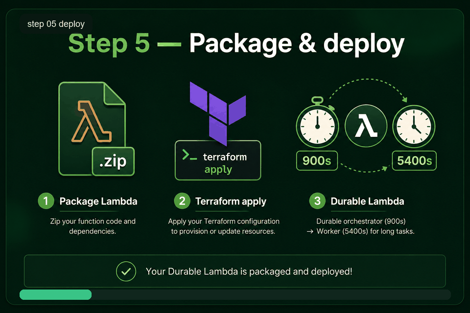
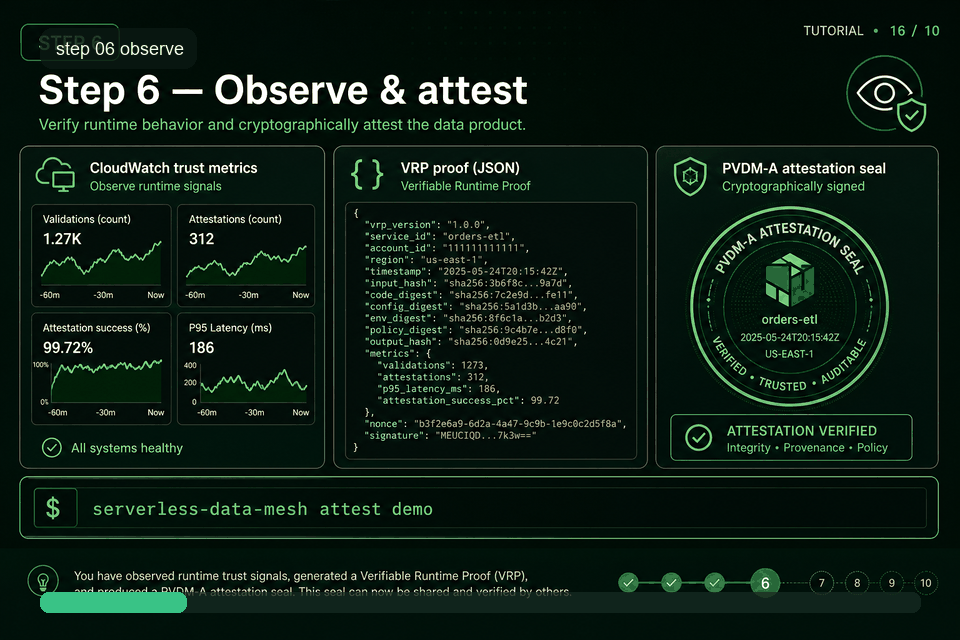

# How to start — step-by-step (with GIFs + benefits)

> **Interactive demo (auto-play like a video):** open [`demo-walkthrough.html`](demo-walkthrough.html) in your browser  
> (from the repo: `docs/demo-walkthrough.html` — or use the Control UI → **Tutorial** tab).

<p align="center">
  
</p>

---

## Start here (copy / paste)

**Requires Python 3.12+.** From the repo root:

```bash
# 1) Install (or: pip install -e ".[dev]" from a clone)
pip install serverless-data-mesh

# 2) Optional 60s proof (no AWS)
serverless-data-mesh demo

# 3) Generate the sample mesh + open the control center
serverless-data-mesh apply ^
  --contract examples/medallion-e2e/northstar.mesh.yaml ^
  --output examples/medallion-e2e/generated

serverless-data-mesh ui --path examples/medallion-e2e/generated --open
```

On Mac/Linux use `\` instead of `^` for line breaks.

**Browser opens:** [http://127.0.0.1:8765/](http://127.0.0.1:8765/)

| What you see | What to click |
|--------------|---------------|
| Overview | KPIs + trust bars |
| Pipelines | All bronze/silver/gold outputs |
| Trust | VRP PASS/FAIL board |
| Tutorial | GIF guide (same as below) |
| **Run PVDM demo** (top button) | Local gate demo → updates Trust |

**Video-style walkthrough page:** open `docs/demo-walkthrough.html` (Play/Pause, auto-advances every ~6.5s).

---

## Each step: what you do → what you get

### Step 1 — Install & prove the gate



| | |
|--|--|
| **You do** | `pip install serverless-data-mesh` then `serverless-data-mesh demo` |
| **You get** | Clean write **commits**; corrupt write is **blocked** — in &lt;60s, **no AWS** |
| **Benefit** | Proof that “pipeline succeeded” ≠ trustworthy data |

### Step 2 — Create mesh YAML



| | |
|--|--|
| **You do** | `serverless-data-mesh new --template medallion --output my-mesh` |
| **You get** | A starter `mesh.yaml` (or use `examples/medallion-e2e/northstar.mesh.yaml`) |
| **Benefit** | Domain teams own the contract — not a central Glue ticket queue |

### Step 3 — Apply (compile pipelines)



| | |
|--|--|
| **You do** | `serverless-data-mesh apply --contract … --output …/generated` |
| **You get** | Handlers, Step Functions ASL, VRP config, layer Lambda manifest |
| **Benefit** | One YAML → many proof-gated pipelines (bronze / silver / gold) |

### Step 4 — Start the control UI



| | |
|--|--|
| **You do** | `serverless-data-mesh ui --path …/generated --open` |
| **You get** | Local control center at **http://127.0.0.1:8765/** |
| **Benefit** | See readiness, trust, PVDM, and durable clocks before you spend AWS $ |

### Step 5 — Deploy Durable Lambda (AWS)



| | |
|--|--|
| **You do** | Package Lambda zip + `terraform apply` (see [durable-compute](../examples/durable-compute/README.md)) |
| **You get** | Durable Lambda on Firecracker, on-demand scale-to-zero, dual clocks (e.g. 900s × 5400s) |
| **Benefit** | Configurable durable backfills (e.g. 60–180+ min) without idle EMR/Glue clusters |

### Step 6 — Observe & attest



| | |
|--|--|
| **You do** | `serverless-data-mesh attest demo --json` and/or trust dashboard |
| **You get** | VRP proofs + PVDM-A decision attestations + CloudWatch trust metrics |
| **Benefit** | Auditable publication: consumers only see snapshots after **VRP PASS** |

---

## Why this path exists (Vaquar Pattern / PVDM)

**Proprietary method by Vaquar Khan** · reference code Apache-2.0

```text
Physical → Verify → Durable → Metadata
Invariant: commit_metadata ⟹ VRP = PASS
```

You start local (Steps 1–4), then optionally go to AWS (Steps 5–6).

---

## Rebuild animated GIFs

```bash
python scripts/build_tutorial_gifs.py
```
