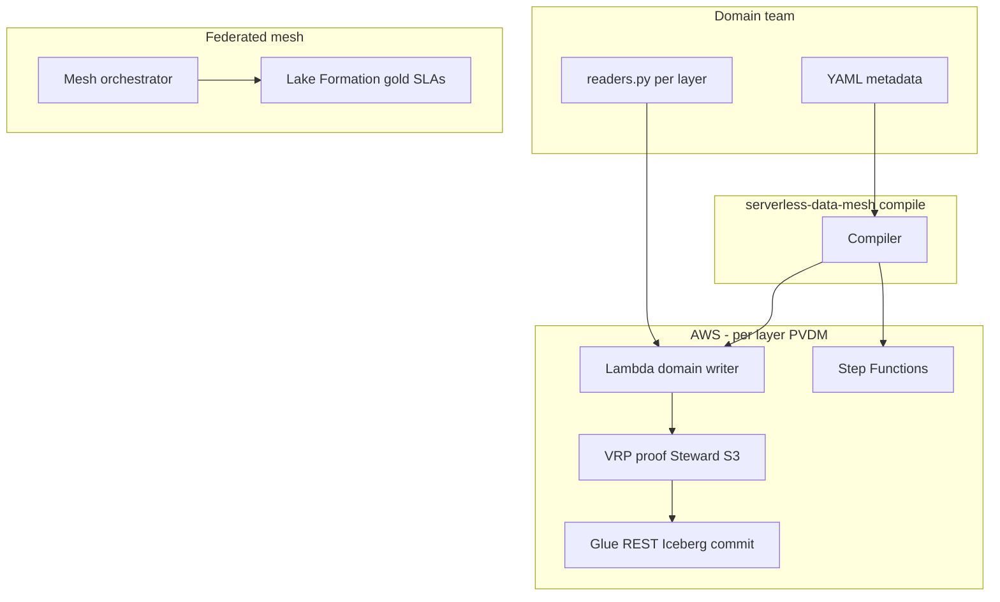

# Metadata-Driven Pipeline & Medallion Mesh — Complete Guide

**Serverless Data Mesh** lets domain teams define **data products in YAML**. The compiler generates proof-gated serverless pipelines (Lambda + Step Functions + VRP + Iceberg), medallion bronze/silver/gold chains, consumer SLAs, and mesh orchestration.

**Invariant (Vaquar Pattern):** `commit_metadata ⟹ VRP = PASS` for every layer and every domain.

---

## Zero friction — 2 commands to a full mesh

```bash
pip install serverless-data-mesh

# 1. Create starter YAML (or drop your own mesh.yaml in my-mesh/)
serverless-data-mesh new --template medallion --output my-mesh

# 2. Generate ALL pipelines + orchestrators + checklist
serverless-data-mesh apply --contract my-mesh/mesh.yaml --output my-mesh/generated
```

Then implement only `readers.py` in each generated layer folder. Re-run `apply` after YAML edits.

| Command | What it does |
|---------|----------------|
| `new` | Copy starter template (`medallion`, `single`, `northstar`) |
| `apply` | validate → compile → doctor → `GETTING_STARTED.md` |
| `validate` | Check YAML only (fast CI gate) |
| `doctor` | List which `readers.py` still need your code |
| `compile` | Generate pipelines only (advanced) |

**Makefile shortcuts:** `make mesh-new` → `make mesh-apply` → `make mesh-doctor`

---

## Table of contents

1. [Overview](#overview)
2. [Quick start](#quick-start)
3. [Contract kinds (`sdm/v1`)](#contract-kinds-sdmv1)
4. [Schema reference: `DataProductPipeline`](#schema-reference-dataproductpipeline)
5. [Schema reference: `MedallionMesh`](#schema-reference-medallionmesh)
6. [Medallion layers (bronze / silver / gold)](#medallion-layers-bronze--silver--gold)
7. [Runtime engines on Lambda](#runtime-engines-on-lambda)
8. [CLI commands](#cli-commands)
9. [Generated artifacts](#generated-artifacts)
10. [How many pipelines do you need?](#how-many-pipelines-do-you-need)
11. [Orchestration](#orchestration)
12. [Mesh transactions](#mesh-transactions)
13. [Consumer SLAs & Lake Formation](#consumer-slas--lake-formation)
14. [Deploy to AWS](#deploy-to-aws)
15. [CI/CD workflow](#cicd-workflow)
16. [Validation rules](#validation-rules)
17. [Examples index](#examples-index)
18. [Related docs](#related-docs)

---

## Overview

### The problem

Traditional data mesh programs reorganize teams but leave pipeline creation to platform tickets: Glue jobs, Step Functions wiring, IAM, monitoring, and quality gates are hand-built per domain.

### The solution

| You provide | Framework generates |
|-------------|---------------------|
| YAML metadata (`mesh.pipeline.yaml` or `northstar.mesh.yaml`) | Lambda handlers, durable Step Functions |
| `readers.py` per layer (source/sink I/O) | VRP proof config, auto-repair hooks |
| Terraform module wiring (one-time platform setup) | Per-pipeline stubs, EventBridge, SLA YAML |
| — | Domain bronze→silver→gold orchestrators |
| — | Mesh-wide orchestrator + leader commit |

### Architecture



---

## Quick start

### Single pipeline

```bash
pip install serverless-data-mesh

serverless-data-mesh compile \
  --contract examples/contracts/payments.mesh.pipeline.yaml \
  --output domains/
```

### Full medallion mesh (recommended for new domains)

```bash
serverless-data-mesh compile \
  --contract examples/medallion-e2e/northstar.mesh.yaml \
  --output generated/
```

### Minimal scaffold

```bash
serverless-data-mesh init \
  --domain payments \
  --table fact_payments \
  --account 123456789012
```

---

## Contract kinds (`sdm/v1`)

| `kind` | Use when | Output |
|--------|----------|--------|
| `DataProductPipeline` | One table / one write path | 1 pipeline directory |
| `MedallionMesh` | Bronze + silver + gold per domain | N domains × 3 layers + orchestrators |

Both use `apiVersion: sdm/v1`.

---

## Schema reference: `DataProductPipeline`

### Full example

```yaml
apiVersion: sdm/v1
kind: DataProductPipeline
metadata:
  domain_id: payments              # required — mesh domain owner
  product_id: payments-fact_payments
  owner_team: payments-platform
  description: Nightly payments fact table
spec:
  accounts:
    producer: "123456789012"       # required — 12-digit AWS account
    steward: "234567890123"        # optional — proofs, Glue catalog
    publisher: "345678901234"      # optional — lakehouse S3
  boundary:
    source_namespace: raw_payments # Glue namespace for VRP metadata
    target_table: fact_payments    # required — Iceberg table name
    partition_key: dt              # default: dt
    quality_policy_id: strict-zero-drop
    max_chunk_records: 5000
  workload:
    identity_fields: [payment_id]  # VRP identity rule
    content_fields: [payment_id, amount, currency]
    checkpoint_interval: 5000
    rollback_threshold_ms: 30000
  runtime:
    engine: pyarrow                # pyarrow | polars | pyspark | pure_python
    package_extras: rules            # pip extra: rules | spark | all
    lambda_memory_mb: 3008
    lambda_timeout_seconds: 900
    spark_rules_enabled: true
    spark_shuffle_partitions: 8
  governance:
    sla_freshness_hours: 2
    auto_repair: true              # VRP FAIL → reprocess drops
    canary_max_divergence_pct: 1.0
    schema_version: "1.0.0"
  triggers:
    - type: schedule
      cron: "0 2 * * *"
      description: Nightly 02:00 UTC
    # - type: manual
    # - type: chain          # after upstream layer VRP PASS
  consumer_slas:
    - consumer_id: analytics-team
      target_table: fact_payments
      max_freshness_minutes: 120
      min_completeness_pct: 99.9
      required_columns: [payment_id, amount, currency]
      enforcement: vrp_backed
  aws_region: us-east-2
  name_prefix: sdm-payments
```

### Field reference

#### `metadata`

| Field | Required | Description |
|-------|----------|-------------|
| `domain_id` | yes | Federated domain identifier (e.g. `orders`, `payments`) |
| `product_id` | no | Registry product id; default `{domain_id}-{target_table}` |
| `owner_team` | no | Owning team for Backstage / catalog |
| `description` | no | Human-readable summary |

#### `spec.accounts`

| Field | Required | Description |
|-------|----------|-------------|
| `producer` | yes | Domain writer Lambda account (12 digits) |
| `steward` | no | Proofs, checkpoints, Glue catalog notary |
| `publisher` | no | Lakehouse S3 + consumer Iceberg tables |

#### `spec.boundary`

| Field | Required | Description |
|-------|----------|-------------|
| `source_namespace` | yes | Glue namespace for catalog commits |
| `target_table` | yes | Iceberg table produced by this pipeline |
| `partition_key` | no | Partition field; default `dt` |
| `quality_policy_id` | no | Audit label; default `strict-zero-drop` |
| `max_chunk_records` | no | IceGuard chunk size; default `5000` |

#### `spec.workload`

| Field | Required | Description |
|-------|----------|-------------|
| `identity_fields` | no | VRP identity columns; default `[id]` |
| `content_fields` | no | Columns hashed for multiset proof |
| `checkpoint_interval` | no | Durable checkpoint frequency |
| `rollback_threshold_ms` | no | IceGuard rollback before Lambda timeout |

#### `spec.runtime`

| Field | Required | Description |
|-------|----------|-------------|
| `engine` | no | `pyarrow`, `polars`, `pyspark`, `pure_python` |
| `package_extras` | no | `rules`, `spark`, `all`; inferred from engine if omitted |
| `lambda_memory_mb` | no | Generated `terraform/lambda.tf` hint |
| `lambda_timeout_seconds` | no | Max 900 for Lambda |
| `spark_rules_enabled` | no | Emit SparkRules hook in readers |
| `spark_shuffle_partitions` | no | PySpark config for silver/gold |

#### `spec.governance`

| Field | Required | Description |
|-------|----------|-------------|
| `auto_repair` | no | Enable VRP-triggered reprocessing |
| `canary_max_divergence_pct` | no | Canary promotion tolerance |
| `sla_freshness_hours` | no | Producer SLA metadata |
| `schema_version` | no | Contract version for registry |

#### `spec.triggers[]`

| `type` | Fields | Behavior |
|--------|--------|----------|
| `schedule` | `cron` (required) | EventBridge → Step Functions |
| `manual` | — | On-demand invoke |
| `chain` | — | Started by upstream layer orchestrator |
| `event` | `description` | EventBridge on upstream success |

#### `spec.consumer_slas[]`

| Field | Required | Description |
|-------|----------|-------------|
| `consumer_id` | yes | Analytics / finance team id |
| `target_table` | no | Defaults to pipeline target table |
| `max_freshness_minutes` | no | Max age of VRP proof for LF grant |
| `min_completeness_pct` | no | sink_count / source_count threshold |
| `required_columns` | no | Must appear in VRP `content_fields` |
| `enforcement` | no | `vrp_backed` (default) |

---

## Schema reference: `MedallionMesh`

One file defines **all domains** and **all layers**. The compiler emits `{domain}/{bronze|silver|gold}/` pipelines plus orchestrators.

### Full example

See [examples/medallion-e2e/northstar.mesh.yaml](../examples/medallion-e2e/northstar.mesh.yaml).

```yaml
apiVersion: sdm/v1
kind: MedallionMesh
metadata:
  organization: northstar-retail
  description: E-commerce medallion mesh — metadata only
spec:
  name_prefix: northstar
  aws_region: us-east-2
  accounts:
    producer: "111111111111"
    steward: "234567890123"
    publisher: "345678901234"
  mesh_transactions:
    - transaction_id: finance-daily-close
      domains: [orders, payments]
      description: Gold layers must both VRP PASS before finance consumers read
  domains:
    - domain_id: orders
      owner_team: orders-platform
      schedule_cron: "0 1 * * *"
      mesh_transaction_group: finance-daily-close
      layers:
        bronze:
          target_table: orders_bronze
          source_namespace: bronze_orders
          identity_fields: [order_id, line_id]
          content_fields: [order_id, line_id, raw_json, ingested_at]
          runtime: { engine: pyarrow, lambda_memory_mb: 3008 }
          transforms: [landing_copy]
        silver:
          target_table: orders_silver
          source_namespace: silver_orders
          upstream_layer: bronze
          runtime:
            engine: pyspark
            package_extras: spark
            lambda_memory_mb: 10240
            spark_shuffle_partitions: 16
          transforms: [dedup, join_lines, filter_cancelled]
          auto_repair: true
        gold:
          target_table: orders_gold_daily
          source_namespace: gold_orders
          upstream_layer: silver
          runtime: { engine: pyspark, package_extras: spark }
          transforms: [enrich_region, daily_snapshot]
          consumer_slas:
            - consumer_id: analytics-team
              required_columns: [order_id, customer_id, order_total]
```

### `spec.domains[]`

| Field | Required | Description |
|-------|----------|-------------|
| `domain_id` | yes | Mesh domain |
| `owner_team` | no | Team owning all layers |
| `description` | no | Domain summary |
| `schedule_cron` | no | Cron for **bronze** layer EventBridge |
| `mesh_transaction_group` | no | Links domain to `mesh_transactions` |
| `layers` | yes | Map with keys `bronze`, `silver`, `gold` |

### `spec.domains[].layers.{bronze|silver|gold}`

| Field | Required | Description |
|-------|----------|-------------|
| `target_table` | yes | Iceberg table for this layer |
| `source_namespace` | no | Default `{layer}_{domain_id}` |
| `upstream_layer` | silver/gold | `bronze` for silver; `silver` for gold |
| `description` | no | Layer purpose |
| `identity_fields` | no | VRP identity |
| `content_fields` | no | VRP content hash fields |
| `runtime` | no | Same as single-pipeline `spec.runtime` |
| `transforms` | no | **Metadata labels** for your `readers.py` (documented in stub) |
| `max_chunk_records` | no | Chunk size |
| `auto_repair` | no | VRP auto-reprocess |
| `consumer_slas` | gold recommended | LF read gates |

### `spec.mesh_transactions[]`

| Field | Required | Description |
|-------|----------|-------------|
| `transaction_id` | yes | e.g. `finance-daily-close` |
| `domains` | yes | Domains that must commit atomically at gold |
| `description` | no | Business reason |

---

## Medallion layers (bronze / silver / gold)

| Layer | Purpose | Typical source | Typical engine | Consumer access |
|-------|---------|----------------|----------------|-----------------|
| **Bronze** | Raw landing, append-only, minimal transform | S3 landing, CDC, API | PyArrow | Internal only |
| **Silver** | Cleansed, deduped, conformed | Bronze Iceberg | PySpark, SparkRules | Domain teams |
| **Gold** | Curated data product | Silver Iceberg | PySpark, PyArrow | Mesh consumers (LF gated) |

### Data flow per domain

```
External source
      │
      ▼
  BRONZE pipeline  ──VRP PASS──►  Iceberg orders_bronze
      │
      ▼
  SILVER pipeline  ──VRP PASS──►  Iceberg orders_silver
      │
      ▼
  GOLD pipeline    ──VRP PASS──►  Iceberg orders_gold_daily
      │
      ▼
  consumer_slas    ──VRP proof──►  Lake Formation SELECT grant
```

Each arrow is a **separate generated PVDM pipeline** with its own Lambda, proofs, and durable checkpoints.

### `transforms` metadata

`transforms: [dedup, join_lines]` are **declarative labels** embedded in generated `readers.py` stubs. They document intent; you implement the logic in `source_reader` / `batch_writer`.

---

## Runtime engines on Lambda

| `engine` | When to use | Package | JVM | Generated readers |
|----------|-------------|---------|-----|-------------------|
| `pyarrow` | Bronze ingest, light transforms | core | no | Default Python readers |
| `polars` | Medium transforms, no cluster | core | no | Default Python readers |
| `pyspark` | Heavy joins, aggregates, silver/gold | `[spark]` | **yes** | `SparkSession` stub |
| `pure_python` | Tiny payloads, tests | core | no | Default readers |

### SparkRules (not PySpark)

Set `spark_rules_enabled: true` and `package_extras: rules` for DRL business rules **without** JVM:

```yaml
runtime:
  engine: pyarrow
  package_extras: rules
  spark_rules_enabled: true
```

Rules run in pure Python before VRP (`SparkRulesConnector.apply_chunk`).

### Lambda packaging

```bash
# Core
./infrastructure/terraform/scripts/package_lambda.sh

# SparkRules
SDM_EXTRAS=rules ./infrastructure/terraform/scripts/package_lambda.sh

# PySpark on Lambda (use container image or JVM layer for production)
SDM_EXTRAS=spark ./infrastructure/terraform/scripts/package_lambda.sh
```

Generated `terraform/lambda.tf` includes `lambda_memory_mb`, `lambda_timeout_seconds`, and `lambda_package_extras` from your YAML.

---

## CLI commands

| Command | Description |
|---------|-------------|
| `serverless-data-mesh new` | Starter YAML from template (`medallion`, `single`, `northstar`) |
| `serverless-data-mesh apply` | **One-shot:** validate + compile + doctor + guide |
| `serverless-data-mesh validate` | Validate YAML without compiling |
| `serverless-data-mesh doctor` | Check generated mesh readiness |
| `serverless-data-mesh compile` | Generate pipeline(s) from YAML |
| `serverless-data-mesh demo` | Local PVDM gate demo (no AWS) |
| `serverless-data-mesh dashboard` | Trust dashboard HTML |
| `serverless-data-mesh canary` | VRP canary comparison |
| `serverless-data-mesh reprocess-demo` | Auto-repair after dropped records |

### Compile output (MedallionMesh)

```
generated/
├── northstar.mesh.yaml
├── mesh.medallion.yaml
├── mesh.manifest.json
├── mesh.orchestrator.asl.json
├── README.md
├── orders/
│   ├── orchestrator.asl.json
│   ├── domain.manifest.json
│   ├── bronze/   # full pipeline
│   ├── silver/
│   └── gold/
└── payments/
    └── ...
```

---

## Generated artifacts

### Per pipeline layer

| File | Generated | Editable |
|------|-----------|----------|
| `mesh.pipeline.yaml` | yes | re-compile from parent mesh YAML |
| `pipeline_config.py` | yes | no |
| `handler.py` | yes | no |
| `readers.py` | stub | **yes — main hand-written file** |
| `step_function.asl.json` | yes | no |
| `consumer_sla.yaml` | yes | via YAML `consumer_slas` |
| `pipeline.manifest.json` | yes | no |
| `terraform/main.tf` | stub | wire to platform modules |
| `terraform/lambda.tf` | yes | memory/extras from YAML |
| `terraform/eventbridge.tf` | if schedule | no |
| `tests/test_*_pipeline.py` | yes | extend |

### Per domain (MedallionMesh only)

| File | Description |
|------|-------------|
| `orchestrator.asl.json` | bronze → silver → gold sequential chain |
| `domain.manifest.json` | Layer list and metadata |

### Mesh root (MedallionMesh only)

| File | Description |
|------|-------------|
| `mesh.orchestrator.asl.json` | Parallel domains → mesh leader commit |
| `mesh.manifest.json` | Pipeline count, domain list |

---

## How many pipelines do you need?

### Formula

```
pipelines = domains × layers_per_domain
```

Medallion: `layers_per_domain` = 3 (bronze + silver + gold) typically.

Plus **orchestrators** (not counted as data pipelines):

- 1 × `orchestrator.asl.json` per domain
- 1 × `mesh.orchestrator.asl.json` for the whole mesh
- 0+ mesh transactions (Step Functions logic, not ETL)

### Northstar medallion example

| Domain | Bronze | Silver | Gold | Subtotal |
|--------|--------|--------|------|----------|
| orders | ✓ PyArrow | ✓ PySpark | ✓ PySpark + SLAs | 3 |
| payments | ✓ PyArrow | ✓ SparkRules | ✓ PyArrow + SLAs | 3 |
| **Total** | | | | **6 pipelines** |

### Northstar flat retail example (alternative)

Five single-layer pipelines + 1 mesh coordinator — see [examples/retail-mesh/README.md](../examples/retail-mesh/README.md).

| Approach | YAML files | Pipelines | Best for |
|----------|------------|-----------|----------|
| **MedallionMesh** | 1 file / org | domains × 3 | New greenfield domains |
| **DataProductPipeline** | 1 file / table | 1 each | Add one table, migrate legacy |
| **Mesh registry** | N contracts + registry | N | Mixed maturity mesh |

---

## Orchestration

### Domain orchestrator (`orchestrator.asl.json`)

Sequential chain per domain:

```
RunBronze → RunSilver → RunGold
```

Each state invokes the layer's domain-writer Lambda with:

```json
{
  "workload_id": "orders-silver-2026-06-14",
  "domain_id": "orders",
  "medallion_layer": "silver",
  "partition_spec": { "dt": "2026-06-14" },
  "total_records": 1000000
}
```

Retries on `VerificationRejectedError` (VRP FAIL).

### Mesh orchestrator (`mesh.orchestrator.asl.json`)

```
Parallel [ orders domain SFN, payments domain SFN ]
        → MeshLeaderCommit
```

Leader commit runs only when all participating domains reach gold with VRP PASS.

### Nightly timeline (Northstar)

| UTC | Action |
|-----|--------|
| 01:00 | orders bronze (scheduled) |
| 01:xx | orders silver → gold (chained) |
| 02:00 | payments bronze (scheduled) |
| 02:xx | payments silver → gold (chained) |
| 05:00 | mesh finance-daily-close (optional schedule) |

---

## Mesh transactions

Declare in `spec.mesh_transactions`:

```yaml
mesh_transactions:
  - transaction_id: finance-daily-close
    domains: [orders, payments]
    description: Both gold tables visible together or neither
```

**Behavior:**

1. Each domain gold pipeline defers consumer-visible snapshot (`defer_snapshot` pattern).
2. Mesh leader evaluates VRP proofs for all domains in the transaction.
3. If all PASS → single coordinated consumer snapshot.
4. If any FAIL → abort, retain Steward proofs, emit alarm.

Implementation reference: [examples/multi-domain-orders-payments/](../examples/multi-domain-orders-payments/)

---

## Consumer SLAs & Lake Formation

Gold layers define `consumer_slas` in YAML. The compiler emits `consumer_sla.yaml`. At runtime:

```python
from serverless_data_mesh.governance import grant_read_if_sla_met

payload = grant_read_if_sla_met(contract, proof=latest_vrp_proof)
# payload["grant_read"] → Steward automation calls lakeformation:GrantPermissions
```

Checks: VRP PASS, freshness, completeness %, required columns.

Terraform module: `infrastructure/terraform/modules/governance/`

---

## Deploy to AWS

### 1. Compile

```bash
serverless-data-mesh compile \
  --contract examples/medallion-e2e/northstar.mesh.yaml \
  --output generated/
```

### 2. Implement readers

Edit `generated/{domain}/{layer}/readers.py` for each layer.

Reference PySpark implementation: [examples/retail-mesh/spark/orders_readers.example.py](../examples/retail-mesh/spark/orders_readers.example.py)

### 3. Package Lambda

```bash
SDM_EXTRAS=spark ./infrastructure/terraform/scripts/package_lambda.sh
```

### 4. Terraform per layer

```bash
cd generated/orders/silver/terraform
cp terraform.tfvars.example terraform.tfvars
terraform init && terraform apply
```

Wire to platform modules in `infrastructure/terraform/environments/multi-account/`.

### 5. Step Functions

```bash
# Domain chain
aws stepfunctions create-state-machine \
  --name northstar-orders-medallion \
  --definition file://generated/orders/orchestrator.asl.json \
  --role-arn arn:aws:iam::ACCOUNT:role/sfn-execution

# Full mesh
aws stepfunctions create-state-machine \
  --name northstar-mesh \
  --definition file://generated/mesh.orchestrator.asl.json \
  --role-arn arn:aws:iam::ACCOUNT:role/sfn-execution
```

### 6. Environment variables (Lambda)

| Variable | Purpose |
|----------|---------|
| `ICEGUARD_CHECKPOINT_BUCKET` | Steward checkpoints |
| `VRP_PROOF_BUCKET` | Steward VRP proofs |
| `ICEBERG_WAREHOUSE` | Publisher warehouse path |
| `SPARKRULES_DRL` or `SPARKRULES_DRL_S3_URI` | Business rules (payments silver) |

---

## CI/CD workflow

```yaml
# .github/workflows/compile-mesh.yml (example)
jobs:
  validate-and-compile:
    runs-on: ubuntu-latest
    steps:
      - uses: actions/checkout@v4
      - run: pip install serverless-data-mesh
      - run: |
          serverless-data-mesh compile \
            --contract examples/medallion-e2e/northstar.mesh.yaml \
            --output build/generated \
            --json
      - run: pytest build/generated/orders/silver/tests/
```

**Versioning:** commit `northstar.mesh.yaml` to git; treat `generated/` as CI artifact (gitignored locally).

---

## Validation rules

### `DataProductPipeline`

- `apiVersion` must be `sdm/v1`
- `kind` must be `DataProductPipeline`
- `metadata.domain_id` required
- `spec.boundary.target_table` required
- `spec.accounts.producer` must be 12 digits
- `schedule` triggers require `cron`

### `MedallionMesh`

- `kind` must be `MedallionMesh`
- Each domain must have `bronze` layer
- `silver.upstream_layer` must be `bronze`
- `gold.upstream_layer` must be `silver`
- `gold` should define `consumer_slas`

---

## Examples index

| Example | Path | Pipelines | Description |
|---------|------|-----------|-------------|
| Single payments pipeline | [examples/contracts/payments.mesh.pipeline.yaml](../examples/contracts/payments.mesh.pipeline.yaml) | 1 | Minimal `DataProductPipeline` |
| Flat retail mesh | [examples/retail-mesh/](../examples/retail-mesh/) | 5 + coordinator | One YAML per domain, PySpark mix |
| **Medallion E2E** | [examples/medallion-e2e/](../examples/medallion-e2e/) | 6 | **One YAML → bronze/silver/gold** |
| Multi-domain atomicity | [examples/multi-domain-orders-payments/](../examples/multi-domain-orders-payments/) | 2 (local demo) | Mesh transaction pattern |
| Domain writer reference | [examples/domain_writer/](../examples/domain_writer/) | — | Hand-wired handler reference |

### Compile all retail flat pipelines

```bash
python examples/retail-mesh/compile_all.py
```

### Compile medallion mesh

```bash
serverless-data-mesh compile \
  --contract examples/medallion-e2e/northstar.mesh.yaml \
  --output examples/medallion-e2e/generated
```

---

## Runtime API (generated handlers)

Generated `handler.py` calls:

```python
from serverless_data_mesh.compile.runtime import run_metadata_pipeline

result = run_metadata_pipeline(
    event,
    context,
    CONTRACT,
    source_reader=source_reader,
    batch_writer=batch_writer,
    sink_reader=sink_reader,  # required when auto_repair: true
)
```

`build_workload_from_contract(event, contract)` maps Step Functions payload + YAML metadata to `DataWriteWorkload`.

---

## Related docs

- [Vaquar Pattern](vaquar-pattern.md) — PVDM invariant and phases
- [Domain contracts](domain-contracts.md) — event schema and boundaries
- [Data mesh patterns](data-mesh-patterns.md) — pattern catalog
- [Mesh trust dashboard](mesh-trust-dashboard.md) — CloudWatch / Grafana
- [SparkRules connector](sparkrules-connector.md) — DRL on Lambda
- [Glue connector](glue-connector.md) — metadata vs Glue ETL
- [End-to-end deploy](data-mesh-end-to-end.md) — three-account IAM

---

## Roadmap (even easier)

| Today | Coming next |
|-------|-------------|
| YAML → all pipelines via `apply` | `serverless-data-mesh deploy` (terraform apply wrapper) |
| Templates via `new` | Web UI contract editor (drag-drop fields) |
| `doctor` checks readers.py | Auto-detect JDBC/S3 from `source_uri` in YAML |
| Manual Lambda package | CI GitHub Action template in repo |
| Hand-written `readers.py` | Optional codegen from `transforms` + sample SQL |

What is **already** drag-and-drop done: metadata → handlers, Step Functions, VRP config, SLAs, orchestrators, terraform stubs, tests, and deploy checklist.
