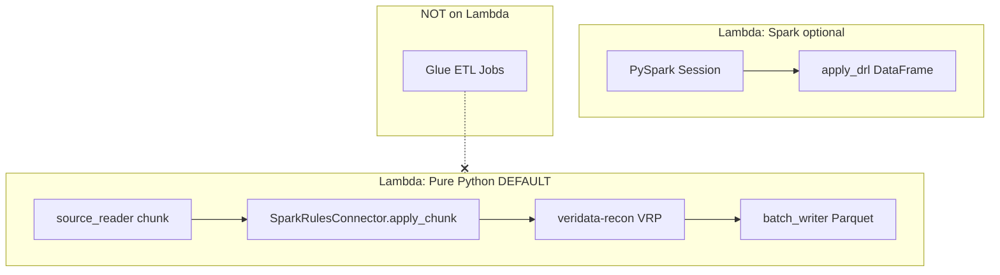
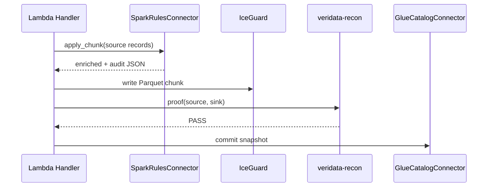

# SparkRules Connector: Business Rules on Lambda

[SparkRules](https://pypi.org/project/sparkrules/) is a Drools-style rule engine on PyPI. It runs on **AWS Lambda** in pure Python mode - no Glue ETL, no Spark cluster required for chunk-level enrichment and quality gates.

Serverless Data Mesh integrates SparkRules **before** VRP verification and physical writes.

---

## Install

```bash
pip install "serverless-data-mesh[rules]"
# or from PyPI after publish:
pip install "serverless-data-mesh[rules]"
```

SparkRules alone:

```bash
pip install sparkrules          # core: Lambda-safe
pip install "sparkrules[spark]" # + PySpark cluster / Lambda layer
```

---

## Two execution modes on Lambda



| Mode | API | When |
|------|-----|------|
| **Pure Python** | `SparkRulesConnector.from_drl(drl).apply_chunk(records)` | Default: sub-ms per fact, small Lambda package |
| **Spark-on-Lambda** | `SparkRulesConnector.apply_drl_spark(spark, df, drl)` | Large partitions, same DRL at scale |
| **Glue ETL** |: | **Not used** by this framework |

---

## Connector API

```python
from serverless_data_mesh import SparkRulesConnector

connector = SparkRulesConnector.from_drl("""
rule HighValue
when
    $row : Row ( $row.amount > 1000 )
then
    result.tier = "gold";
end
""")

enriched, audit = connector.apply_chunk(records)
# enriched rows merged with rule actions
# audit = list of RuleFireSummary for Steward lineage bucket

passed = connector.quality_gate(records, require_any_rule_fired=True)
```

### Load rules from Steward S3 (governance pattern)

```python
connector = SparkRulesConnector.from_s3(
    "s3://steward-rules/orders-domain/curated-v2.drl",
    policy_id="orders-curated-v2",
)
```

Or via environment:

```bash
SPARKRULES_DRL_S3_URI=s3://steward-rules/orders/curated.drl
SPARKRULES_POLICY_ID=orders-curated-v2
```

```python
connector = SparkRulesConnector.from_environment()
```

---

## Pipeline position



**Order matters:** Rules → Physical write → VRP → Metadata commit.

---

## Wire into domain writer

`examples/domain_writer/rules_io.py`:

```python
from examples.domain_writer.rules_io import enrich_records_with_rules

result = coordinator.execute_workload(
    workload,
    batch_writer=...,
    source_reader=lambda s, e: enrich_records_with_rules(
        records_from_source(workload.source_uri, s, e)
    ),
)
```

Persist rule audit to Steward:

```python
audit_json = connector.audit_json(audit)
# upload to s3://{proof_bucket}/{domain_id}/{workload_id}/rules/chunk-NN.json
```

---

## Spark-on-Lambda (optional)

```python
from serverless_data_mesh import SparkRulesConnector

out_df = SparkRulesConnector.apply_drl_spark(spark, input_df, drl_text)
```

Requires `pip install "serverless-data-mesh[spark]"` and JVM Lambda layer/container.

---

## Terraform / Lambda env

| Variable | Purpose |
|----------|---------|
| `SPARKRULES_DRL` | Inline DRL for small rule packs |
| `SPARKRULES_DRL_S3_URI` | Steward-hosted rule pack |
| `SPARKRULES_POLICY_ID` | Audit tag in rule fire summaries |

Package Lambda with rules:

```bash
SDM_EXTRAS=rules ./infrastructure/terraform/scripts/package_lambda.sh
```

---

## Failure handling

| Error | Meaning |
|-------|---------|
| `RuleEvaluationError` | Quality gate rejected entire chunk |
| `ImportError` | Install `[rules]` extra |
| DRL parse error | Fix rule syntax (Drools-style DRL) |

Failed rule evaluation **blocks** the chunk before VRP - consistent with validate-then-commit philosophy.

---

## Related

- [PyPI install guide](pypi.md)
- [Glue catalog connector](glue-connector.md)
- [Data mesh patterns](data-mesh-patterns.md)
- [sparkrules on PyPI](https://pypi.org/project/sparkrules/)
