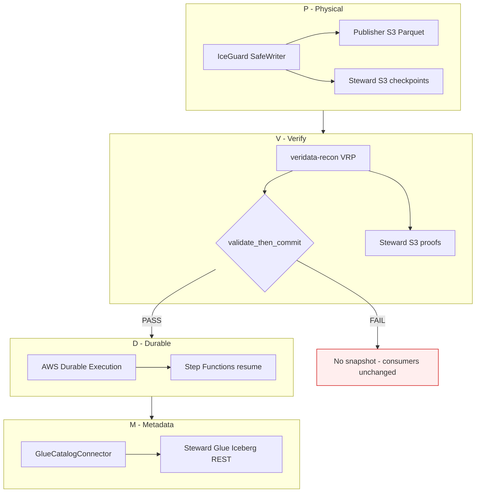
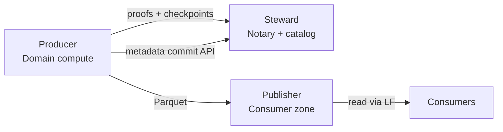
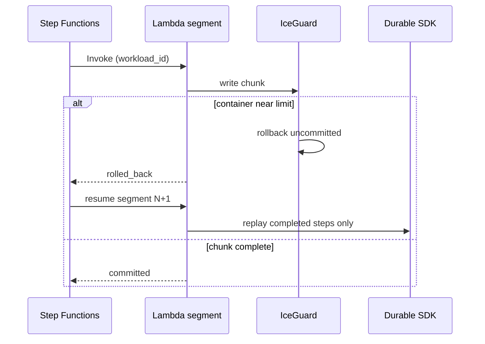

# The Vaquar Pattern

**Proof-Gated Serverless Lakehouse Publication for Federated Data Meshes**

> **Full blog (images, end-to-end journey, adoption playbook):** **[blog-the-vaquar-pattern.md](blog-the-vaquar-pattern.md)**

| Field | Value |
|-------|-------|
| **Pattern name** | Vaquar Pattern |
| **Also known as** | PVDM (Physical · Verify · Durable · Metadata) |
| **Version** | 1.0 |
| **Canonical URL** | [vaquar-pattern.md](https://github.com/vaquarkhan/aws-serverless-datamesh-framework/blob/main/docs/vaquar-pattern.md) |
| **Origin** | [Serverless Data Mesh](https://github.com/vaquarkhan/aws-serverless-datamesh-framework) |
| **Status** | Published reference pattern (Apache-2.0) |
| **Problem class** | Governed domain writes on serverless compute without central ETL |

---

## One-sentence definition

> **The Vaquar Pattern** is a federated write pattern where domain-owned serverless compute physically writes lakehouse data, a **Steward notary** stores cryptographic multiset proofs, and **Iceberg metadata commits only after proof PASS** - never because the executor returned success.

This is not organizational data mesh advice. It is a **technical publication contract** any domain can implement.

---

## Why a new pattern name?

Existing patterns solve adjacent problems but leave a gap:

| Pattern | What it solves | What it does not solve |
|---------|----------------|------------------------|
| **Data mesh** (Dehghani) | Decentralized ownership, data as product | No write transaction primitive |
| **Medallion architecture** | Bronze / silver / gold layering | No cryptographic source-sink proof |
| **Outbox pattern** | Reliable async side effects | No multiset equivalence gate |
| **Saga pattern** | Distributed compensating transactions | No proof notary; logs not math |
| **Two-phase commit (2PC)** | Atomic commit across resources | Central coordinator; not domain serverless |
| **dbt tests** | Row-level warehouse quality | Not multiset hash; not pre-snapshot gate |
| **Glue job bookmarks** | Incremental ETL cursor | Executor state, not source-sink proof |
| **Lambda idempotency keys** | Duplicate request suppression | No proof corrupt data was blocked |

**The gap:** Domain teams need to **own** serverless writes while the mesh **proves** correctness **before** consumers see a snapshot.

The Vaquar Pattern names that gap and gives it a repeatable structure.

---

## Pattern structure

### Four mandatory phases (PVDM)



| Phase | Invariant | Violation symptom |
|-------|-----------|-------------------|
| **Physical** | Uncommitted files can be rolled back | Orphan Parquet in lakehouse |
| **Verify** | Multiset proof PASS required | Silent row loss reaches consumers |
| **Durable** | Completed chunks replay, not rewrite | Duplicate data on Lambda retry |
| **Metadata** | Catalog commit is last, proof-gated | Phantom snapshots |

### Three mandatory accounts



| Account | Role | Holds |
|---------|------|-------|
| **Producer** | Domain autonomy | Lambda, Step Functions, domain code |
| **Steward** | Federated governance | VRP proofs, checkpoints, Glue catalog, LF |
| **Publisher** | Blast-radius isolation | Lakehouse S3, consumer-facing Iceberg |

**Steward is the notary.** Proofs and checkpoints live where the domain cannot unilaterally delete audit evidence.

### Two clocks (segmented serverless)

| Clock | Owner | Scope |
|-------|-------|-------|
| **Container clock** | IceGuard watchdog | One Lambda invocation (max 900s) |
| **Workload clock** | Durable SDK + Step Functions | Full backfill (e.g. 5400s) |

**Linkage key:** `workload_id` ties checkpoints, proofs, and durable step replay across segments.



---

## The Vaquar invariant (cite this)

```
∀ chunk C in workload W:
  commit_metadata(C) ⟹ VRP(C) = PASS
  VRP(C) = FAIL ⟹ ¬∃ snapshot' : consumers_visible(snapshot')
```

In plain language: **if the proof fails, the snapshot does not exist for consumers.** Executor exit code is irrelevant.

This is stronger than "run dbt tests after load" and stronger than "Glue job succeeded."

---

## Reference implementation

| Artifact | Location |
|----------|----------|
| Coordinator | `IceGuardDurableCoordinator` |
| Proof gate | `validate_then_commit` |
| Boundary contract | `DomainTransactionBoundary` |
| Product contract | `DataProductContract` |
| Benchmark | `eval/validate_then_commit_benchmark.py` |
| Domain handler | `examples/domain_writer/handler.py` |
| Terraform | `infrastructure/terraform/environments/` |

```python
from serverless_data_mesh import (
    IceGuardDurableCoordinator,
    DataProductContract,
    DomainTransactionBoundary,
    VRPProofGenerator,
)

# Vaquar Pattern: declare boundary before write
boundary = DomainTransactionBoundary(
    domain_id="orders-domain",
    source_namespace="raw_orders",
    target_table="orders_curated",
    partition_spec={"dt": "2026-06-14"},
    quality_policy_id="strict-zero-drop",
)

# Coordinator enforces PVDM inside one Lambda segment
coordinator = IceGuardDurableCoordinator(
    durable_context=durable_ctx,
    lambda_context=lambda_ctx,
    proof_generator=VRPProofGenerator(),
    catalog_adapter=glue_adapter,
)
outcome = coordinator.run_workload(workload)
# outcome ∈ {committed, rolled_back, verification_failed}
```

---

## When to apply the Vaquar Pattern

### Apply when

- Multiple domains publish to a **shared Iceberg lakehouse**
- **Federated AWS accounts** (or planned split)
- Auditors need **offline-verifiable** evidence per chunk
- Backfills run **15-90+ minutes** on Lambda
- "Job succeeded" has burned the organization before

### Do not apply when

- Single team, single pipeline, no mesh governance
- Streaming with proven exactly-once semantics you already trust
- Domains refuse to declare transaction boundaries
- You need sub-second latency (this is batch/backfill oriented)

---

## Comparison: Vaquar vs "pipeline succeeded"

| Event | Traditional pipeline | Vaquar Pattern |
|-------|---------------------|----------------|
| 6 rows silently dropped | Job green; analysts find drift later | VRP FAIL; snapshot blocked |
| Lambda retry duplicates chunk | Duplicate Parquet possible | IceGuard rollback + durable replay |
| Timeout mid-backfill | Manual restart; duplicate risk | `rolled_back` → SFN resume |
| Auditor asks "prove it" | Log exports, samples | `veridata-recon verify_proof` |
| Domain wants autonomy | Ticket to platform team | Ship `handler.py` + contract |

---

## Pattern combinations

The Vaquar Pattern composes with (does not replace):

| Pattern | How it composes |
|---------|-----------------|
| **Medallion** | Vaquar governs silver→gold publication |
| **Data mesh contracts** | `DataProductContract` is the registry-facing envelope |
| **SparkRules** | Business rules run **before** Phase V (optional) |
| **Canary rollout** | First N rows through full PVDM before full partition |
| **OpenLineage** | Emit lineage on `committed` via `lineage/openlineage.py` |

---

## Anti-patterns (what is NOT Vaquar)

| Anti-pattern | Why it fails the invariant |
|--------------|---------------------------|
| Commit metadata first, verify later | Consumers see bad snapshots |
| Store proofs in Producer account | Domain can delete audit trail |
| Trust CloudWatch "SUCCESS" | No multiset proof |
| Single-account everything | No blast-radius separation |
| Glue ETL as the write primitive | Not domain-owned serverless |

---

## How to cite

**Canonical URL:**

https://github.com/vaquarkhan/aws-serverless-datamesh-framework/blob/main/docs/vaquar-pattern.md

**Academic / blog:**

> Vaquar Pattern: Proof-Gated Serverless Lakehouse Publication (PVDM). Serverless Data Mesh reference implementation. https://github.com/vaquarkhan/aws-serverless-datamesh-framework/blob/main/docs/vaquar-pattern.md

**BibTeX:**

```bibtex
@misc{khan2026vaquar,
  author       = {Vaquar Khan},
  title        = {The Vaquar Pattern: Proof-Gated Serverless Lakehouse Publication},
  year         = {2026},
  version      = {1.0},
  howpublished = {GitHub},
  url          = {https://github.com/vaquarkhan/aws-serverless-datamesh-framework/blob/main/docs/vaquar-pattern.md}
}
```

**Architecture docs:**

> We apply the **Vaquar Pattern** (PVDM) for domain writes: Physical → Verify → Durable → Metadata, with Steward notarization and VRP-gated Iceberg commits.

**Terraform / runbooks:**

> MeshRole tags: `producer`, `steward`, `publisher` per Vaquar three-account model.

---

## Known implementations

| Implementation | Platform | Status |
|----------------|----------|--------|
| [Serverless Data Mesh](https://github.com/vaquarkhan/aws-serverless-datamesh-framework) | AWS Lambda + Iceberg + Glue REST | Reference implementation (this repo) |
| *Your implementation* | Databricks, GCP, Azure, … | Open: submit a PR to list it here |

The pattern is platform-agnostic. This repository is the **reference implementation** for AWS.

---

## Related documentation

| Doc | Focus |
|-----|-------|
| **[blog-the-vaquar-pattern.md](blog-the-vaquar-pattern.md)** | **Full blog: images, E2E journey, adoption** |
| [why-serverless-data-mesh.md](why-serverless-data-mesh.md) | Blog: problem, connectivity, thesis |
| [data-mesh-patterns.md](data-mesh-patterns.md) | Full pattern catalog + coverage matrix |
| [data-mesh-end-to-end.md](data-mesh-end-to-end.md) | Three-account deploy journey |
| [architecture.md](architecture.md) | Component internals |
| [glue-connector.md](glue-connector.md) | Compute vs catalog split |

---

*The Vaquar Pattern gives the data engineering world a name for what was missing: **prove correctness before publication**, on serverless compute, in a federated mesh.*
