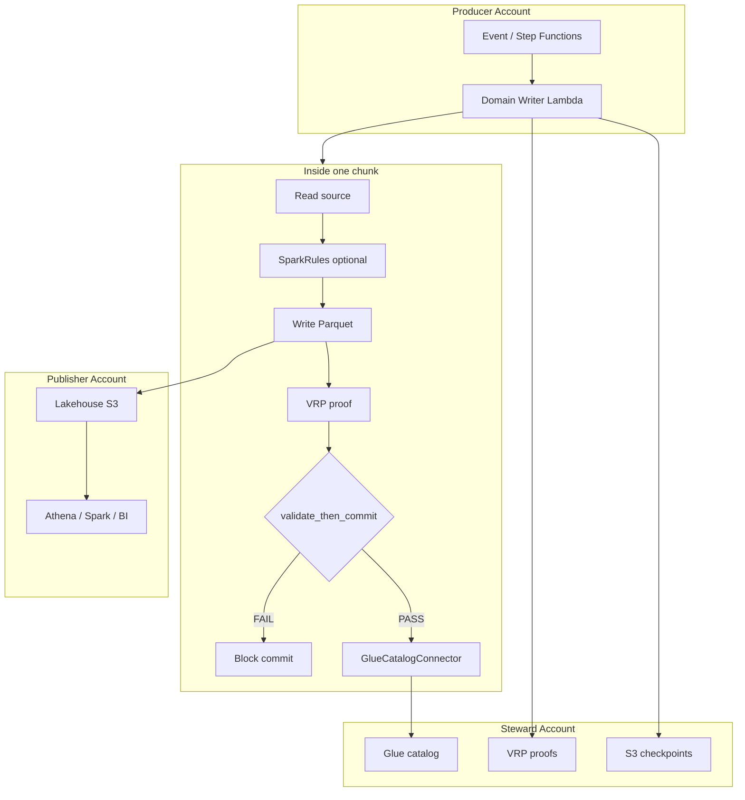

# Why Serverless Data Mesh Exists

**The problem, the failed alternatives, and why a new coordination framework is necessary.**

This article explains why organizations building a **federated data mesh on AWS** need more than Glue jobs, more than "pipeline succeeded" logs, and more than a central platform team running every backfill. It is written for CTOs, principal engineers, domain data owners, and auditors evaluating lakehouse strategy.

---

## Table of contents

1. [The industry problem](#1-the-industry-problem)
2. [What data mesh promised vs what teams actually ship](#2-what-data-mesh-promised-vs-what-teams-actually-ship)
3. [Why AWS Glue alone does not solve it](#3-why-aws-glue-alone-does-not-solve-it)
4. [Why Lambda was considered impossible for serious backfills](#4-why-lambda-was-considered-impossible-for-serious-backfills)
5. [The trust gap: "pipeline succeeded" is not proof](#5-the-trust-gap-pipeline-succeeded-is-not-proof)
6. [What Serverless Data Mesh is](#6-what-serverless-data-mesh-is)
7. [The four problems it solves](#7-the-four-problems-it-solves)
8. [How the pieces fit together](#8-how-the-pieces-fit-together)
9. [Who benefits and when to adopt](#9-who-benefits-and-when-to-adopt)
10. [What changes for each role](#10-what-changes-for-each-role)
11. [Comparison to alternatives](#11-comparison-to-alternatives)
12. [The strategic thesis](#12-the-strategic-thesis)

---

## 1. The industry problem

Every large organization faces the same structural tension:

| Force | What teams want |
|-------|-----------------|
| **Data mesh** | Domain teams own their data products, schemas, and SLAs |
| **Lakehouse** | One governed place to query curated Iceberg tables |
| **Compliance** | Proof that published data matches source, with audit trails |
| **Cost** | No always-on clusters for nightly 90-minute backfills |
| **Speed** | New domains onboard in weeks, not quarters |

Traditional platforms resolve this by **centralizing ingestion**: one platform team, one Glue/Spark fleet, one set of pipelines. That works until you have 50 domains, each with different source systems, quality rules, and release cadences. The platform team becomes a bottleneck. Domains route around governance with shadow pipelines. Consumers lose trust because nobody can prove a given partition is correct.

**The unsolved question:** How does each domain team **own** its write path while the mesh still guarantees **exactly-once**, **verifiable** publication to a shared lakehouse?

---

## 2. What data mesh promised vs what teams actually ship

Zhamak Dehghani's data mesh principles are clear:

- Domain-oriented decentralized data ownership
- Data as a product
- Self-serve data infrastructure
- Federated computational governance

In practice, most "mesh" implementations stop at **organizational restructuring**:

```
What companies often ship:
  Domain team → tickets to platform team → central Glue job → "success" email

What mesh intended:
  Domain team → owns data product → publishes with contract → consumers trust the product
```

The gap is **technical infrastructure for governed writes**. Domains get Confluence pages and ownership tags, but the **write transaction** is still a black box owned by someone else.

Serverless Data Mesh exists to close that gap with a **repeatable write contract** every domain can implement without operating clusters.

---

## 3. Why AWS Glue alone does not solve it

AWS Glue is excellent for **managed Spark ETL** at cluster scale. It is not a **domain write coordination framework**.

| Glue provides | What mesh domains still need |
|---------------|------------------------------|
| Job execution (DPUs) | Per-domain transaction boundary |
| Data Catalog | Validate-then-commit before snapshot |
| Job bookmarks | Cryptographic proof per chunk |
| Studio / scheduling | Cross-account Producer/Steward/Publisher model |
| "Job succeeded" status | Proof that sink multiset equals source multiset |

A Glue job that finishes with `SUCCEEDED` tells you the **runner** did not crash. It does not prove:

- No records were silently dropped between source and sink
- No duplicate writes occurred across retries
- Metadata commit was blocked when data drifted
- A 90-minute backfill resumed without duplicating committed chunks

Glue ETL also **cannot run inside Lambda**. Domains that want serverless economics need a **catalog connector** (Glue REST metadata) separate from the **compute** choice (Lambda + Spark/Polars).

Serverless Data Mesh uses `GlueCatalogConnector` for metadata only. Physical transforms run on Lambda. Glue jobs remain valid for **downstream** aggregation, not as the mesh write primitive.

---

## 4. Why Lambda was considered impossible for serious backfills

Until recently, Lambda had two blockers for lakehouse backfills:

### Blocker A: 15-minute hard timeout

A 2-million-row backfill can take 60-90 minutes. Lambda containers max out at **900 seconds per invocation**.

**Old answer:** "Use Glue or EMR instead."

**New answer:** AWS Durable Execution + IceGuard + Step Functions resume loops chain multiple 15-minute segments into a **single governed workload** with S3 checkpoints and rollback safety.

### Blocker B: Retry = duplicate data

Lambda retries and manual re-invokes historically caused **duplicate Parquet files** and **double metadata commits**.

**Old answer:** Idempotency keys in application code (every domain reinvents this badly).

**New answer:** IceGuard SafeWriter rolls back uncommitted physical files; durable steps replay completed chunks; `workload_id` keys checkpoints and proofs.

### Blocker C: No transaction boundary

Physical write and catalog commit are two phases. Failing between them leaves **orphan files** or **phantom snapshots**.

**New answer:** Explicit four-phase boundary: Physical → Verify → Durable checkpoint → Metadata 2PC.

Lambda is now viable as the **domain write unit** when wrapped in this framework.

---

## 5. The trust gap: "pipeline succeeded" is not proof

Consider a nightly orders backfill:

```
Source:  250,000 orders in operational export
Sink:    orders_curated Iceberg partition dt=2026-06-14
Status:  Glue job SUCCEEDED ✓
```

An analyst finds **249,991 rows** in Athena. Six hours of incident response follow:

- Was it source drift, a silent filter, a join drop, or a retry duplicate?
- Logs show "success" but cannot **prove** multiset equivalence
- Auditors ask for evidence; the team exports CSV samples and argues

**Serverless Data Mesh changes the question.** For every chunk, veridata-recon produces a **Verifiable Reconciliation Proof (VRP)**:

```
source multiset hash  →  VRP proof  →  validate_then_commit  →  metadata commit
                              ↓ FAIL
                         no snapshot published
```

The benchmark in `eval/validate_then_commit_benchmark.py` quantifies this:

| Attack scenario | VRP verdict | Consumer sees new data? |
|-----------------|-------------|------------------------|
| Identical source/sink | PASS | Yes (if commit proceeds) |
| Record drop | FAIL | **No** |
| Duplicate injection | FAIL | **No** |
| Payload mutation | FAIL | **No** |

**Trust becomes mathematical**, not operational. Consumers and regulators verify proofs offline without access to raw source systems.

---

## 6. What Serverless Data Mesh is

Serverless Data Mesh is an **open Python framework** that coordinates governed lakehouse writes on AWS Lambda. It is not a SaaS product, not a Glue replacement, and not a single pipeline.

It is the **coordination layer** that binds four proven primitives into one transaction boundary:

| Primitive | Role |
|-----------|------|
| [IceGuard](https://pypi.org/project/iceguard/) | Physical SafeWriter, timeout watchdog, S3 resume |
| [veridata-recon](https://pypi.org/project/veridata-recon/) | VRP proof generation and validation |
| [AWS Durable Execution](https://docs.aws.amazon.com/durable-execution/) | Cross-invocation step replay |
| [PyIceberg Glue REST](https://py.iceberg.apache.org/) | SigV4 metadata commit (no JVM catalog) |

Optional: [SparkRules](https://pypi.org/project/sparkrules/) for DRL business rules on Lambda before verification.

Each domain ships a small handler (`examples/domain_writer/handler.py`). The framework enforces the contract. Steward governance holds proofs. Publisher exposes curated tables.

---

## 7. The four problems it solves

### Problem 1: Silent data loss on backfill

**Symptom:** Partition row counts drift; nobody notices until a dashboard breaks.

**Solution:** `validate_then_commit` gates every metadata commit on VRP `PASS`. FAIL blocks the Iceberg snapshot.

### Problem 2: Duplicate writes on retry

**Symptom:** Lambda timeout or operator re-invoke creates duplicate Parquet or double commits.

**Solution:** IceGuard rollback + S3 checkpoints + durable step replay. Step Functions resume loop respects `workload_id` identity.

### Problem 3: Domain autonomy without governance chaos

**Symptom:** Domains want independence; platform wants control; result is ticket queues or shadow IT.

**Solution:** `DomainTransactionBoundary` and `DataProductContract` declare scope. Three-account model (Producer, Steward, Publisher) separates blast radius and audit.

### Problem 4: Cost and ops burden of always-on compute

**Symptom:** EMR/Glue clusters run for 90 minutes once per night; 23 hours idle.

**Solution:** Lambda scales to zero between backfills. Pay per segment invoked. Durable execution stretches 15-minute containers to 90+ minute jobs.

---

## 8. How the pieces fit together



**End-to-end journey:**

1. Domain declares `DataProductContract` (table, partition, quality policy, SLA).
2. Producer triggers backfill via Step Functions or EventBridge.
3. Lambda processes chunks: physical write → VRP → gate → metadata commit.
4. Near timeout: IceGuard rolls back, Step Functions resumes next segment.
5. Steward stores immutable proofs per chunk.
6. Publisher consumers query only after snapshot exists.
7. Auditors run `veridata-recon verify_proof` offline.

---

## 9. Who benefits and when to adopt

### Adopt when you have:

- Multiple domain teams publishing to a **shared Iceberg lakehouse**
- **Federated AWS accounts** or planning Producer/Steward/Publisher split
- Compliance or audit requirements beyond log statements
- Backfills from **15 minutes to 90+ minutes** on Lambda
- Desire to reduce Glue DPU spend for intermittent domain writes

### Defer when you have:

- Single team, single pipeline, no mesh governance needs
- Streaming-only ingestion with existing exactly-once semantics you trust
- Domains unwilling to declare transaction boundaries

### Ideal first domain:

Pick one high-value curated table (e.g. `orders_curated`). Run a **canary backfill** (5,000 rows). Inspect proofs in Steward S3. Query Publisher. Expand to full partition and additional domains.

---

## 10. What changes for each role

| Role | Before | After |
|------|--------|-------|
| **Domain engineer** | Custom scripts or platform tickets | Ship `handler.py`, declare boundary, own SLA |
| **Platform / Steward** | Operate every pipeline | Operate trust infra: buckets, catalog, LF, alarms |
| **Consumer / Analytics** | Trust "job green" | Trust VRP proofs + Iceberg snapshot lineage |
| **Auditor** | Sample rows, debate | Verify cryptographic proofs per chunk |
| **FinOps** | Glue DPUs 24/7 mindset | Lambda per backfill; zero idle cost |

---

## 11. Comparison to alternatives

| Approach | Domain autonomy | Proof of correctness | Serverless economics | Long backfills |
|----------|-----------------|----------------------|----------------------|----------------|
| Central Glue ETL | Low | Logs only | No (DPUs) | Yes |
| EMR Spark jobs | Medium | Logs only | No (cluster) | Yes |
| Custom Lambda scripts | High | None | Yes | Fragile |
| dbt + warehouse | Medium | Tests, not multiset proofs | N/A (warehouse) | N/A |
| **Serverless Data Mesh** | **High** | **VRP per chunk** | **Yes** | **Yes (durable + resume)** |

---

## 12. The strategic thesis

The data industry spent a decade optimizing **how fast** we move data. The next decade must optimize **how provably correct** published data is.

Serverless Data Mesh is built on a simple thesis:

> **Domain teams should own their write path. The mesh should prove correctness before consumers ever see a snapshot.**

That requires:

1. **Physical safety** (IceGuard) so Lambda timeouts do not corrupt the lakehouse
2. **Cryptographic verification** (veridata-recon) so "success" means multiset match, not executor exit code 0
3. **Durable orchestration** (AWS Durable Execution) so serverless economics extend to 90-minute backfills
4. **Governed metadata** (Glue Catalog Connector) so domains commit snapshots without Glue ETL lock-in
5. **Federated accounts** (Producer, Steward, Publisher) so autonomy and audit coexist

This is the capstone of a portfolio that spans write safety (IceGuard), proof (veridata), and execution (Durable Lambda). It is the framework that lets agent skills, domain teams, and platform governance all speak the same **transaction boundary language**.

---

## Next steps

| Audience | Start here |
|----------|------------|
| Decision makers (this article) | You are here |
| Architects | [data-mesh-end-to-end.md](data-mesh-end-to-end.md) |
| Patterns and coverage | [data-mesh-patterns.md](data-mesh-patterns.md) |
| Developers | [getting-started.md](getting-started.md) |
| Trust benchmark | `make benchmark` |
| Deploy | [terraform-guide.md](terraform-guide.md) |

---

*Apache-2.0. Repository: [github.com/vaquarkhan/aws-serveless-datamesh-framwork](https://github.com/vaquarkhan/aws-serveless-datamesh-framwork)*
