# Why Serverless Data Mesh Exists

**A blog-style guide to the problem, the failed alternatives, how every piece connects, and why a new coordination framework is necessary.**

*Reading time: ~18 minutes · Audience: CTOs, principal engineers, domain data owners, auditors*

---

<p align="center">
  
</p>

Most data mesh programs fail for a reason that has nothing to do with org charts.

Teams rename squads, assign domain owners, and publish Confluence pages about "data as a product." Then, on Sunday night, a central platform team still runs a Glue job, sends a green "success" email, and hopes the lakehouse partition is correct. When it is not, nobody can prove what went wrong.

**Serverless Data Mesh** is an open framework that closes that gap. It gives every domain a small Lambda writer, a declared transaction boundary, and cryptographic proof before any Iceberg snapshot reaches consumers. This article explains why that matters, what failed before, and **how IceGuard, veridata-recon, AWS Durable Execution, PyIceberg Glue REST, and optional SparkRules connect into one governed write path**.

---

## Table of contents

1. [The industry problem](#1-the-industry-problem)
2. [What data mesh promised vs what teams actually ship](#2-what-data-mesh-promised-vs-what-teams-actually-ship)
3. [Why AWS Glue alone does not solve it](#3-why-aws-glue-alone-does-not-solve-it)
4. [Why Lambda was considered impossible for serious backfills](#4-why-lambda-was-considered-impossible-for-serious-backfills)
5. [The trust gap: "pipeline succeeded" is not proof](#5-the-trust-gap-pipeline-succeeded-is-not-proof)
6. [What Serverless Data Mesh is](#6-what-serverless-data-mesh-is)
7. [How every primitive connects to the others](#7-how-every-primitive-connects-to-the-others)
8. [The four problems it solves](#8-the-four-problems-it-solves)
9. [End-to-end journey across three accounts](#9-end-to-end-journey-across-three-accounts)
10. [Who benefits and when to adopt](#10-who-benefits-and-when-to-adopt)
11. [What changes for each role](#11-what-changes-for-each-role)
12. [Comparison to alternatives](#12-comparison-to-alternatives)
13. [The strategic thesis and portfolio stack](#13-the-strategic-thesis-and-portfolio-stack)

---

## 1. The industry problem

Every large organization faces the same structural tension. Five forces pull in different directions at once:

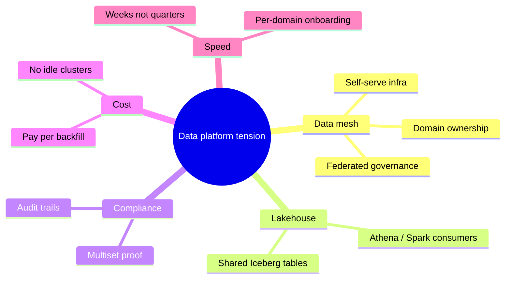

| Force | What teams want |
|-------|-----------------|
| **Data mesh** | Domain teams own their data products, schemas, and SLAs |
| **Lakehouse** | One governed place to query curated Iceberg tables |
| **Compliance** | Proof that published data matches source, with audit trails |
| **Cost** | No always-on clusters for nightly 90-minute backfills |
| **Speed** | New domains onboard in weeks, not quarters |

Traditional platforms resolve this by **centralizing ingestion**: one platform team, one Glue/Spark fleet, one set of pipelines. That works until you have 50 domains, each with different source systems, quality rules, and release cadences. The platform team becomes a bottleneck. Domains route around governance with shadow pipelines. Consumers lose trust because nobody can prove a given partition is correct.

**The unsolved question:** How does each domain team **own** its write path while the mesh still guarantees **exactly-once**, **verifiable** publication to a shared lakehouse?

That question needs a **coordination framework**, not another monolithic ETL job.

---

## 2. What data mesh promised vs what teams actually ship

Zhamak Dehghani's data mesh principles are clear:

- Domain-oriented decentralized data ownership
- Data as a product
- Self-serve data infrastructure
- Federated computational governance

In practice, most "mesh" implementations stop at **organizational restructuring**:

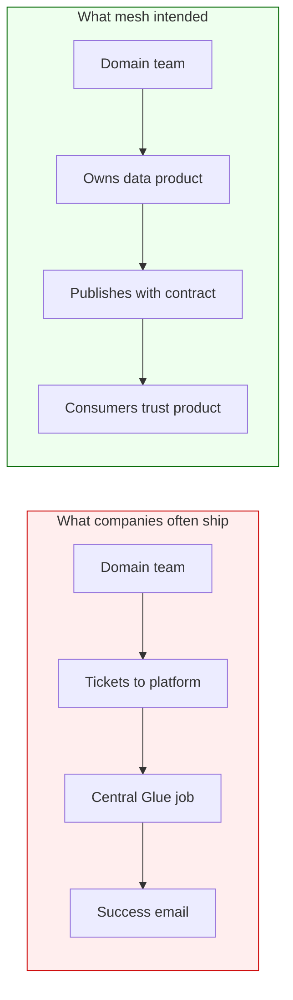

The gap is **technical infrastructure for governed writes**. Domains get ownership tags, but the **write transaction** is still a black box owned by someone else.

Serverless Data Mesh exists to close that gap with a **repeatable write contract** every domain can implement without operating clusters. The contract is not a PDF. It is code: `DomainTransactionBoundary`, `DataProductContract`, and `IceGuardDurableCoordinator`.

---

## 3. Why AWS Glue alone does not solve it

AWS Glue is excellent for **managed Spark ETL** at cluster scale. It is not a **domain write coordination framework**.

| Glue provides | What mesh domains still need |
|---------------|------------------------------|
| Job execution (DPUs) | Per-domain transaction boundary |
| Data Catalog | Validate-then-commit before snapshot |
| Job bookmarks | Cryptographic proof per chunk |
| Studio / scheduling | Cross-account Producer/Steward/Publisher model |
| "Job succeeded" status | Proof that sink multiset equals source multiset |

A Glue job that finishes with `SUCCEEDED` tells you the **runner** did not crash. It does not prove:

- No records were silently dropped between source and sink
- No duplicate writes occurred across retries
- Metadata commit was blocked when data drifted
- A 90-minute backfill resumed without duplicating committed chunks

### Compute vs catalog: the split that makes Lambda viable

Glue ETL **cannot run inside Lambda**. Domains that want serverless economics need a **catalog connector** (Glue REST metadata) separate from the **compute** choice (Lambda + Spark/Polars).

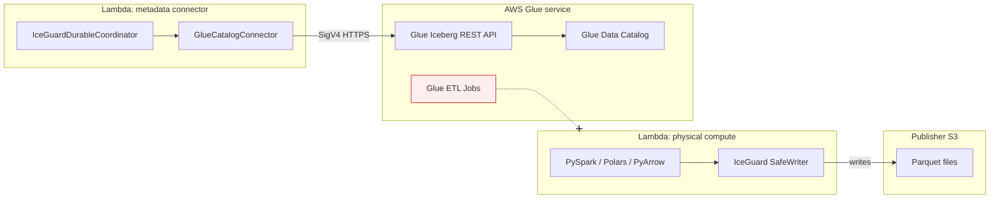

| Runs on Lambda | Does not run on Lambda |
|----------------|------------------------|
| PySpark-on-Lambda, Polars, PyArrow | AWS Glue ETL jobs |
| IceGuard, VRP, Durable SDK | Glue Interactive Sessions |
| `GlueCatalogConnector` (REST client only) | Glue Studio job execution |

Serverless Data Mesh uses `GlueCatalogConnector` for metadata only. Physical transforms run on Lambda. Glue jobs remain valid for **downstream** aggregation, not as the mesh write primitive.

Full connector guide: **[glue-connector.md](glue-connector.md)**

---

## 4. Why Lambda was considered impossible for serious backfills

Until recently, Lambda had three blockers for lakehouse backfills. Each blocker maps to a specific primitive in the framework:

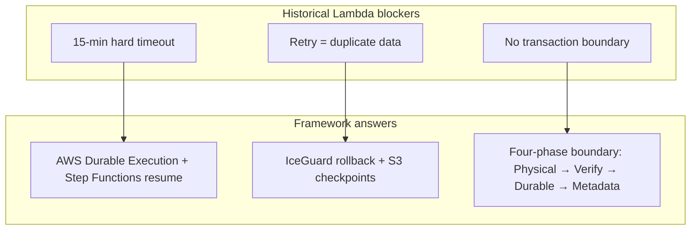

### Blocker A: 15-minute hard timeout

A 2-million-row backfill can take 60-90 minutes. Lambda containers max out at **900 seconds per invocation**.

**Old answer:** "Use Glue or EMR instead."

**New answer:** AWS Durable Execution + IceGuard + Step Functions resume loops chain multiple 15-minute segments into a **single governed workload** with S3 checkpoints and rollback safety.

### Blocker B: Retry = duplicate data

Lambda retries and manual re-invokes historically caused **duplicate Parquet files** and **double metadata commits**.

**Old answer:** Idempotency keys in application code (every domain reinvents this badly).

**New answer:** IceGuard SafeWriter rolls back uncommitted physical files; durable steps replay completed chunks; `workload_id` keys checkpoints and proofs.

### Blocker C: No transaction boundary

Physical write and catalog commit are two phases. Failing between them leaves **orphan files** or **phantom snapshots**.

**New answer:** Explicit four-phase boundary coordinated by `IceGuardDurableCoordinator`.

Lambda is now viable as the **domain write unit** when wrapped in this framework.

---

## 5. The trust gap: "pipeline succeeded" is not proof

Consider a nightly orders backfill:

```
Source:  250,000 orders in operational export
Sink:    orders_curated Iceberg partition dt=2026-06-14
Status:  Glue job SUCCEEDED ✓
```

An analyst finds **249,991 rows** in Athena. Six hours of incident response follow:

- Was it source drift, a silent filter, a join drop, or a retry duplicate?
- Logs show "success" but cannot **prove** multiset equivalence
- Auditors ask for evidence; the team exports CSV samples and argues

<p align="center">
  
</p>

**Serverless Data Mesh changes the question.** For every chunk, veridata-recon produces a **Verifiable Reconciliation Proof (VRP)**:

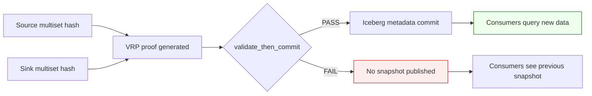

The benchmark in `eval/validate_then_commit_benchmark.py` quantifies this:

| Attack scenario | VRP verdict | Consumer sees new data? |
|-----------------|-------------|------------------------|
| Identical source/sink | PASS | Yes (if commit proceeds) |
| Record drop | FAIL | **No** |
| Duplicate injection | FAIL | **No** |
| Payload mutation | FAIL | **No** |

**Trust becomes mathematical**, not operational. Consumers and regulators verify proofs offline with `veridata-recon verify_proof` without access to raw source systems.

---

## 6. What Serverless Data Mesh is

Serverless Data Mesh is an **open Python framework** that coordinates governed lakehouse writes on AWS Lambda. It is not a SaaS product, not a Glue replacement, and not a single pipeline.

It is the **coordination layer** that binds four proven primitives into one transaction boundary:

| Primitive | Package | Role in the mesh |
|-----------|---------|------------------|
| **IceGuard** | [iceguard](https://pypi.org/project/iceguard/) | Physical SafeWriter, timeout watchdog, S3 resume |
| **veridata-recon** | [veridata-recon](https://pypi.org/project/veridata-recon/) | VRP proof generation and `validate_then_commit` gate |
| **AWS Durable Execution** | [aws-durable-execution-sdk-python](https://pypi.org/project/aws-durable-execution-sdk-python/) | Cross-invocation step replay beyond 15 minutes |
| **PyIceberg Glue REST** | [pyiceberg](https://pypi.org/project/pyiceberg/) | SigV4 metadata commit via `GlueCatalogConnector` |

Optional fifth primitive:

| Primitive | Package | Role |
|-----------|---------|------|
| **SparkRules** | [sparkrules](https://pypi.org/project/sparkrules/) | DRL business rules on Lambda before verification (`[rules]` extra) |

Each domain ships a small handler (`examples/domain_writer/handler.py`). The framework enforces the contract. Steward governance holds proofs. Publisher exposes curated tables.

The single class that wires everything together is `IceGuardDurableCoordinator` in `src/serverless_data_mesh/orchestration/coordinator.py`.

---

## 7. How every primitive connects to the others

This is the heart of the framework. None of the primitives alone delivers a governed mesh write. **Connectivity** is the product.

<p align="center">
  
</p>

### The four-phase transaction boundary

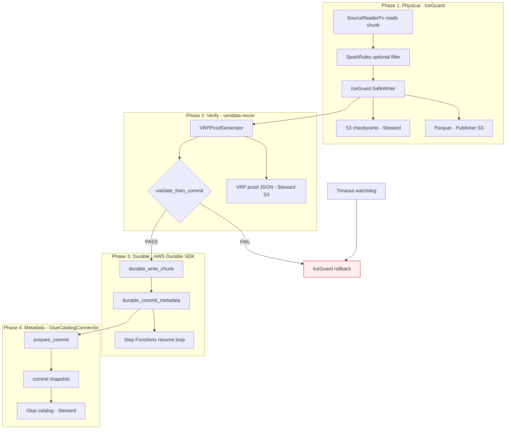

| Phase | Primitive | Connects to | What crosses the boundary |
|-------|-----------|-------------|---------------------------|
| **1 Physical** | IceGuard | Publisher S3, Steward checkpoints | Parquet URIs, checkpoint offsets |
| **2 Verify** | veridata-recon | Steward proof bucket | VRP hash, PASS/FAIL verdict |
| **3 Durable** | Durable SDK | Step Functions, Lambda context | Completed step IDs, `workload_id` state |
| **4 Metadata** | GlueCatalogConnector | Steward Glue REST | Iceberg snapshot, table metadata |

### Connectivity matrix: who talks to whom

| From | To | Protocol / artifact | Why the link exists |
|------|-----|---------------------|---------------------|
| **Domain handler** | `IceGuardDurableCoordinator` | Python API | Single entry point for the transaction |
| **IceGuard** | Publisher S3 | `s3:PutObject` | Physical Parquet landing zone |
| **IceGuard** | Steward S3 checkpoints | `s3:PutObject` | Resume after timeout without re-writing committed chunks |
| **IceGuard** | Durable SDK | `@durable_step` decorators | Replay completed physical steps on resume |
| **veridata-recon** | Source + sink URIs | Multiset hash | Proof that data was not dropped or mutated |
| **veridata-recon** | Steward S3 proofs | `s3:PutObject` | Immutable audit artifact per chunk |
| **veridata-recon** | `GlueCatalogConnector` | `validate_then_commit` gate | **Blocks metadata if proof FAIL** |
| **Durable SDK** | Step Functions | `rolled_back` / `committed` status | Orchestrator decides whether to resume |
| **GlueCatalogConnector** | Glue Iceberg REST | SigV4 HTTPS | Metadata 2PC without Glue ETL |
| **SparkRules** | Domain records | DRL rules | Business validation before VRP (optional) |
| **Consumers** | Publisher Iceberg | Athena / Spark | Read only after Phase 4 succeeds |
| **Auditors** | Steward proofs | `verify_proof` CLI | Offline trust without source access |

### Sequence diagram: one chunk inside Lambda

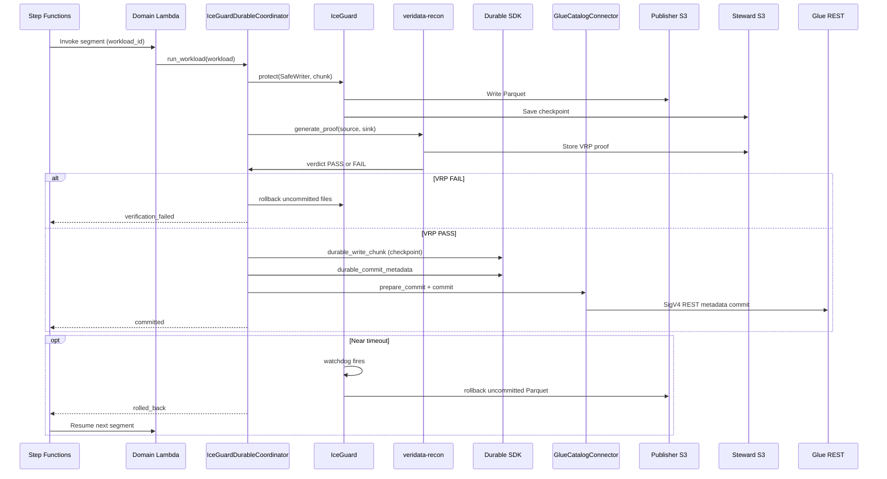

### How IceGuard connects to Durable Execution

IceGuard and Durable Execution solve **different time horizons**:

| Concern | Owner | Time scale |
|---------|-------|------------|
| "This container is about to die" | IceGuard watchdog | Seconds before Lambda hard limit |
| "This workload spans many containers" | Durable SDK + Step Functions | Minutes to 90+ minutes |

**Connection point:** When IceGuard rolls back near timeout, it returns `rolled_back` to Step Functions. The durable context has already checkpointed **completed** chunks. The next Lambda segment replays only pending work via `durable_write_chunk`, keyed by `workload_id`. Without this link, you get either duplicate writes (no IceGuard) or stuck workloads (no Durable).

### How veridata-recon connects to GlueCatalogConnector

This is the **trust gate**. `validate_then_commit` sits between proof generation and metadata commit:

```
VRP PASS  →  GlueCatalogConnector may commit snapshot
VRP FAIL  →  CatalogCommitError / VerificationRejectedError; consumers unchanged
```

No other AWS service provides this gate natively. Glue job success does not call veridata-recon. IceGuard alone does not prove multiset equivalence. **The framework connects them** inside `IceGuardDurableCoordinator.run_workload()`.

### How SparkRules connects (optional)

When `pip install serverless-data-mesh[rules]` is used:

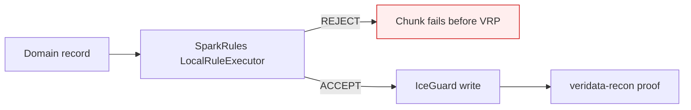

SparkRules filters **business logic** (e.g. `amount > 0`). veridata-recon proves **multiset integrity** (nothing dropped or duplicated). They are complementary, not interchangeable.

---

## 8. The four problems it solves

### Problem 1: Silent data loss on backfill

**Symptom:** Partition row counts drift; nobody notices until a dashboard breaks.

**Solution:** `validate_then_commit` gates every metadata commit on VRP `PASS`. FAIL blocks the Iceberg snapshot.

**Connectivity:** veridata-recon → gate → GlueCatalogConnector (commit blocked)

### Problem 2: Duplicate writes on retry

**Symptom:** Lambda timeout or operator re-invoke creates duplicate Parquet or double commits.

**Solution:** IceGuard rollback + S3 checkpoints + durable step replay. Step Functions resume loop respects `workload_id` identity.

**Connectivity:** IceGuard ↔ Steward checkpoints ↔ Durable SDK ↔ Step Functions

### Problem 3: Domain autonomy without governance chaos

**Symptom:** Domains want independence; platform wants control; result is ticket queues or shadow IT.

**Solution:** `DomainTransactionBoundary` and `DataProductContract` declare scope. Three-account model separates blast radius and audit.

**Connectivity:** Producer Lambda → Steward governance → Publisher consumers

### Problem 4: Cost and ops burden of always-on compute

**Symptom:** EMR/Glue clusters run for 90 minutes once per night; 23 hours idle.

**Solution:** Lambda scales to zero between backfills. Pay per segment invoked. Durable execution stretches 15-minute containers to 90+ minute jobs.

**Connectivity:** Step Functions → Lambda segments → zero idle cost between runs

---

## 9. End-to-end journey across three accounts

Production federated meshes use **three AWS accounts** with clear ownership:

<p align="center">
  
</p>

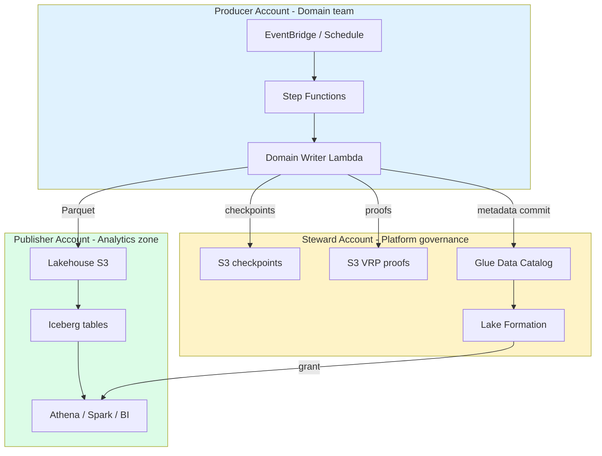

**End-to-end journey:**

1. Domain declares `DataProductContract` (table, partition, quality policy, SLA).
2. Producer triggers backfill via Step Functions or EventBridge.
3. Lambda processes chunks: physical write → VRP → gate → metadata commit.
4. Near timeout: IceGuard rolls back, Step Functions resumes next segment.
5. Steward stores immutable proofs per chunk.
6. Publisher consumers query only after snapshot exists.
7. Auditors run `veridata-recon verify_proof` offline.

Cross-account IAM and deploy order: **[data-mesh-end-to-end.md](data-mesh-end-to-end.md)**

### Long-running backfill: two clocks working together

```mermaid
gantt
    title 90-minute backfill across Lambda segments
    dateFormat X
    axisFormat %M min

    section Segment 1
    IceGuard write + VRP + commit :0, 14
    section Segment 2
    Resume from checkpoint :14, 28
    section Segment 3
    Resume from checkpoint :28, 42
    section Segment N
    Final chunk committed :84, 90
```

| Layer | Setting | Default | Role |
|-------|---------|---------|------|
| Per invocation | Lambda `timeout` | 900s (15 min) | One container segment |
| Total budget | `durable_config.execution_timeout` | 5400s (90 min) | Durable execution ceiling |
| Orchestration | Step Functions resume loop | ≥ 8 attempts | Chains segments |

Terraform tuning: **[terraform-guide.md](terraform-guide.md)**

---

## 10. Who benefits and when to adopt

### Adopt when you have:

- Multiple domain teams publishing to a **shared Iceberg lakehouse**
- **Federated AWS accounts** or planning Producer/Steward/Publisher split
- Compliance or audit requirements beyond log statements
- Backfills from **15 minutes to 90+ minutes** on Lambda
- Desire to reduce Glue DPU spend for intermittent domain writes

### Defer when you have:

- Single team, single pipeline, no mesh governance needs
- Streaming-only ingestion with existing exactly-once semantics you trust
- Domains unwilling to declare transaction boundaries

### Ideal first domain:

Pick one high-value curated table (e.g. `orders_curated`). Run a **canary backfill** (5,000 rows). Inspect proofs in Steward S3. Query Publisher. Expand to full partition and additional domains.

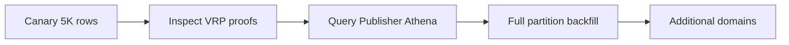

---

## 11. What changes for each role

| Role | Before | After |
|------|--------|-------|
| **Domain engineer** | Custom scripts or platform tickets | Ship `handler.py`, declare boundary, own SLA |
| **Platform / Steward** | Operate every pipeline | Operate trust infra: buckets, catalog, LF, alarms |
| **Consumer / Analytics** | Trust "job green" | Trust VRP proofs + Iceberg snapshot lineage |
| **Auditor** | Sample rows, debate | Verify cryptographic proofs per chunk |
| **FinOps** | Glue DPUs 24/7 mindset | Lambda per backfill; zero idle cost |

---

## 12. Comparison to alternatives

| Approach | Domain autonomy | Proof of correctness | Serverless economics | Long backfills |
|----------|-----------------|----------------------|----------------------|----------------|
| Central Glue ETL | Low | Logs only | No (DPUs) | Yes |
| EMR Spark jobs | Medium | Logs only | No (cluster) | Yes |
| Custom Lambda scripts | High | None | Yes | Fragile |
| dbt + warehouse | Medium | Tests, not multiset proofs | N/A (warehouse) | N/A |
| **Serverless Data Mesh** | **High** | **VRP per chunk** | **Yes** | **Yes (durable + resume)** |

What none of the alternatives provide is **connected primitives**: physical safety, cryptographic verification, durable orchestration, and governed metadata in **one transaction boundary language**.

---

## 13. The strategic thesis and portfolio stack

The data industry spent a decade optimizing **how fast** we move data. The next decade must optimize **how provably correct** published data is.

Serverless Data Mesh is built on a simple thesis:

> **Domain teams should own their write path. The mesh should prove correctness before consumers ever see a snapshot.**

### Portfolio stack: how the projects connect

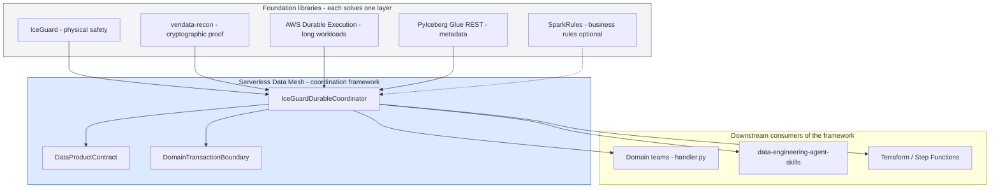

| Layer | Project | Connects upward to |
|-------|---------|-------------------|
| Physical safety | IceGuard | Coordinator Phase 1 |
| Proof | veridata-recon | Coordinator Phase 2 gate |
| Orchestration | Durable SDK | Coordinator Phase 3 resume |
| Metadata | GlueCatalogConnector | Coordinator Phase 4 commit |
| Rules (optional) | SparkRules | Pre-Phase 1 filter |
| **Coordination** | **serverless-data-mesh** | Domain handlers, agents, IaC |
| **Future** | data-engineering-agent-skills | AI agents that speak the same contract |

That requires:

1. **Physical safety** (IceGuard) so Lambda timeouts do not corrupt the lakehouse
2. **Cryptographic verification** (veridata-recon) so "success" means multiset match, not exit code 0
3. **Durable orchestration** (AWS Durable Execution) so serverless economics extend to 90-minute backfills
4. **Governed metadata** (Glue Catalog Connector) so domains commit snapshots without Glue ETL lock-in
5. **Federated accounts** (Producer, Steward, Publisher) so autonomy and audit coexist

This is the capstone of a portfolio that spans write safety (IceGuard), proof (veridata), and execution (Durable Lambda). It is the framework that lets agent skills, domain teams, and platform governance all speak the same **transaction boundary language**.

---

## Next steps

| Audience | Start here |
|----------|------------|
| Pattern adopters | **[vaquar-pattern.md](vaquar-pattern.md)** |
| Decision makers (this article) | You are here |
| Architects | [data-mesh-end-to-end.md](data-mesh-end-to-end.md) |
| Patterns and coverage | [data-mesh-patterns.md](data-mesh-patterns.md) |
| Component internals | [architecture.md](architecture.md) |
| Glue vs Lambda split | [glue-connector.md](glue-connector.md) |
| Developers | [getting-started.md](getting-started.md) |
| Trust benchmark | `make benchmark` |
| Deploy | [terraform-guide.md](terraform-guide.md) |

---

## Related diagrams in this repository

| Image | What it shows |
|-------|---------------|
| [why-sdm-hero-connectivity.png](images/why-sdm-hero-connectivity.png) | Four primitives + three accounts |
| [why-sdm-four-phase-connectivity.png](images/why-sdm-four-phase-connectivity.png) | Phase-by-phase data flows |
| [why-sdm-trust-gap.png](images/why-sdm-trust-gap.png) | Pipeline success vs VRP proof |
| [three-account-data-mesh.png](images/three-account-data-mesh.png) | Producer / Steward / Publisher |
| [lambda-execution-flow.png](images/lambda-execution-flow.png) | Lambda durable execution flow |

---

*Apache-2.0 · Repository: [github.com/vaquarkhan/aws-serveless-datamesh-framwork](https://github.com/vaquarkhan/aws-serveless-datamesh-framwork) · Article: [why-serverless-data-mesh.md](https://github.com/vaquarkhan/aws-serveless-datamesh-framwork/blob/main/docs/why-serverless-data-mesh.md)*
