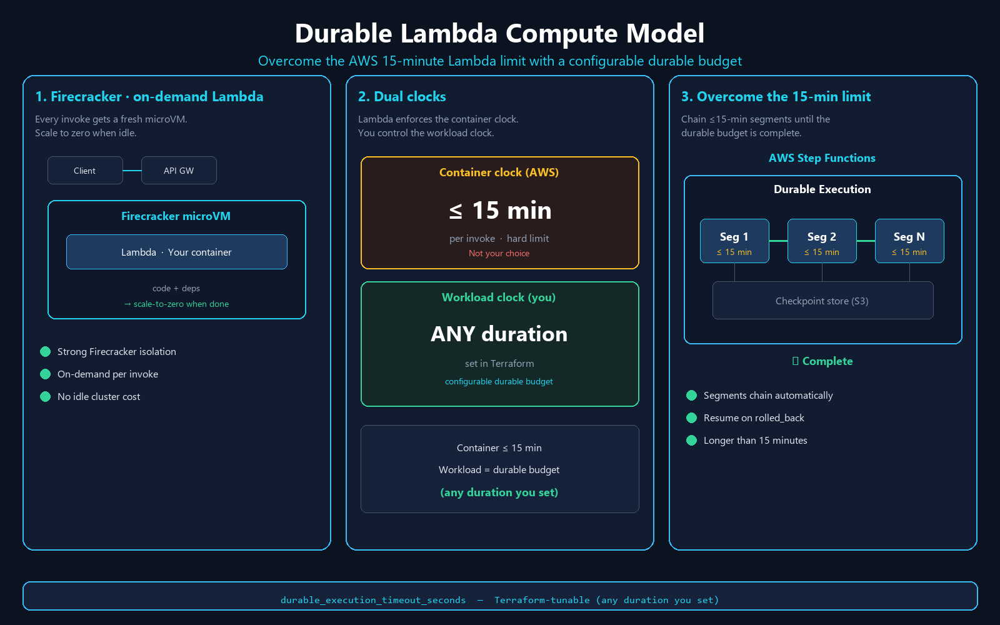

# Durable compute example — Lambda dual clocks

Configure **Durable Lambda**, Firecracker isolation (AWS-managed), **on-demand** scaling, and a **configurable workload clock** so jobs can run longer than the AWS 15-minute per-invoke limit.

<p align="center">
  
</p>

## What this demonstrates

| Topic | Answer in this framework |
|-------|--------------------------|
| Durable Lambda? | **Yes** — `enable_durable_execution = true` |
| MicroVM? | **Firecracker** under Lambda (AWS-managed) |
| On-demand EC2? | **No** — on-demand **Lambda** only |
| Overcome 15-min limit? | **Yes** — chain segments via Durable Execution + Step Functions |
| Configurable time? | **Yes** — set `durable_execution_timeout_seconds` to your backfill needs |

## Sample `terraform.tfvars`

Copy into `infrastructure/terraform/environments/prod/terraform.tfvars` (or medallion):

```hcl
enable_durable_execution          = true
lambda_timeout_seconds            = 900     # segment clock (AWS max 15 min)
# Workload clock: set to your job's wall-clock. Segments chain until this budget
# is used — this is how the framework overcomes the 15-minute Lambda limit.
durable_execution_timeout_seconds = 10800
durable_retention_days            = 14
lambda_memory_mb                  = 4096
iceguard_rollback_threshold_ms    = 30000   # rollback before hard timeout
max_resume_attempts               = 14      # auto-bumped if too low for durable÷segment
resume_wait_seconds               = 60
sfn_invoke_timeout_buffer_seconds = 60
```

### Shorter segments (cost / blast-radius tuning)

```hcl
lambda_timeout_seconds            = 300     # 5 min segments
durable_execution_timeout_seconds = 3600    # set total budget for your job
iceguard_rollback_threshold_ms    = 20000
```

## Related

- [Architecture — dual clocks](../../docs/architecture.md#durable-lambda-compute-model)
- [Terraform guide](../../docs/terraform-guide.md)
- [Vaquar Pattern / proprietary PVDM](../../docs/vaquar-pattern.md)
