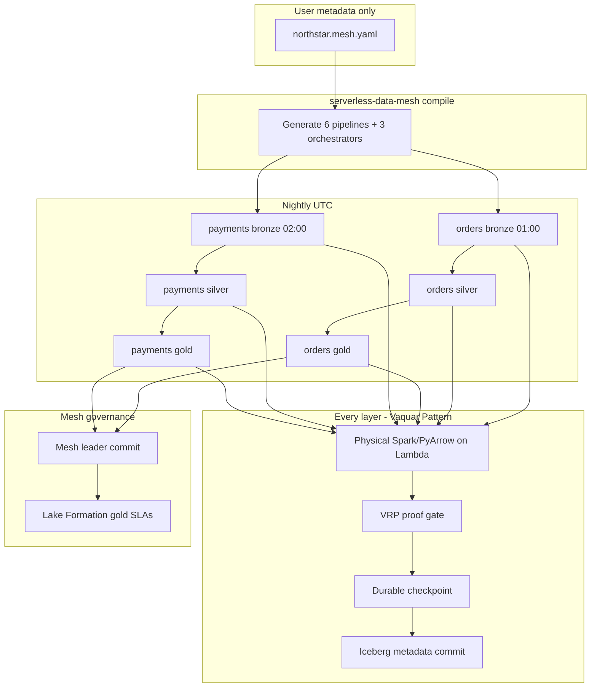

# Medallion E2E — metadata-only data mesh

> **Full reference:** [docs/metadata-driven-pipeline.md](../../docs/metadata-driven-pipeline.md) — schema, field tables, deploy, CI/CD, validation rules.

**One YAML file** defines bronze, silver, and gold layers for every domain.  
`serverless-data-mesh compile` generates **all pipelines**, orchestrators, Lambda handlers, VRP gates, and consumer SLAs.

No Glue ETL. Spark runs on Lambda for silver/gold transforms where configured.

---

## What you write (metadata only)

Edit [`northstar.mesh.yaml`](northstar.mesh.yaml):

```yaml
apiVersion: sdm/v1
kind: MedallionMesh
spec:
  accounts: { producer, steward, publisher }
  domains:
    - domain_id: orders
      schedule_cron: "0 1 * * *"
      layers:
        bronze: { target_table, transforms, runtime }
        silver: { upstream_layer: bronze, transforms, runtime: pyspark }
        gold:   { upstream_layer: silver, consumer_slas, runtime }
    - domain_id: payments
      layers: { bronze, silver, gold }
```

---

## What the framework generates

```bash
serverless-data-mesh compile \
  --contract examples/medallion-e2e/northstar.mesh.yaml \
  --output examples/medallion-e2e/generated
```

### Pipeline count (this example)

| Domain | Bronze | Silver | Gold | Total |
|--------|--------|--------|------|-------|
| orders | Lambda+SFN | PySpark Lambda | PySpark Lambda | 3 |
| payments | Lambda+SFN | SparkRules Lambda | Lambda | 3 |
| **Mesh** | orchestrator + finance txn | | | **6 pipelines** |

### Generated tree

```
generated/
├── northstar.mesh.yaml          # your metadata (copied)
├── mesh.medallion.yaml          # normalized
├── mesh.manifest.json
├── mesh.orchestrator.asl.json   # parallel domains → mesh leader commit
├── README.md
├── orders/
│   ├── orchestrator.asl.json    # bronze → silver → gold chain
│   ├── domain.manifest.json
│   ├── bronze/                  # full PVDM pipeline
│   │   ├── handler.py
│   │   ├── readers.py           # ← you implement
│   │   ├── mesh.pipeline.yaml
│   │   └── terraform/
│   ├── silver/
│   └── gold/                    # consumer_sla.yaml → Lake Formation
└── payments/
    ├── orchestrator.asl.json
    ├── bronze/
    ├── silver/
    └── gold/
```

---

## End-to-end flow



---

## Layer responsibilities

| Layer | Purpose | Typical engine | Source |
|-------|---------|----------------|--------|
| **Bronze** | Raw landing, append-only | PyArrow | External S3, CDC, API |
| **Silver** | Cleanse, dedup, conform | PySpark / SparkRules | Bronze Iceberg table |
| **Gold** | Consumer data product | PySpark / PyArrow | Silver Iceberg table |

Each layer is a **separate PVDM pipeline** with its own VRP proof, durable steps, and Iceberg snapshot.  
Gold layers include `consumer_slas` for Lake Formation read gates.

---

## What you implement (once per layer)

Only `readers.py` in each generated folder:

```python
# generated/orders/silver/readers.py
def source_reader(start, end):
    # Read orders_bronze Iceberg partition via Spark
    ...

def batch_writer(start, end):
    # Write orders_silver Parquet
    ...
```

Everything else — handler, Step Functions, EventBridge, VRP config, SLA YAML — is generated from metadata.

---

## Deploy

```bash
# Package PySpark domains
SDM_EXTRAS=spark ./infrastructure/terraform/scripts/package_lambda.sh

# Per layer
cd generated/orders/silver/terraform && terraform apply

# Domain chain
aws stepfunctions create-state-machine --definition file://generated/orders/orchestrator.asl.json

# Full mesh
aws stepfunctions create-state-machine --definition file://generated/mesh.orchestrator.asl.json
```

---

## Mesh transaction (finance daily close)

`spec.mesh_transactions` in YAML declares that **orders gold** and **payments gold** must both VRP PASS before the mesh leader publishes consumer snapshots.

---

## Related

- **[Complete metadata-driven guide](../../docs/metadata-driven-pipeline.md)** — full schema, deploy, CI/CD
- [Metadata-driven pipeline compiler](../../docs/metadata-driven-pipeline.md)
- [Retail flat pipelines example](../retail-mesh/README.md)
- [Vaquar Pattern](../../docs/vaquar-pattern.md)
