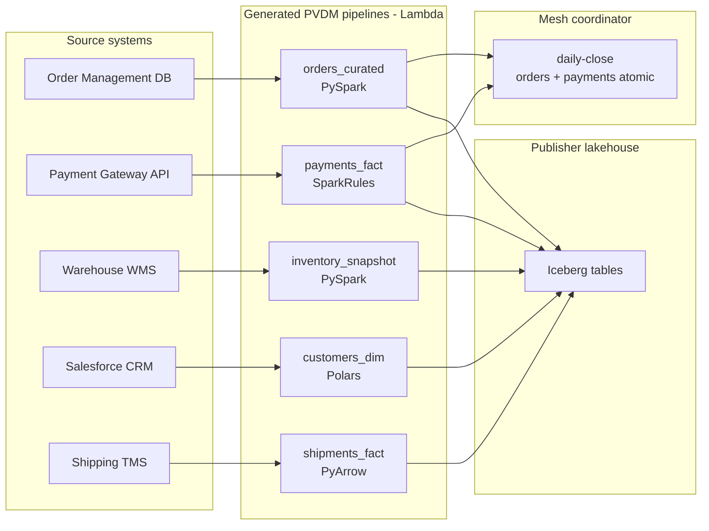

# Northstar Retail — real-world ETL on the federated mesh

> **Full reference:** [docs/metadata-driven-pipeline.md](../../docs/metadata-driven-pipeline.md) — medallion schema, runtime engines, pipeline counting, deploy.

End-to-end example: a mid-size retailer runs **five domain pipelines** plus **one mesh coordinator** on AWS Lambda. Metadata in YAML drives `serverless-data-mesh compile` to generate handlers, Step Functions, EventBridge schedules, and Lambda packaging hints.

**Company:** Northstar Retail (e-commerce + stores)  
**Goal:** Nightly curated lakehouse data products with proof-gated publication (Vaquar Pattern PVDM)

---

## Source systems → data products



---

## How many pipelines do you need?

| # | Pipeline ID | Domain | Target table | Engine on Lambda | Memory | Why its own pipeline |
|---|-------------|--------|--------------|------------------|--------|----------------------|
| 1 | `orders-curated-nightly` | orders | `orders_curated` | **PySpark** | 10 GB | 8M order lines/night; join line items, dedup, window aggregates |
| 2 | `payments-fact-nightly` | payments | `fact_payments` | **SparkRules** + PyArrow | 3 GB | PCI amount/currency rules before VRP; smaller row volume |
| 3 | `inventory-snapshot` | inventory | `inventory_snapshot` | **PySpark** | 10 GB | 2M SKU × location wide aggregates |
| 4 | `customers-dim` | customers | `dim_customers` | Polars | 3 GB | SCD Type 2; 400K customers; no JVM |
| 5 | `shipments-fact` | shipping | `fact_shipments` | PyArrow | 3 GB | Triggered after orders; lighter transform |
| 6 | `daily-close-mesh` | *(coordinator)* | — | Step Functions only | — | **Atomic** orders + payments consumer snapshot |

**Totals**

- **5 compiled domain pipelines** → 5 × (Lambda + Step Functions + schedule/event)
- **1 mesh transaction** → 1 Step Functions workflow (not a separate data transform)
- **0 Glue ETL jobs** — Spark runs **inside** domain Lambdas for physical Parquet only
- **3 consumer SLA bindings** (analytics, finance, ops) — metadata only, not pipelines

---

## Metadata registry

[`mesh-registry.yaml`](mesh-registry.yaml) lists every contract path, compile command, and mesh transaction. This is the **catalog** platform teams use in CI:

```bash
# Compile all domain pipelines from registry
python examples/retail-mesh/compile_all.py
```

Or one at a time:

```bash
serverless-data-mesh compile \
  --contract examples/retail-mesh/contracts/orders.mesh.pipeline.yaml \
  --output examples/retail-mesh/generated/
```

Output layout:

```
examples/retail-mesh/generated/
├── orders/          # PySpark Lambda artifacts
├── payments/
├── inventory/
├── customers/
└── shipping/
```

---

## Pipeline 1: Orders (PySpark on Lambda) — the heavy ETL

**Business ETL (what Spark does):**

1. Read raw OMS export from `s3://producer-orders/raw/dt=YYYY-MM-DD/`
2. Join `order_lines`, filter cancelled statuses
3. Dedup on `order_id`, compute `line_count`, `order_total`
4. Write Parquet to Publisher lakehouse
5. **VRP** compares source multiset vs sink multiset
6. **Glue REST** commits Iceberg snapshot only if VRP PASS

**Contract metadata** ([`contracts/orders.mesh.pipeline.yaml`](contracts/orders.mesh.pipeline.yaml)):

```yaml
spec:
  runtime:
    engine: pyspark
    package_extras: spark
    lambda_memory_mb: 10240
    lambda_timeout_seconds: 900
    spark_shuffle_partitions: 16
  workload:
    identity_fields: [order_id]
    content_fields: [order_id, customer_id, order_total, line_count, status]
  triggers:
    - type: schedule
      cron: "0 1 * * *"   # 01:00 UTC — first in the chain
```

**Lambda packaging (from generated `terraform/lambda.tf`):**

```bash
SDM_EXTRAS=spark ./infrastructure/terraform/scripts/package_lambda.sh
# Deploy container image or JVM layer for PySpark (zip alone is often too large)
```

**Generated `readers.py`** uses `SparkSession` — domain team fills in `spark.read.parquet(...)` (see [`spark/orders_readers.example.py`](spark/orders_readers.example.py)).

---

## Pipeline 2: Payments (SparkRules, no PySpark JVM)

**Business ETL:**

1. Read payment gateway settlement files
2. **SparkRules DRL**: reject negative amounts, invalid currency, duplicate `payment_id`
3. Write `fact_payments` Parquet
4. VRP gate → metadata commit

```yaml
spec:
  runtime:
    engine: pyarrow
    package_extras: rules
    spark_rules_enabled: true
    lambda_memory_mb: 3008
```

`pip install "serverless-data-mesh[rules]"` — pure Python rule executor on Lambda, no JVM.

---

## Pipeline 3: Inventory (PySpark)

Same pattern as orders; 03:00 UTC schedule; `max_chunk_records: 10000` for wide rows.

---

## Pipeline 4: Customers (Polars)

Lighter engine — metadata sets `engine: polars`; generated `readers.py` uses PyArrow/Polars pattern (domain implements). No Spark JVM cost.

---

## Pipeline 5: Shipping (event-triggered)

```yaml
triggers:
  - type: event
    description: Start when orders_curated VRP PASS for partition dt
```

EventBridge rule listens for `orders` pipeline success → starts shipping Step Functions with `partition_spec.dt` in payload.

---

## Mesh transaction: daily close (orders + payments)

Finance requires **both** `orders_curated` and `fact_payments` for the same `dt` to commit together or not at all.

[`mesh-transactions/daily-close.yaml`](mesh-transactions/daily-close.yaml):

```yaml
apiVersion: sdm/v1
kind: MeshTransaction
metadata:
  transaction_id: daily-close
spec:
  domains:
    - orders
    - payments
  leader_commit: true   # single consumer snapshot only if both VRP PASS
  schedule:
    cron: "0 5 * * *"     # after individual domain runs complete
```

Step Functions:

```
Parallel → [orders Lambda, payments Lambda]
       → LeaderEvaluate (all committed?)
       → CommitMeshSnapshot | AbortAndAlarm
```

See existing demo: [`examples/multi-domain-orders-payments/`](../multi-domain-orders-payments/)

---

## What metadata generates vs what engineers write

| Generated from YAML | Hand-written once per domain |
|---------------------|------------------------------|
| `handler.py`, `pipeline_config.py` | `readers.py` — real Spark/SQL/API I/O |
| `step_function.asl.json` | DRL rules file (if `spark_rules_enabled`) |
| `eventbridge.tf` / schedule | Terraform module wiring to shared infra |
| `consumer_sla.yaml` | — |
| `terraform/lambda.tf` (memory, extras) | Container image Dockerfile (PySpark) |
| VRP fields, auto-repair flags | — |

**Rule of thumb:** ~90% of the PVDM envelope is generated; domain teams own **data access + business rules** only.

---

## Nightly timeline (UTC)

| Time | Pipeline | Engine |
|------|----------|--------|
| 01:00 | orders_curated | PySpark Lambda |
| 02:00 | fact_payments | SparkRules Lambda |
| 03:00 | inventory_snapshot | PySpark Lambda |
| 04:00 | dim_customers | Polars Lambda |
| *event* | fact_shipments | PyArrow Lambda (after orders) |
| 05:00 | daily-close mesh txn | Step Functions |

---

## Run the example locally

```bash
# Compile all contracts
python examples/retail-mesh/compile_all.py

# Verify orders contract
serverless-data-mesh compile \
  --contract examples/retail-mesh/contracts/orders.mesh.pipeline.yaml \
  --output /tmp/retail-generated

# Inspect generated PySpark readers stub
cat /tmp/retail-generated/orders/readers.py
```

---

## Related docs

- [Metadata-driven pipeline compiler](../../docs/metadata-driven-pipeline.md)
- [SparkRules on Lambda](../../docs/sparkrules-connector.md)
- [Multi-domain atomicity](../multi-domain-orders-payments/)
- [Vaquar Pattern](../../docs/vaquar-pattern.md)
